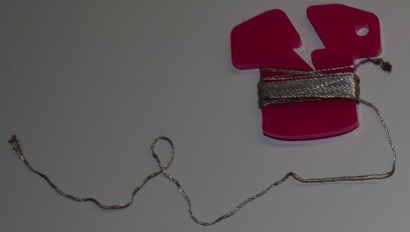

## المقدمة

ستقدم لك بطاقات السوشي هذه الأجهزة الإلكترونية القابلة للارتداء. هذه هي دوائر إلكترونية يمكنك صنعها باستخدام أجزاء مصممة خصيصًا لإنشاء ملابس وإكسسوارات رائعة المظهر.

سوف تتعلم عن الدوائر الإلكترونية وتصنعها ، وستقوم أيضًا ببعض الخياطة.

يمكنك استخدام الإلكترونيات القابلة للارتداء لتزيين الملابس والحقائب والقبعات وأي شيء - الاحتمالات غير محدودة!

### ما الذي ستصنعه

سوف تقوم بعمل علامة (باج) أو قطعة قماش تضيء!

سترى أيضًا كيف يمكنك تصميم الباج بحيث يمكنك ضم الكثير منها معًا لعمل خليط متوهج. قد يكون هذا ممتعًا مع النينجا الآخرين!

--- collapse ---
---
العنوان: ما الذي سوف تتعلمه
---

+ أساسيات مكونات الدائرة والمفاهيم التي ينطوي عليها ** موجب/ + ** و ** سالب/ - **
+ صنع دائرة LED (ضوء) بسيطة
+ كيف يعمل المفتاح وكيفية استخدامه في الدائرة
+ استخدام خيط موصل ومكونات (أجزاء) قابلة للخياطة لصنع دائرة يمكن ارتداؤها
+ مهارات الخياطة الأساسية
+ إضافة مصابيح LED متعددة إلى الدائرة
+ كيفية إنشاء دائرة يمكن ارتداؤها مقسمة إلى مكونات قابلة للفصل

--- /collapse ---

--- collapse ---
---
العنوان: ما تحتاج إليه
---

### الأجهزة

تسمى الأجزاء المختلفة للدائرة الإلكترونية **مكونات**. فيما يلي قائمة بالمكونات التي ستستخدمها:

+ بطارية 

+ ضوء LED. هذه أضواء صغيرة تأتي بألوان مختلفة ، ويمكن لبعضها وميض أو تغيير اللون. يمكنك أيضًا الحصول على مصابيح LED خاصة قابلة للخياطة. لهذا المشروع ، يمكنك استخدام أي نوع من LED!

+ حامل بطارية قابل للخياطة ( يمكن تثبيتها أو وضعها بواسطة التطريز). هذا حامل بطارية متصل بلوحة خاصة (تسمى **لوحة دائرة مطبوعة**) التي يمكنك خياطتها في مشروعك.

ملاحظة: قد يبدو حامل البطارية مختلفًا عن ما هو موضح أعلاه.

+ خيط موصل. يشبه هذا خيط التطريز ، لكنه يحتوي على معدن حتى تتدفق الشحنات الكهرباء من خلاله. نقول أنها ** توصل** كهرباء.

+ مقاطع تشبه فم التمساح (اختياري)

+ مفتاح (اختياري). سترى أن هناك العديد من أنواع المفاتيح المختلفة.

### عناصر اخرى

+ بعض الأقمشة لخياطة المكونات عليها. قد يكون هذا قطعة من الملابس أو حقيبة أو أي شيء تريده. سأستخدم الحرفة اليدوية (اعمال يديوية).

+ إبرة خياطة ، مثل إبرة التطريز

+ مقص

+ الشريط الكهربائي أو الشريط اللاصق أو أي شريط آخر قابل للإزالة

+ دبوس أمان أو أي نوع من دبوس العلامة (الباج)

#### اختياري

+ خيط التطريز العادي (أو أي نوع آخر من الخيط)

+ كماشة(يفضل أن تكون دائرية الشكل)

--- /collapse ---