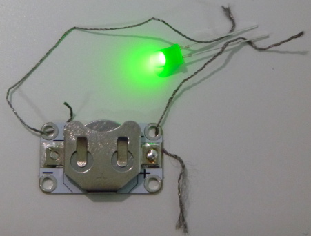

## اصنع دائرة كهربائية

دعونا إنشاء دائرتك الكهربائية الأولى!

+ خذ مصباح LED عاديًا (واحد بساقين بدلاً من واحدة قابلة للخياطة) وقم بتوصيله بالبطارية عن طريق تثبيت كلا الساقين بالبطارية ، واحدة على كلا الجانبين. لاحظ أن أحد أرجل LED أطول من الأخرى. يجب توصيل الجهاز الأطول بجانب البطارية مع وضع علامة **+**. شاهد ضوء LED الخاص بك!

--- collapse ---
---
title: لم يضيء مصباح LED الخاص بي
---

+ إذا لم يفلح ذلك ، تحقق من أن الأرجل تم توصيلها بالطريقة الصحيحة.

--- /collapse ---

+ بمجرد إضاءة LED ، حاول قلب البطارية حتى يتم توصيل الأرجل بطريقة خاطئة ، مع وجود أقصر على `+` جانب البطارية. هل مازال يعمل؟

--- collapse ---
---
title: كيف يعمل؟
---

في كل دائرة ، هناك اتجاه **موجبة** أو **+** وسالب أو **-**.

لتدفق الكهرباء ، تحتاج إلى مطابقة **+** إلى **+** و **-** إلى **-** بين مكوناتك. هذا هو السبب في أن ضوء LED لا يضيء عند قلب البطارية.

--- /collapse ---

--- collapse ---
---
title: تحديد + و- على مصابيح LED مختلفة
---

+ على LED ، تكون الساق الأطول هي **+** والدبوس الأقصر هو **-**. يمكنك أيضًا تحديد **-** من خلال النظر إلى المصباح عن كثب: إنه الجانب ذو الحافة المسطحة.

+ تم بناء مصباح LED قابل للخياطة على لوحة دائرة مطبوعة **صغيرة** فتوجد بها ثقوب بدلاً من الأرجل. يتم تمييز الثقوب بعلامة **+** و **-**.

--- /collapse ---

+ افصل LED والبطارية ، وادخل البطارية في حامل البطارية ، باستخدام **+** متجهة لأعلى (سيحصل حامل البطاقة على علامة لإظهار **+** جانبًا أيضًا).

+ احصل على قطعتين من الخيط الموصل ، وتعاون مع النينجا بجانبك ، حتى تتمكن من مساعدة بعضكما البعض على تثبيت الأشياء في مكانها.

+ ضع أحد طرفي الخيط الأول من خلال **+** ثقب حامل البطارية ، مع التأكد من أنه يلمس المعدن ، وأمسك الطرف الآخر **الموجب** بساق LED. يمكنك استخدام الشريط إذا كنت بحاجة إلى ذلك ، على الرغم من أن هذا سوف يتسبب في تآكل الخيط كثيرًا. إذا كان لديك مقاطع تشبه فم التمساح (لتثبيت المكونات بشكل افضل)، يمكنك استخدامها بدلاً من الخيط.

+ الآن خذ الموضوع الثاني. ضع أحد طرفي الخيط الأول من خلال **+** ثقب حامل البطارية ، مع التأكد من أنه يلمس المعدن ، وأمسك الطرف الآخر **الموجب** بساق LED.

+ تأكد من أن الخيطين لا يلامسان أو يعبران في أي وقت. إذا فعلوا ذلك ، سيؤدي ذلك إلى **خلل** في دائرتك ولن تعمل بشكل صحيح.

--- collapse ---
---
title: ما هو الخلل؟
---

+ عندما يكون لديك **خلل بالدائرة** ، سوف يسبب خلال بتوصيل الشحنات الكهربائية في الدائرة، وتتخطى بعض المكونات ، ولهذا السبب تتوقف عن العمل.

--- /collapse ---

لديك الآن دائرة كهربائية ومستعدة لعمل علامة (باج) مضيئة!
