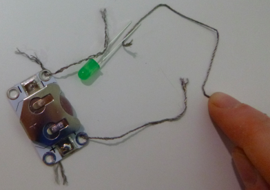

## أضف مفتاحًا كهربائياً

ماذا لو كنت تريد إيقاف تشغيل دائرتك؟ للقيام بذلك ، تحتاج إلى فاصل في مكان ما من الدائرة لإيقاف تدفق الشحنات الكهرباء. **مفتاح ** هو مكون يسمح لك بإيقاف تشغيل الدائرة وتشغيلها بسهولة. هناك الكثير من أنواع المفاتيح المختلفة: الأزرار ، المنزلقات ، حتى المغناطيسية أو القابلة للإمالة. تحتوي بعض حوامل البطاريات على مفتاح مدمج.

+ في دائرتك ، افصل الخيط عن ** + ** فتحة حامل البطارية. خذ قطعة خيط واوضع نهاية واحدة للقطعة الجديدة من خلال ثقب** + ** اين كان الخيط الآخر للتو. قد تحتاج إلى التعاون مع شخص ثالث هنا ، للحصول على بعض الأيدي الإضافية! وإلا يمكنك دائمًا استخدام الشريط ، أو استخدام مقاطع التثبيت تشبه فم التمساح بدلاً من الخيط.

+ إذا كان لديك مفتاح جاهز ، أمسك الطرف الآخر من الخيط الجديد بأحد طرفيه. ثم خذ الخيط الذي قمت بإزالته من حامل البطارية (يجب أن يظل متصلًا بمصباح LED) وثبته في الطرف الآخر من المفتاح. الآن يمكنك استخدام المفتاح لاطفاء LED وتشغيله!

--- collapse ---
---
العنوان: أي اتجاه ينبغي أن يذهب المفتاح؟
---

+ لاحظ أنه لا يوجد جانب موجب أو سالب على المفتاح. هذا يعني أنه لا يهم أي اتجاه يوضع حول المفتاح.

--- /collapse ---

+ إذا لم يكن لديك مفتاح تحويل ، يمكنك إنشاء مفتاح بسهولة. خذ طرفي الخيط في دائرتك وأمسكهما معًا لجعل لاضاءة المصباح LED الخاص بك. عند فصلها ، يتم إيقاف تشغيلها مرة أخرى. لقد قمت للتو بإنشاء مفتاح بسيط!

  

--- collapse ---
---
title: كيف يعمل؟
---

كما رأيت ، تتدفق الشحنات الكهرباء على طول الطريق حول الدائرة لإضاءة ضوء LED. لكي تتدفق الشحنات الكهرباء ، يجب أن يكون هناك اتصال بين كل مكون في الدائرة.

عندما تفصل الخيطين ، تكون قد قطعت الاتصال بينهما ، وبالتالي لم تعد الشحنات الكهربائية تتدفق.

عند لمس الخيوط ، يتم توصيلها وتكون الشحنات الكهرباء قادرة على التدفق مرة أخرى.

لقد وضعت شريطًا بالقرب من نهاية كل خيط بحيث يمكنك بسهولة رؤية مكان الفاصل في الدائرة. سيكون هذا هو المفتاح. هنا هو في العمل:

في المفتاح الجاهز ، عادة ما يتم إخفاء الجزء الذي ينقطع فيه الاتصال وإعادة توصيله في الداخل بحيث لا يمكنك رؤيته. الآن أنت تعرف ما يحدث حقًا عند تشغيل شيء ما أو إيقافه!

--- /collapse ---

تعمل أنواع المفاتيح المختلفة عن طريق فصل الدائرة بطرق مختلفة. يمكنك استخدام مفتاح في مشاريع الأجهزة القابلة للارتداء الخاصة بك لتمنحك التحكم في وقت تشغيل الدائرة أو إيقاف تشغيلها.
