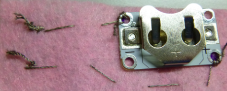

## أكمل دائرتك الكهربائية القابلة للارتداء

الآن لديك إبرة وخيط يخرجان من قطعة القماش حيث تم توصيل المصباح. تخيل خيط بين هذا المكان والمكان الذي حددته لـ **-** فتحة حامل البطارية. إذا كان ذلك مفيدًا ، يمكنك رسم الخط على قطعة القماش. ستخيط من خلال **تمرير الإبرة إلى داخل وخارج** على طول هذا الخط لتوصيل المصباح بحامل البطارية.

+ ضع طرف الإبرة على الخط ، على بعد حوالي 1 سم من مكان خروج الخيط من قطعة القماش، وادفعه خلاله. اسحب الإبرة وخيطها بالكامل من الأمام. ثم كرر هذا على الجانب الآخر من القماش. تخيل خيط بين هذا المكان والمكان الذي حددته لـ **-** فتحة حامل البطارية.

+ بعد ذلك ، ضع حامل البطارية في مكانه على القماش. ثم ، وكما فعلت مع المصباح، قم بتثبيت حامل البطارية عن طريق خياطة ثلاث غرز من خلال ثقب طرف الــ **-**. تذكر وللتأكد من أنها جيدة وضيقة!

+ للانتهاء ، قم بخياطة ثلاث غرز صغيرة بجوار المكان الذي قمت بتوصيل حامل البطارية فيه ، وكل ذلك في نفس المكان. سيؤدي ذلك إلى تأمين نهاية الخيط وإيقاف عملك من التفكك.

+ اقطع الخيط بحيث يتدلى جزء صغير جدًا من قطعة القماش.

--- collapse ---
---
title: شاهد فيديو الجزء الاخير
---

إليك مقطع فيديو يوضح لك كيفية إنهاء هذا الجزء من الخياطة: [dojo.soy/wear-finishing](http://dojo.soy/wear-finishing){:target="_blank"}

--- /collapse ---

 

لديك الآن نصف دائرتك مخيط.

+ لإكمال الدائرة ، تحتاج إلى توصيل **+** ثقب على LED مع **+** ثقب على حامل البطارية. افعل ذلك بالطريقة نفسها التي ربطت بها **السلبيات**. أنا لا أقوم بتضمين مفتاح في هذه الدائرة ، ولكن يمكنك إذا أردت استخدام قطعة ثالثة من الخيط كما كان من قبل.

  **هام!** تأكد من أن مسار **+ الخاص بك** الخيط **لا يتقاطع / اللمس** **-** الخيط أو أي حواف لحامل البطارية في أي مكان. تذكر أن هذا قد يتسبب في **تماس كهربائى** (شيئا سيئا)!

+ أدخل البطارية في حامل البطارية وشاهد ضوء المصباح الخاص بك!

### صنع العلامة (الباج)

+ حان وقت البرمجة! قم بتزيين علامتك كيفما تشاء مع خيوط ملونة مختلفة ، أو أي مواد أخرى لديك. ستغطي المصباح بقطعة القماش وتعطيه وهجًا أكثر نعومة.

+ إذا كنت تعلق دبوسًا على علامتك، فمن الجيد وضعه على قطعة قماش منفصلة تعلقها بالجزء الخلفي من علامتك. هذا يضمن أن الدبوس لا يلمس أي جزء من دائرتك - لأن الدبوس معدن ، مما قد يتسبب خلل في الدائرة كهربائية. استخدم خيطًا عاديًا للخياطة الإضافية ، أو الغراء أو الشريط بدلاً من ذلك.

تهانينا! تم الانتهاء من علامتك، وقمت بخياطة دائرة كاملة يمكن ارتداؤها. توضح لك بطاقات السوشي التالية كيفية إضافة المزيد من مصابيح ، وهي اختيارية.
