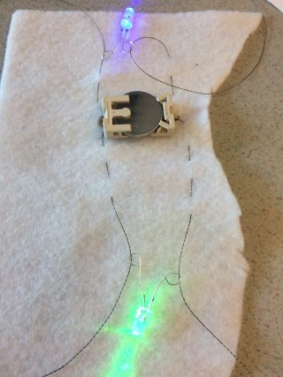

## أضف المزيد من المصابيح

إن إضافة المزيد من مصابيح إلى دائرتك أمر سهل ، ولا تحتاج إلى أي بطاريات إضافية!

** ملاحظة **: يجب أن تكون مصابيح في دائرتك من نفس النوع ، سواء كانت قابلة للخياطة أو غير قابلة للخياطة. ستعمل بشكل أفضل مع مصابيح القابلة للخياطة، حيث يمكنك توصيل المزيد منها بنفس البطارية دون تقليل الطاقة.

+ أخرج البطارية من حامل البطارية في الوقت الحالي. عند العمل على الدائرة، من المهم دائمًا التأكد من عدم وجود **مباشر** عن طريق إيقاف تشغيله أو إخراج البطارية!

+ حدد المكان الذي تريد أن تضع فيه مؤشر المصباح التالي على علامتك، وحدد ذلك المكان.

سوف تقوم بتوصيل المصابيح في بشكل** موازي**. هناك طريقتان للقيام بذلك.

### الطريقة الاولى

أحد الخيارات هو توصيل المصباح مباشرة بالبطارية ، تمامًا مثل مصباح الأول. من المقبول استخدام نفس الثقوب على حامل البطارية أكثر من مرة على حامل البطارية - الحد الوحيد هو مقدار الخيط الذي يمكنك وضعه من خلاله! مثال الدائرة الكهربائية في الصورة لم يتم خياطة أي شيء على اي شي ، حتى تتمكن من رؤية الخيوط بوضوح:

### الطريقة الثانية

خيار آخر هو ربط المصباح الجديد بمصباح الموجود بالفعل في دائرتك ، بدلاً من البطارية. تتطابق مع ** + ** إلى ** + ** و ** - ** إلى ** - ** كما لو كنت توصله ببطارية. في المثال أدناه ، يتم استخدام نفس قطعتين من الخيط لكلا المصابيح. يمكنك أيضًا استخدام قطع منفصلة من الخيط لكل مصباح.

--- collapse ---
---
title: ما الخيار الذي يجب علي اختياره؟
---

يعتمد تحديد ما إذا كنت تريد توصيل مصباح إلى حامل البطارية أو مصباح الآخر على المكان الذي تريد وضع مصباح الجديد فيه!

+ عادة ستختار المكون الأقرب إلى المكان الذي اخترته لمصباح الثاني.

+ تحتاج أيضًا إلى التأكد من أن جميع سلاسل الخيوط المختلفة منفصلة ولا تتقاطع أو تلمس ، لذلك من الجيد أن ننظر إلى مكان ** + ** و ** - ** من المكونات الخاصة بك عند اختيار طريقة ومكان المصباح.

--- /collapse ---

+ عند تثبيت المصباح في مكانه ، استخدم إبرة وقطعة خيط موصل جديدة لتأمين ثقب القطب ** - ** كما فعلت لأول واحد بالخياطة عليه.

+ الخطوة التالية هي تمرير الإبرة إلى داخل وخارج القماش. إذا كنت تقوم بتوصيل المصباح بمصباح آخر ، فستكون الخياطة هذه المرة في خط باتجاه القطب** - ** اللمصباح الأخرى ، بدلاً من حامل البطارية. بمجرد الوصول إلى الفتحة الصحيحة ، قم بعمل ثلاث غرز من خلالها ، وثلاث غرز صغيرة لإكمالها ، تمامًا كما فعلت من قبل.

+ الآن قم بتوصيل قطب** + ** مع المصباح الجديد باستخدام نفس الطريقة.

في هذه الصورة ، يتم توصيل المصباح الثاني مباشرة بالبطارية:

في الصورة التالية ، تم توصيل مؤشر المصباح آخر بمصباح الأول ، والذي يتم توصيله بدوره بالبطارية (البطارية في الجزء الخلفي من القماش):

