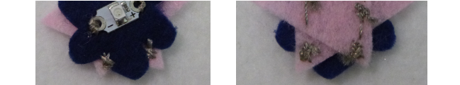
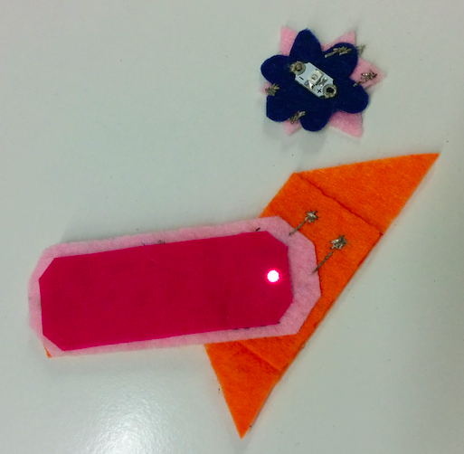
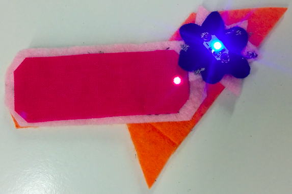

## اصنع أجزاء قابلة للفصل

يمكنك أيضًا تمديد دائرة العلامة الخاصة بك بحيث يمكن ربط قطع منفصلة من القماش بمصابيح الخاصة بها (من نفس النوع) لجعلها تضيء!

أولاً ، ستحتاج إلى علامة أخرى. هذا لن يكون لديه بطارية خاصة به. ولكن بدون بطارية ، أين ستذهب الخيوط؟

+ عند خياطة المصباح الخاص بك على هذه العلامة الجديدة ، قم تمرير الإبرة إلى داخل وخارج القماش على طول الطريق حتى حافة القماش أو بالقرب من الحافة. تذكر أن تحافظ على تكون خيوط ** الموجب** و ** السالب** منفصلة عن بعضها البعض!

+ ثم خيط عدة غرز متوسطة الحجم بجانب بعضها البعض أو متقاطعًا فوق بعضها البعض. تريد أن تجعلها تبدو وكأنها "بقعة" من الخيط الموصل على القماش.

+ قم بإنهاء الغرز كالمعتاد عن طريق عمل ثلاث غرز صغيرة في بقعة واحدة قبل قطع الخيط القصير.

+ بمجرد أن يكون لديك نقطة واحدة للجانب ** السالب** ، ونقطة واحدة للجانب** للموجب** ، العلامة الجديدة جاهزة. إذا أردت ، يمكنك تكرار هذه الخطوات بحيث يمكنك تمديد الدائرة إلى زوج آخر من النقط عند الحافة المقابلة للعلامة الجديدة ، مثل هذا:

+ الآن تحتاج فقط إلى تمديد الدائرة على الباج الرئيسي (ذلك الذي يحتوي على البطارية). تذكر إزالة البطارية من الحامل أولاً.

+ حدد المكان الذي تريد أن تنضم إليه العلامات معًا. ستقوم بخياطة غرز من المصباح على العلامة الرئيسية إلى هذه النقطة ، لذا تأكد من أنه يمكنك تتبع خط من ** + ** إلى ** الموجب ** النقطة ومن ** - ** إلى السالب ** ** النقطة دون عبور الخطوط.

+ ضع نقطتين على العلامة الرئيسية بحيث نقطتي** الموجب ** و ** السالب ** تلمسها. ستقوم بخياطة النقط المطابقة هنا للتواصل معها. يمكنك وضع العلامة الجديدة على جانب واحد للجزء التالي.

+ خيط مجموعة جديدة و العلامة الرئيسية ، خيط مجموعة من الغرز في المكان الذي حددته للعلامة ** السالبة**. ثم خيط من خلال تمرير الإبرة إلى داخل وخارج القماش على طول الطريق إلى المصباح على هذه العلامة وثبتها بـفتحة ** - **. كرر هذه العملية لجعل نقطة** الموجب** المتصلة بـنقطة ** + ** من نفس المصباح. عند الانتهاء ، يجب أن يبدو شيء مثل هذا:

علامتك جاهزة للانضمام معًا!

+ أعد إدخال البطارية في حاملها. ضع العلامة الجديدة على العلامة الرئيسية حتى تلمس النقط بعضها البعض. تذكر أن تطابق ** + ** إلى ** + ** و ** - ** إلى ** - **. من المفترض أن ترى العلامة الجديدة تضيء فجأة!

 

--- challenge ---

## التحدي: قم بعمل مفتاح ناعم

+ يمكنك استخدام هذه التقنية لعمل مفتاح بسيط في مشروعك. على سبيل المثال ، ضع علامة ** الموجب** يفصل كل طرف من طرفي السوار ، حتى يتلامس الاثنان عند غلقه.

--- /challenge ---
