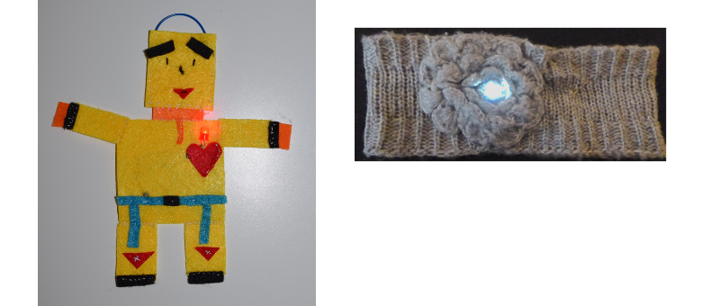

## Einleitung

Diese Sushi Karte führt dich in das Thema der tragbaren Elektronik ein. Hierbei handelt es sich um elektronische Schaltungen, die du mit speziell entwickelten Teilen herstellen kannst, um fantastisch aussehende Klamotten und Accessoires herzustellen.

Du wirst lernen, elektronische Schaltungen herzustellen und du wirst auch etwas nähen.

Du kannst tragbare Elektronik verwenden, um Klamotten, Taschen, Hüte usw. zu dekorieren - die Möglichkeiten sind unbegrenzt!

### Was du machen wirst

Du wirst einen Filz-Anstecker oder einen Filz-Aufnäher machen, der leuchten kann!

Du wirst auch sehen, wie du den Aufnäher so gestalten kannst, dass du viele von ihnen zu einem leuchtenden Patchwork zusammenfügen kannst. Es könnte Spaß machen, dies mit anderen Ninjas zusammen zu tun!

--- collapse ---
---
title: Was du lernen wirst
---

+ Die Grundlagen der Schaltungskomponenten und die Konzepte von **plus / +** und **minus / -**
+ Das Erstellen einer einfachen LED-Schaltung
+ Wie ein Schalter funktioniert und wie man ihn in einer Schaltung verwendet
+ Das Verwenden eines leitenden Fadens und vernähbarer Komponenten (Teile) zur Herstellung einer tragbaren Schaltung
+ Grundlegende Nähkentnisse
+ Das Hinzufügen mehrerer LEDs zu einer Schaltung
+ Wie man eine tragbare Schaltung erstellt, die aus abnehmbaren Komponenten besteht

--- /collapse ---

--- collapse ---
---
title: Was du brauchst
---

### Hardware

Die verschiedenen Teile einer elektronischen Schaltung werden als **Komponenten bezeichnet**. Hier ist eine Liste der Komponenten, die du verwenden wirst:

+ Eine Batterie

+ LEDs. Dies sind kleine Lichter, die es in verschiedenen Farben gibt. Einige können sogar blinken oder die Farbe ändern. Es gibt auch spezielle LEDs zum Annähen. Für dieses Projekt kannst du jede Art von LED verwenden!

+ Eine Batteriehalterung zum Annähen. Diese Batteriehalterung ist an einer speziellen Platte (der sogenannten **Leiterplatte**) angebracht, die du an deine Schaltung annähen kannst.

Hinweis: Deine Batteriehalterung sieht möglicherweise anders aus als die auf den oben angezeigten Bildern.

+ Leitende Fäden. Dies ist eine Art Stickfaden, welcher Metalle enthält damit Elektrizität durch ihn hindurch fließen kann. Man bezeichnet es als **elektrisch leitend**.

+ Krokodilklemmen (optional)

+ Einen Schalter (optional). Du wirst sehen, dass es viele verschiedene Arten von Schaltern gibt.

### Sonstige Gegenstände

+ Etwas Stoff zum Vernähen der Komponenten. Dies kann ein Kleidungsstück, eine Tasche oder ein anderer Stoff sein. Du hast die Wahl. Ich werde normalen Bastelfilz verwenden.

+ Eine Nähnadel, z.B. eine Sticknadel

+ Eine Schere

+ Klebeband - Isolierband oder Abdeckband, oder ein anderes entfernbares Klebeband

+ Eine Sicherheitsnadel oder irgendeine Art von Anstecknadel

#### Optional

+ Normaler Stickfaden (oder eine andere Art von Faden)

+ Zange (vorzugsweise eine Rundzange)

--- /collapse ---