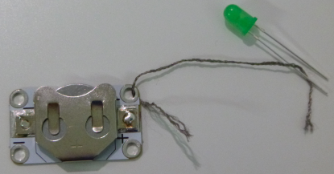

## Fertige einen Schaltkreis an

Lass uns deinen ersten Schaltkreis erstellen!

+ Nimm eine normale LED (eine mit zwei Anschlussbeinen anstelle einer vernähbaren) und schließe sie an eine Batterie an, indem du beide Beine an die Batterie hältst, eines auf jeder Seite. Beachte, dass das eine Anschlussbein der LED länger ist als das andere. Das Längere sollte an die Seite der Batterie angeschlossen werden, die mit einem Pluszeichen **+** gekennzeichnet ist. Schau, wie deine LED aufleuchtet!

--- collapse ---
---
title: Meine LED hat nicht geleuchtet
---

+ Wenn es nicht funktioniert hat, überprüfe, ob die Beine richtig herum sind.

--- /collapse ---

+ Wenn die LED aufleuchtet, drehe die Batterie um, damit die Beine falsch herum angeschlossen sind. Das kürzere Anschlussbein befindet sich nun auf der `+` Seite der Batterie. Funktioniert es immer noch?

--- collapse ---
---
title: So funktioniert es
---

In jeder Schaltung gibt es eine **positive** oder **+** und eine **negative** oder **-** Richtung.

Damit Strom fließen kann, musst du bei deinen Komponenten **+** an **+** und **-** an **-** anschließen. Aus diesem Grund leuchtet die LED nicht auf, wenn du den Akku umdrehst.

--- /collapse ---

--- collapse ---
---
title: Erkennen von + und - auf verschiedenen LEDs
---

+ Das längere Bein der LED ist **+** und der kürzere Pin ist **-**. Du kannst **-** auch erkennen wenn du dir die Glühbirne ganz genau anschaust: Es ist die Seite mit der flachen Kante.

+ Eine LED zum Annähen ist auf einer kleinen **Leiterplatte** angebracht. Daher hat es Löcher an Stelle von Anschlussbeinen. Die Löcher sind mit den Zeichen **+** und **-** markiert.

--- /collapse ---

+ Nimm die LED von der Batterie ab und stecke die Batterie mit dem **+** nach oben in einen Batteriehalterung (die Halterung hat ebenfalls eine Markierung, um die **+** Seite anzuzeigen).

+ Nimm zwei Leitfäden und schließe dich mit dem Ninja neben dir zusammen. So könnt ihr euch gegenseitig helfen, damit nichts verrutscht.

+ Führe ein Ende des ersten Fadens durch das **+** Loch der Batteriehalterung. Achte hierbei darauf, dass es das Metall berührt. Halte nun das andere Ende an das **positive** Anschlussbein der LED. Du kannst bei Bedarf etwas Klebeband verwenden, jedoch wird das den Faden stark ausfransen. Wenn du Krokodilklemmen hast, kannst du diese anstelle der Fäden verwenden.

+ Nimm jetzt den zweiten Faden. Führe ein Ende durch das **-** Loch der Batteriehalterung und halte das andere Ende an das **negative** Anschlussbein der LED.

+ Stelle sicher, dass sich die beiden Fäden an keiner Stelle berühren oder kreuzen. Wenn das passiert, führt es zu einem **Kurzschluss** in deiner Schaltung und sie wird nicht richtig funktionieren.

--- collapse ---
---
title: Was ist ein Kurzschluss?
---

+ Wenn du einen **Kurzschluss** hast, fließt der Strom auf einem kürzeren Weg durch den Stromkreis und überspringt einige der Komponenten. Deshalb funktioniert er nicht mehr.

--- /collapse ---

Jetzt ist die Schaltung fertig und du bist bereit, einen leuchtenden Anstecker anzufertigen!
