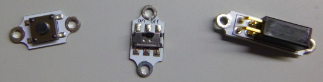

## Füge einen Schalter hinzu

Was, wenn du deine Schaltung ausschalten möchtest? Hierzu benötigst du eine Unterbrechung im Stromkreis, um den Stromfluss zu stoppen. Ein **Schalter** ist eine Komponente, mit der du einen Stromkreis einfach aus- und einschalten kannst. Es gibt viele verschiedene Arten von Schaltern: Knöpfe, Schieberegler, und sogar magnetische oder zum Kippen. Einige Batteriehalterungen haben sogar einen eingebauten Schalter.

+ Nimm den Faden deiner Schaltung vom **+** Loch der Batteriehalterung ab. Nimm ein neues Stück Faden und stecke ein Ende des neuen Fadens durch das **+** Loch, wo der andere Faden gerade war. Möglicherweise benötigst du hier die Hilfe einer dritten Person! Andernfalls kannst du auch immer Klebeband oder Krokodilklemmen anstelle der Fäden verwenden.

+ Wenn du einen vorgefertigten Schalter hast, halte das andere Ende des neuen Fadens an ein Ende des Schalters. Nimm dann den Faden, den du vorher aus der Batteriehalterung entfernt hast (er sollte noch immer mit der LED verbunden sein) und halte ihn an das andere Ende des Schalters. Jetzt kannst du den Schalter benutzen um die LED ein- und auszuschalten!

--- collapse ---
---
title: Wie rum gehört der Schalter?
---

+ Beachte, dass ein Schalter keine positive oder negative Seite hat. Dies bedeutet, dass es keine Rolle spielt, in welcher Richtung sich der Schalter befindet.

--- /collapse ---

+ Wenn du keinen Schalter hast, kannst du ganz einfach selber einen erstellen. Nimm die beiden losen Fadenenden in deinem Stromkreis und halte sie zusammen, damit deine LED aufleuchtet. Wenn du sie auseinander nimmst, schaltet sich die LED wieder aus. Du hast gerade einen einfachen Schalter erstellt!

  

--- collapse ---
---
title: Wie funktioniert es?
---

Wie du gesehen hast, fließt Strom rund um den Stromkreis, damit die LED aufleuchtet. Damit der Strom fließen kann, muss zwischen den einzelnen Komponenten des Stromkreises eine Verbindung bestehen.

Wenn du die beiden Fäden trennst, unterbrichst du die Verbindung zwischen ihnen, sodass der Strom nicht mehr fließen kann.

Wenn du die Fäden zusammenführst sodass sie sich berühren, verbindest du sie miteinander und der Strom kann wieder fließen.

Ich habe Klebeband am Ende jedes Fadens angebracht, damit du leichter erkennen kannst, wo sich die Unterbrechung im Stromkreis befindet. Dies wird der Schalter sein. So funktioniert es in Aktion:

Bei einem vorgefertigten Schalter ist der Teil, an dem die Verbindung unterbrochen und wieder verbunden wird, normalerweise im Inneren versteckt, sodass du ihn nicht sehen kannst. Jetzt weißt du, was wirklich passiert, wenn du etwas ein- oder ausschalten!

--- /collapse ---

Verschiedene Arten von Schaltern funktionieren, indem sie den Stromkreis auf unterschiedliche Weise unterbrechen. Du kannst bei deinen "Tragbare Elektronik"-Projekten einen Schalter verwenden, um zu steuern, wann der Stromkreis ein- oder ausgeschaltet ist.
