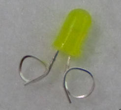
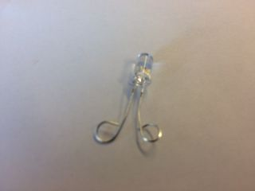

## Nähe die Komponenten zusammen

+ Schneide ein Stück Filz auf die gewünschte Größe deines Ansteckers zu. Entscheide, wo du die LED platzieren möchtest, und markiere die Stelle auf dem Filz. Wähle nun aus an welcher Stelle du die Batteriehalterung befestigen möchtest. Es könnte auf der Rückseite sein! Markiere die Stelle für eines der positiven und eines der negativen Löcher mit einem **+** und **-**.

+ Wenn du eine normale LED verwendest, musst du die Pins zu einer Schleife biegen. Hierbei kann eine Zange hilfreich sein. Wenn du eine LED zum Annähen hast, kannst du diesen Schritt überspringen!

 

+ Fädel deine Nadel ein! Nimm ein etwa 30 cm langes Stück Leitfaden und ziehe eines der Enden durch das Loch in der Nadel (dieses wird auch als **Auge** bezeichnet). Das kann ganz schöne Fummelarbeit sein. Wenn das Ende des Fadens ausgefranst ist, kannst du den ausgefransten Teil einfach mit einer Schere abschneiden.

+ Sobald die Nadel eingefädelt ist, hängt auf beiden Seiten der Faden heraus. Ziehe an einer Seite des Fadens, so dass sie ein gutes Stück länger ist als die andere. Mache nun einen Knoten am Ende des langen Stücks.

Bereit zum Nähen?

+ Lege deine LED an die Stelle auf dem Filz, die du markiert hast. Halte mit einer Hand den Filz und die LED fest. Mit der anderen Hand kannst du jetzt die Nadel **von hinten** durch den Filz schieben, so dass sie durch das **-** Loch der LED hindurchkommt.

+ Ziehe die Nadel und den Faden komplett nach vorne durch. Versuche, die Nadel am Auge, wo der Faden sitzt, festzuhalten, damit er beim Ziehen nicht aus der Nadel rutscht (wenn er doch herausfällt, kannst du ihn einfach erneut einfädeln). Ziehe so lange, bis nur noch der Knoten an der Rückseite des Filzes ist.

+ Setze die Nadelspitze jetzt **direkt neben** das **-** Loch der LED (das, durch das sie gerade gekommen ist), aber **nicht hinein** in das Loch. Genau so:

+ Schiebe die Nadel durch den Filz, so dass sie hinten herauskommt. Ziehe die Nadel hinter dem Filz ganz durch, genauso wie du es vorne auch getan hast. Du hast gerade deine erste Masche genäht! Es sollte ungefähr so aussehen:

+ Wiederhole die letzten beiden Schritte noch dreimal. Achte darauf, den Faden jedes Mal fest zu ziehen. Dadurch wird eine gute Verbindung hergestellt und die LED bleibt fest am Filz befestigt.

+ Du hast soeben gelernt, wie man tragbare Komponenten anbringt. Fast fertig!

--- collapse ---
---
titel: Tipps zum Nähen
---

+ Übung macht den Meister! Wenn du noch nie zuvor genäht hast, kann es am Anfang etwas schwierig sein. Mach dir keine Sorgen, du wirst den Dreh raus bekommen.

+ Dieses Video kann hilfreich sein, wenn du mit dem Nähen noch nicht so vertraut bist: [dojo.soy/wear-stitches](http://dojo.soy/wear-stitches){:target="_blank"}

--- /collapse ---
