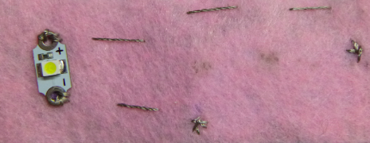
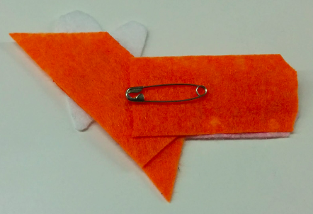

## Stelle deine tragbare Schaltung fertig

Nadel und Faden kommen jetzt aus dem Filz heraus, wo die LED angebracht wurde. Stell dir eine Linie vor zwischen diesem Punkt und dem Punkt, den du für das **-** Loch der Batteriehalterung markiert hast. Wenn es hilft, kannst du die Linie auch auf den Filz malen. Du wirst nun einen **Vorstich** entlang dieser Linie nähen, um die LED mit der Batteriehalterung zu verbinden.

+ Platziere die Nadelspitze etwa 1 cm von der Stelle entfernt, an der der Faden aus dem Filz kommt, und drücke sie hindurch. Ziehe die Nadel und den Faden, wie eben, komplett durch. Wiederhole dies dann auf der anderen Seite des Filzes. Wiederhole dies in 1 cm breiten Schritten, bis du die Stelle erreichen, die du für das **-** Loch der Batteriehalterung markiert hast.

+ Setze als nächstes deine Batteriehalterung auf den Filz. Befestige die Batteriehalterung dann wie die LED, indem du drei Stiche durch das **-** Loch nähst. Achte darauf, dass die Stiche sauber und fest sind!

+ Nähe zuletzt drei kleine Knoten direkt neben die Stelle, an der du die Batteriehalterung angebracht hast. Alle Knoten sollten an derselben Stelle sein. Dies sichert das Ende des Fadens und verhindert, dass er sich lockert.

+ Schneide den Faden so ab, dass nur ein kleines Stück aus dem Filz heraushängt.

--- collapse ---
---
title: Schaue dir ein Video zum letzten Teil an
---

Hier ist ein Video, das zeigt, wie du diesen Teil des Nähens beenden kannst: [ dojo.soy/wear-finishing ](http://dojo.soy/wear-finishing) {: target = "_ blank"}

--- /collapse ---

 

Du hast jetzt die Hälfte deines Schaltkreises genäht.

+ Um den Schaltkreis zu vervollständigen, musst du das **+** Loch der LED mit dem **+** Loch der Batteriehalterung verbinden. Tue dies so, wie du es gerade mit den **Negativen** Löchern getan hast. Ich füge keinen Schalter zu diesem Schaltkreis hinzu, aber du kannst es, wenn du willst, tun, indem du wie zuvor ein drittes Stück Faden verwendest.

  **Wichtig!** Stelle sicher, dass der **+** Faden den **-** Faden oder die Ecken der Batteriehalterung an keiner Stelle **kreuzt / berührt**.  Denke daran, dass dies einen **Kurzschluss** verursachen würde. (Das wäre eine schlechte Sache)!

+ Platziere eine Batterie in der Batteriehalterung und beobachte, wie deine LED aufleuchtet!

### Den Anstecker herstellen

+ Zeit, kreativ zu werden! Dekoriere deinen Anstecker nach Belieben mit verschiedenfarbigem Filz, Fäden oder anderen Materialien. Wenn du die LED mit Filz bedeckst, leuchtet sie weicher.

+ Wenn du eine Anstecknadel an deinem Anstecker befestigst, ist es eine gute Idee, sie auf ein separates Stück Filz zu kleben, welches du auf der Rückseite deines Anstecker anbringen kannst. Dies stellt sicher, dass die Anstecknadel keinen Teil deines Stromkreises berührt - da die Anstecknadel aus Metall besteht, würde dies einen Kurzschluss verursachen. Verwende zum vernähen der Anstecknadel gewöhnlichen Faden, Kleber oder Klebeband.

Herzlichen Glückwunsch! Dein Anstecker ist fertig und du hast nun einen kompletten tragbaren Schaltkreis genäht. Die nächsten Sushi-Karten zeigt dir, wie du weitere LEDs hinzufügen kannst. Dies ist optional.
