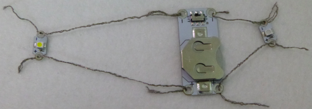

## Füge weitere LEDs hinzu

Es ist sehr einfach weiterer LEDs zu deinem Schaltkreis hinzuzufügen und du benötigst keine zusätzlichen Batterien!

**Hinweis**: Die LEDs in deinem Schaltkreis müssen vom gleichen Typ sein, entweder alle zum Annähen oder alle nicht annähbar. Es funktioniert am besten mit LEDs zum Annähen, da so viele LEDs an dieselbe Batterie angeschlossen werden können, ohne dass es die Leistung beeinträchtigt.

+ Nimm die Batterie jetzt aus der Batteriehalterung heraus. Wenn du an einem Schaltkreis arbeitest, ist es wichtig, immer sicherzustellen, dass dieser nicht ** live** ist. Dies kannst du erreichen in dem du ihn ausschaltest oder die Batterie herausnimmst!

+ Entscheide dich, an welcher Stelle des Ansteckers du deine nächste LED platzieren möchtest und markiere diese Stelle.

Du wirst die LEDs **parallel** anschließen. Es gibt zwei Möglichkeiten, dies zu tun.

### Methode 1

Zum Einen gibt es die Möglichkeit die LED genau wie die erste LED direkt an die Batterie anzuschließen. Es ist in Ordnung, die gleichen Löcher der Batteriehalterung mehrmals zu verwenden - man kann so viele Fäden hindurch stecken wie es passt! Der Schaltkreis auf dem Bild wurde nicht auf etwas drauf genäht, damit du die Fäden deutlich sehen kannst:

### Methode 2

Zum andern hast du auch die Möglichkeit, die neue LED an der LED zu befestigen, die sich bereits in deinem Schaltkreis befindet, anstatt an der Batterie. Du musst auch hier **+** an **+** und **-** an **-** anschließen, wie als würdest du sie mit der Batterie verbinden. Im folgenden Beispiel werden für beide LEDs die zwei langen Fadenstücke verwendet. Du kannst auch verschiedene Fadenstücke für jede LED verwenden.

--- collapse ---
---
title: Welche Methode soll ich wählen?
---

Die Entscheidung, ob du die LED an der Batteriehalterung oder an die andere LED anschließen solltest, hängt davon ab, wo du die neue LED platzieren möchtest!

+ In der Regel sollte man die Komponente auswählen, die sich näher an der Stelle befindet, die du für deine zweite LED ausgewählt hast.

+ Du musst auch sicherstellen, dass die verschiedenen Fäden getrennt gehalten werden und sich nicht kreuzen oder berühren. Daher ist es eine gute Idee, zu prüfen, wo sich **+** und **-** deiner Komponenten befinden, wenn du eine Methode und eine Stelle für die LED auswählst.

--- /collapse ---

+ Halte die LED an die ausgewählte Stelle und nähe das **-** Loch der LED mit einer Nadel und einem neuen Stück leitendem Faden fest - genau so wie du es bei der ersten LED gemacht hast.

+ Der nächste Schritt ist der Vorstich. Wenn du die LED mit der anderen LED verbindest, werden die Stiche in einer Reihe in Richtung des **-** Loch der anderen LED, anstelle der Batteriehalterung, genäht. Sobald du das richtige Loch erreicht hast, mache drei Stiche durch das Loch und zum Abschluss drei kleine Knoten, genau wie zuvor.

+ Verbinde nun das **+** Loch der neuen LED auf die gleiche Art und Weise.

Auf diesem Foto ist die zweite LED direkt an die Batterie angeschlossen:

Auf dem nächsten Foto wurde eine zweite LED an die erste LED angeschlossen, die wiederum an die Batterie angeschlossen ist (die Batterie befindet sich auf der Rückseite des Stoffes):

