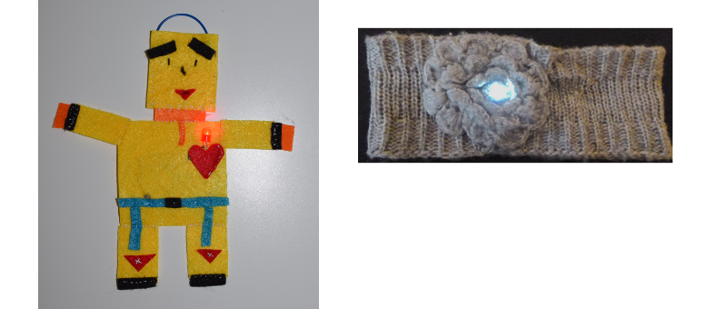

## Introduction

These Sushi Cards will introduce you to Wearable Electronics. These are electronic circuits made using components (parts) especially designed to be sewn directly into clothes or accessories. 

You will get to learn about and make electronic circuits and also do some sewing.
 
You can use this stuff to decorate clothes, bags, hats... The possibilities are unlimited!

### What you will make

You are going to make a felt badge or patch that lights up

You will also see how you can design the badge so that lots of them can be joined together to make a glowing patchwork. This might be fun to do together with other Ninjas!

### What you will learn

+ Introduction to circuit components and concepts of **+** and **-**
+ Making a simple LED circuit
+ How a switch works and how to use one in a circuit
+ Using conductive thread and sewable components to make a wearable circuit
+ Basic sewing skills
+ Adding multiple LEDs to a circuit
+ How to make a wearable circuit that’s split into detachable components
