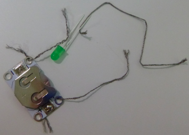
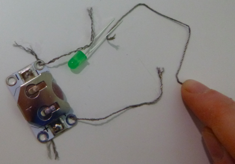
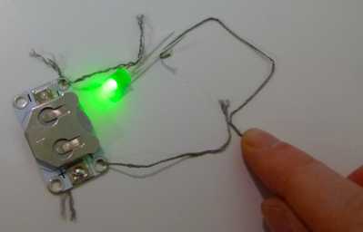
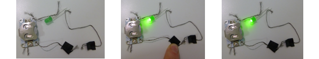

## Add a switch

What if you want to turn your circuit off? To do this, you need a break somewhere in the circuit to stop the electricity from flowing. A **switch** is a component that allows you to turn a circuit off and on easily. There are lots of different types of switches: buttons, sliders, even magnetic or tilting ones. Some battery holders even have a built-in switch. 

+ On your circuit, detach the thread from the **+** hole of the battery holder. Take a new piece of thread and put one end of the new piece through the the **+** hole where the other thread just was. You might need to team up with a third person here, for some extra hands! Otherwise you can always use tape, or use crocodile clips instead of thread.

+ If you have a ready-made switch, hold the other end of the new thread to one end of it. Then take the thread you removed from the battery holder (it should still be attached to the LED) and hold it to the other end of the switch. Now you can use the switch to turn the LED off and on!

--- collapse ---
---
title: Which way around should the switch go?
---

+ Notice there is no positive or negative side on a switch. This means it doesn't matter which way around the switch sits.

--- /collapse ---

+ If you don't have a switch, you can make one very easily. Take the two loose ends of thread in your circuit and hold them together to make your LED light up. When you separate them, it turns off again. You have just created a simple switch! 

--- collapse ---
---
title: How does it work?
---

As you've seen, electricity flows all the way around the circuit to make the LED light up. For the electricity to flow, there needs to be a connection between each component in the circuit. 

When you separate the two threads, you have broken the connection between them, so the electricity can no longer flow.

When you make the threads touch, they are connected and the electricity is able to flow once more. 

I've put tape near the end of each thread so you can more easily see where the break is in the circuit. This will be the switch. Here it is in action:

In a ready-made switch, the part where the connection gets broken and reconnected is usually hidden inside so you can't see it. Now you know what is really happening when you switch something on or off! 

--- /collapse ---

Different types of switches work by breaking the circuit in different ways. You can use a switch in your wearables projects to give you control over when the circuit is on or off.
