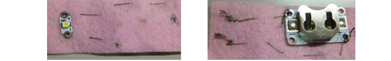

## Complete a wearable circuit

By now you have needle and thread coming out of the felt where the LED has been attached. Imagine a line between this spot and the spot you marked for the **-** of the battery holder. If it helps, you could draw the line on the felt. You will sew a **running stitch** along this line to connect the LED to the battery holder. 

+ Place the tip of the needle on the line about 1cm away from where the thread is coming out of the felt and push it through, pulling the needle and thread all the way through as before. Then repeat this on the other side of the felt. Keep doing this until you reach the spot you marked for the **-** hole of the battery holder.

+ Next, put your battery holder into place on the felt. Then, just like you did for the LED, attach the battery holder by sewing three stitches through the **-** hole. Remember to make sure they are good and tight!

+ To finish, sew about three tiny stitches right next to where you attached the battery holder, all in the same place. This will secure the end of the thread to stop your work unravelling.

+ Cut the thread so that only a tiny bit is hanging out of the felt. 
  
--- collapse ---
---
title: Watch a video of the last bit
---

Here is a video showing you how to finish the sewing: [dojo.soy/wear-finishing](http://dojo.soy/wear-finishing){:target="_blank"} 

--- /collapse ---

 

You now have half of your circuit sewn. 

+ To complete the circuit, you need to connect the **+** hole on the LED with the **+** hole on the battery holder. Use the same method you already used to connect the **negatives**. I am not including a switch in this circuit, but you could if you wanted, using a third piece of thread as before.

  **Important!** Make sure the path for your **positive** thread **does not cross or touch** the **negative** thread or any edges of the battery holder anywhere. Remember, this would cause a **short circuit** (a bad thing)!

 
+ Insert a battery into the battery holder and watch your LED light up ☺︎

### Making the badge

+ If you are attaching a pin to your badge, it is a good idea to put it onto a separate piece of felt that you attach to the back of your badge. This ensures the pin does not touch any part of your circuit—since the pin is metal that would cause a short circuit. Use ordinary ordinary thread for the extra sewing—or you could use glue or tape instead. 

  
 
10. If you like, you could cover the battery holder with an extra piece of felt too. You can also decorate your badge with different coloured felt or thread. Covering the LED with felt will give it a soft glow. You design your own fashion!

11. Congratulations! Your badge is done and you have sewn a complete wearable circuit. The following extra Sushi Cards show you how to add more LEDs and are optional.