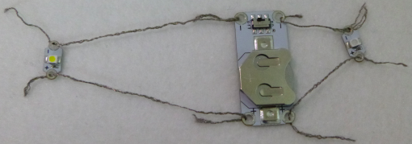
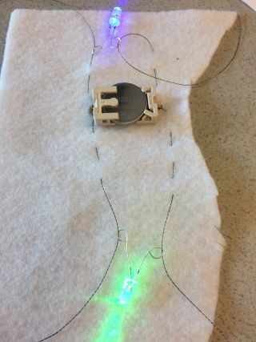

## Add more LEDs

Adding more LEDs to a circuit is easy! You don't need any additional batteries. 
 
**Note**: the LEDs must be of the same type, either all sewable or all non-sewable. It works best with sewable LEDs, as you can connect many more of them to the same battery without the power being reduced.
 
You will connect the LEDs in **parallel**. There are two ways to do this.

### Method 1

One option is to connect the LED directly to the battery, just like the first LED. It is ok to use the same holes more than once on the battery holder - the only limit is how much thread you can fit through! The example circuit in the picture hasn't been sewn onto anything, so you can see the threads clearly:

### Method 2

Another option is to attach the new LED to the LED that's already in your circuit, instead of to the battery. You match up the **+** to the **+** and the **-** to the **-** as you would if you were connecting it to a battery. In the below example, the same two long pieces of thread are used for both LEDs. You could also use separate pieces of thread for each LED.

 
--- collapse ---
---
title: Which method should I choose?
---

Deciding which method to use depends on where you want to put the new LED. 

+ The best place to connect it is usually whichever is closer.

+ You also need to make sure all the different threads are kept separate and don't cross over or touch, so it is a good idea to look at where the **+**'s and **-**'s are when you pick a method and a place for the LED.

--- /collapse ---

+ Decide where on your badge you want to put your next LED, and mark the place.

+ Pop the battery out of the battery holder for now. When working on a circuit, it is important to always make sure is is not **live** by switching it off or taking out the battery!

+ You will sew the LED on and connect it to either the battery holder or the LED you already attached - whichever is easier.

+ Holding the LED in place, use a needle and a new piece of conductive thread to secure the **-** hole of the LED like you did the first time.

+ The next step is the running stitch. If you are connecting the LED to the other LED, then this time the stitches will go in a line towards the **-** hole of the other LED, instead of to the battery holder. Once you reach the correct hole, make three stitches through it, and three tiny stitches to finish, exactly as you have done before.

+ Now connect the **+** hole of the new LED using the same method.

In this picture, the second LED is connected directly to the battery:

Below, a second LED has been connected to the first LED, which is in turn connected to the battery (the battery is at the back of the fabric).

