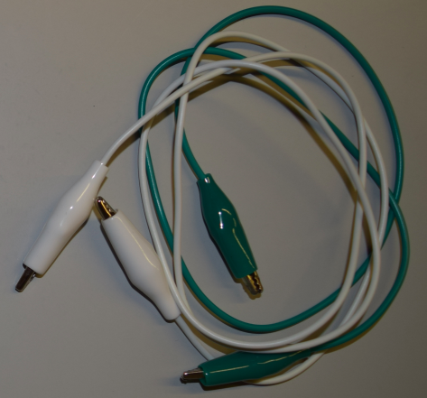

## Qué necesitarás

### Hardware

Las diferentes partes de un circuito electrónico se denominan **componentes**. Aquí hay una lista de los componentes que usarás:

+ Una batería 

+ LEDs. Estas son luces pequeñas que vienen en diferentes colores y algunas de ellas incluso parpadean o cambian de color. You can also get special sewable LEDs. ¡Para este proyecto, puedes usar cualquier tipo de LED!

+ Un soporte de batería que puedas coser. Este es un soporte de batería que está conectado a una placa especial (llamada **placa de circuito impreso** o **PCB**) que puedas coser a tu proyecto.

Nota: el soporte de la batería puede verse diferente de los que se muestran arriba.

+ Cable conductor. Esto es como hilo de bordar, pero contiene metal para que la electricidad pueda fluir a través de él. We say that it **conducts** electricity.

+ Pinzas de cocodrilo (opcional)

+ Un interruptor (opcional). Verás que hay muchos tipos diferentes de interruptores.

### Otros elementos

+ Un poco de tela para coser los componentes. Esto podría ser una prenda de ropa o una bolsa o cualquier cosa que desees. Usaré fieltro artesanal regular.

+ Una aguja de coser, p. Ej. Aguja de bordar

+ Tijeras

+ Cinta eléctrica o cinta de enmascarar, o cualquier otra cinta extraíble

+ Un pin de seguridad o cualquier tipo de pin de insignia

#### Opcional

+ Hilo de bordar regular (o cualquier otro tipo de hilo)

+ Alicates (preferiblemente de punta redonda)
 
