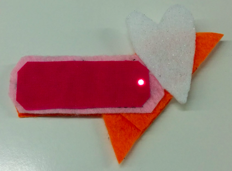

## Introducción

Estas tarjetas de Sushi te presentarán la electrónica portátil. Estos son circuitos electrónicos que puedes hacer usando piezas especialmente diseñadas para crear prendas y accesorios que se vean increíbles.

Llegarás a aprender a crear circuitos electrónicos, y también coserás un poco.

Puedes usar dispositivos electrónicos portátiles para decorar ropa, bolsos, sombreros, cualquier cosa: ¡las posibilidades son ilimitadas!

### Lo que harás

You are going to make a felt badge or patch that lights up!

También verás cómo puedes diseñar la insignia de modo que puedes unir muchos de ellos y hacer un mosaico brillante. ¡Esto podría ser una actividad divertida para hacer junto con otros Ninjas!

--- collapse ---
---
title: Lo que vas a aprender
---

+ Los fundamentos de los componentes del circuito y los conceptos involucrados en **positivo/+** y **menos/-**
+ Making a simple LED circuit
+ Cómo funciona un interruptor y cómo usar uno en un circuito
+ Usar hilo conductor y componentes (piezas) que puedas coser para hacer un circuito portátil
+ Habilidades básicas de costura
+ Agregar múltiples LEDs a un circuito
+ Cómo hacer un circuito portátil que se divida en componentes desmontables

--- /collapse ---

--- collapse ---
---
title: Lo que necesitas
---

### Hardware

The different parts of an electronic circuit are called **components**. Aquí hay una lista de los componentes que usarás:

+ Una batería 

+ LEDs. Estas son luces pequeñas que vienen en diferentes colores y algunas de ellas incluso parpadean o cambian de color. También puede conseguir LEDs especiales que puedas coser. ¡Para este proyecto, puedes usar cualquier tipo de LED!

+ Un soporte de batería que puedas coser. This is a battery holder that's attached to a special board (called a **printed circuit board** or **PCB**) that you can sew onto your project.

Nota: el soporte de la batería puede verse diferente de los que se muestran arriba.

+ Cable conductor. Esto es como hilo de bordar, pero contiene metal para que la electricidad pueda fluir a través de él. Decimos que **conduce ** electricidad.

+ Pinzas de cocodrilo (opcional)

+ Un interruptor (opcional). Verás que hay muchos tipos diferentes de interruptores.

### Otros elementos

+ Un poco de tela para coser los componentes. Esto podría ser una prenda de ropa o una bolsa o cualquier cosa que desees. Usaré fieltro artesanal regular.

+ Una aguja de coser, p. Ej. Aguja de bordar

+ Scissors

+ Tape-electrical or masking tape, or any other removable tape

+ A safety pin or any kind of badge pin

#### Optional

+ Regular embroidery thread (or any other kind of thread)

+ Pliers (preferably round-nosed)

--- /collapse ---