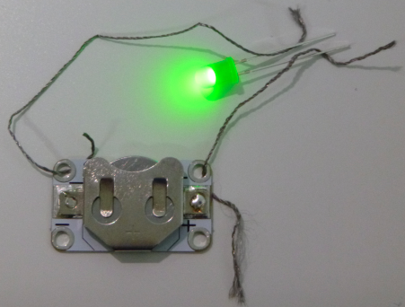

## Crear un circuito

¡Creemos tu primer circuito!

+ Toma un LED normal (uno con dos patas en lugar de uno que puedas coser) y conéctelo a una batería sosteniendo ambas patas a la batería, una a cada lado. Ten en cuenta que una de las patas del LED es más larga que la otra. El más largo debe estar conectado al lado de la batería marcado con un signo más **+**. ¡Mira cómo se enciende tu LED!

--- collapse ---
---
title: Mi LED no se encendió
---

+ Si no funcionó, verifica que las patas estén en la dirección correcta.

--- /collapse ---

+ Una vez que haya encendido el LED, intenta voltear la batería para que las patas estén conectadas al revés, con la más corta en el `+` lado de la batería. ¿Todavía funciona?

--- collapse ---
---
titulo: ¿Cómo funciona?
---

En cada circuito, hay un polo **positivo** o **+** y uno **negativo** o **-**.

Para que fluya la electricidad, debes hacer coincidir el **+** con el **+** y el **-** con el **-** entre tus componentes. Este es el motivo por el que el LED no se enciende cuando volteas la batería.

--- /collapse ---

--- collapse ---
---
title: Identificando + y - en diferentes LEDs
---

+ En el LED, la pata más larga es **+** y el pin más corto es **-**. También puedes identificar **-** mirando de cerca la bombilla: es el lado con el borde plano.

+ Un LED que puedes coser está integrado en una pequeña **placa de circuito impreso**, por lo que tiene agujeros en lugar de patas. Los agujeros están marcados con símbolos de **+** y **-**.

--- /collapse ---

+ Separa el LED y la batería, y coloca la batería en un soporte de batería, con el **+** hacia arriba (el soporte también tendrá una marca que indique su lado **+**).

+ Obtén dos piezas de hilo conductor y forma un equipo con el Ninja a tu lado para que puedan ayudarse mutuamente a mantener las cosas en su lugar.

+ Inserte un extremo del primer hilo a través del orificio **+** del soporte de la batería, asegurándose de que toque el metal, y sostenga el otro extremo a la pata **positiva** del LED. Puedes usar cinta si es necesario, aunque esto desgastará mucho el hilo. Si tienes pinzas de cocodrilo, puedes usarlas en lugar de hilo.

+ Ahora toma el segundo hilo. Inserte el extremo a través del orificio **-** del soporte de la batería y sostenga el otro extremo a la pata **negativa** del LED.

+ Asegúrate de que los dos hilos no se toquen o crucen en ningún punto. Si se cruzan, esto provocará un **corto** en el circuito y no funcionará correctamente.

--- collapse ---
---
title: ¿Qué es un corto?
---

+ Cuando tienes un **cortocircuito**, la electricidad recorre un circuito más corto, omitiendo algunos de los componentes y es por eso deja de funcionar.

--- /collapse ---

¡Ahora tienes un circuito y estás listo para hacer que tu insignia brille!
