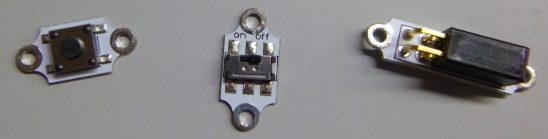
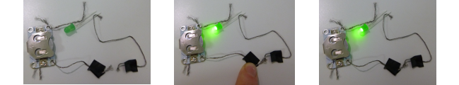

## Agregar un interruptor

¿Qué pasa si quieres apagar tu circuito? Para hacer esto, necesitas una interrupción en algún lugar del circuito para detener el flujo de electricidad. Un **interruptor** es un componente que permite apagar y encender un circuito fácilmente. Hay muchos tipos diferentes de interruptores: botones, controles deslizantes, incluso magnéticos o inclinables. Algunos soportes de batería incluso tienen un interruptor incorporado.

+ En tu circuito, desconecta el hilo del orificio **+** del soporte de la batería. Tome una nueva pieza de hilo y coloque un extremo de la nueva pieza a través del orificio **+** donde estaba el otro hilo. ¡Es posible que debas formar un equipo con una tercera persona aquí, para obtener algunas manos adicionales! De lo contrario, siempre puede usar cinta o pinzas de cocodrilo en lugar de hilo.

+ Si tienes un interruptor ya hecho, sostén el otro extremo del nuevo hilo en uno de sus extremos. Luego toma el hilo que retiró del soporte de la batería (aún debe estar conectado al LED) y sosténgalo en el otro extremo del interruptor. ¡Ahora puedes usar el interruptor para apagar y encender el LED!

--- collapse ---
---
title: ¿En qué dirección debería ir el interruptor?
---

+ Observa que no hay un lado positivo o negativo en un interruptor. Esto significa que no importa en qué dirección se encuentra el interruptor.

--- /collapse ---

+ Si no tienes un interruptor, puedes hacer uno muy fácilmente. Tome los dos extremos sueltos del hilo en su circuito y manténgalos juntos para que su LED se ilumine. Cuando los separas, se apaga nuevamente. ¡Acabas de crear un interruptor simple!

  

--- collapse ---
---
title: ¿Cómo funciona?
---

Como has visto, la electricidad fluye todo el camino alrededor del circuito para encender el LED. Para que la electricidad fluya, debe haber una conexión entre cada componente en el circuito.

Cuando separas los dos hilos, habrás roto la conexión entre ellos, por lo que la electricidad ya no puede fluir.

Cuando haces que los hilos se toquen, están conectados y la electricidad puede fluir una vez más.

He colocado cinta adhesiva cerca del final de cada hilo para que pueda ver más fácilmente dónde está la ruptura en el circuito. Este será el interruptor. Aquí está en acción:

En un interruptor listo para usar, la parte donde la conexión se rompe y se vuelve a conectar suele estar oculta en su interior, por lo que no puedes verla. ¡Ahora sabes lo que realmente sucede cuando enciendes o apagas algo!

--- /collapse ---

Los diferentes tipos de interruptores funcionan al romper el circuito de diferentes maneras. Puedes usar un interruptor en tus proyectos portátiles para que puedas controlar cuándo el circuito este encendido o apagado.
