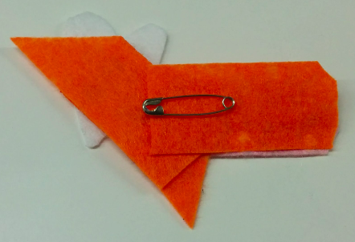

## Completa tu circuito portátil

En este momento, tienes aguja e hilo saliendo del fieltro donde se ha fijado el LED. Imagine una línea entre este lugar y el lugar que marcó para el agujero **-** del soporte de la batería. Si ayuda, puedes dibujar una línea en el fieltro. Coserás una **puntada continua** a lo largo de esta línea para conectar el LED al soporte de la batería.

+ Coloca la punta de la aguja en la línea, aproximadamente a 1 cm de distancia de donde sale el hilo del fieltro, y empújala. Tira de la aguja y pasa el hilo por la parte delantera. Luego repite esto en el otro lado del fieltro. Sigue haciendo esto en pasos de 1 cm de ancho hasta llegar al lugar que marcó para el orificio **-** del soporte de la batería.

+ Después, coloca el soporte de la batería en su lugar sobre el fieltro. Luego, tal como lo hizo para el LED, conecta el soporte de la batería cosiendo tres puntos a través de el orificio **-**. ¡Recuerda asegurarte de que están bien hechos y ajustados!

+ Para terminar, cose tres pequeñas puntadas justo al lado de donde fijaste el soporte de la batería, todo en el mismo lugar. Esto asegurará el final del hilo y evitará que tu trabajo se descosa.

+ Corta el hilo de modo que solo un poquito sobresalga del fieltro.

--- collapse ---
---
title: Mira un vídeo de la última parte
---

Aquí hay un vídeo que muestra cómo terminar esta parte de la costura: [dojo.soy/wear-finishing](http://dojo.soy/wear-finishing) {:target="_blank"}

--- /collapse ---

 

Ahora tienes la mitad de tu circuito cosido.

+ Para completar el circuito, debes conectar el orificio **+** del LED con el orificio **+** del soporte de la batería. Haz esto de la misma manera en la que acabas de conectar los **negativos**. No estoy incluyendo un interruptor en este circuito, pero podrías incluirlo si lo deseas, utilizando un tercer hilo como antes.

  **¡Importante!** Asegúrate de que el patrón para tu **hilo**+** no se cruce/toque con **el hilo**-** o con cualquiera de los bordes del soporte de la batería en cualquier lugar. ¡Recuerda, esto causaría un **cortocircuito** (algo realmente malo)!

+ ¡Inserte una batería en el soporte de la batería y observa cómo tu LED se enciende!

### Haciendo la insignia

+ ¡Es hora de ser creativo! Decora tu insignia a tu gusto utilizando fieltro o hilo de diferentes colores, o cualquier otro material que tengas. Cubrir el LED con fieltro le dará un brillo más suave.

+ Si estás colocando un imperdible en tu insignia, es una buena idea colocarlo en un trozo de fieltro aparte que puedas fijar a la parte posterior de su insignia. Esto asegura que el imperdible no toque ninguna parte de tu circuito, ya que el imperdible es de metal, lo que provocaría un cortocircuito. Usa hilo ordinario para la costura adicional, pegamento o cinta en su lugar.

¡Felicidades! Tu insignia está lista y has cosido un circuito portátil completo. Las siguientes tarjetas de sushi te muestran cómo agregar más LEDs y son opcionales.
