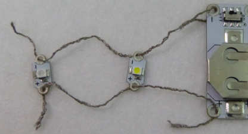

## Agrega más LEDs

¡Agregar más LEDs a tu circuito es fácil y no necesitan baterías adicionales!

**Nota**: los LEDs en tu circuito deben ser del mismo tipo, todos deben ser LEDs que puedas coser o LEDs que no puedas coser. Sin embargo, funcionará mejor con LEDs que puedas coser, ya que puedes conectar muchos más a la misma batería sin que se reduzca la energía.

+ Saca la batería del soporte por ahora. ¡Cuando se trabaja en un circuito, es importante asegurarse siempre de que no esté **prendido** apagándolo o sacando la batería!

+ Decide en qué parte de tu insignia deseas colocar tu próximo LED y marca el lugar.

Conectarás los LEDs en **paralelo**. Hay dos maneras de hacer esto.

### Método 1

Una opción es conectar el LED directamente a la batería, al igual que el primer LED. Está bien usar los mismos orificios en el soporte de la batería más de una vez: ¡el único límite es la cantidad de hilo que puedes pasar! El circuito de ejemplo en la imagen no se ha cosido a nada, por lo que se pueden ver los hilos claramente:

### Método 2

Otra opción es conectar el nuevo LED al LED que ya está en tu circuito, en lugar de la batería. Empareja el **+** al **+** y el **-** al **-** como lo harías si lo estuvieras conectando a una batería. En el ejemplo a continuación, se utilizan los mismos dos trozos largos de hilo para ambos LEDs. También puedes usar piezas separadas de hilo para cada LED.

--- collapse ---
---
title: ¿Qué método debo elegir?
---

¡Decide si conectar el LED al soporte de la batería o al otro LED depende de dónde desees colocar el nuevo LED!

+ Por lo general, elegirás el componente que esté más cerca del lugar que eligió para su segundo LED.

+ También debes asegurarte de que todos los hilos diferentes se mantengan separados y no se crucen ni se toquen, por lo que es una buena idea mirar dónde está el **+** y el **-** de sus componentes cuando elija un método y un lugar para el LED.

--- /collapse ---

+ Sosteniendo el LED en su lugar, use una aguja y una nueva pieza de hilo conductor para asegurar el orificio **-** del LED como lo hizo para el primero que cosió.

+ El siguiente paso es la puntada continua. Si estás conectando el LED al otro LED, esta vez las puntadas irán en línea hacia el orificio **-** del otro LED, en lugar de ir en el soporte de la batería. Una vez que llegue al orificio correcto, haga tres puntos a través de él y tres pequeños puntos para terminar, exactamente como lo hizo antes.

+ Ahora conecta el orificio **+** del nuevo LED utilizando el mismo método.

En esta foto, el segundo LED está conectado directamente a la batería:

En la siguiente foto, se ha conectado un segundo LED al primer LED, que a su vez está conectado a la batería (la batería está en la parte posterior de la tela):

