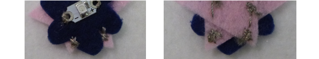

## Crea piezas desmontables

¡También puedes extender tu circuito de tu insignia para que se puedan unir piezas separadas de fieltro con sus propios LEDs (del mismo tipo) para que se iluminen!

Primero necesitarás otra insignia. Esta no tendrá una batería propia. Pero, sin una batería, ¿dónde irán los hilos?

+ Cuando cosas tu LED en esta nueva insignia, realiza las puntadas hasta el borde del fieltro o cerca del borde. Recuerda mantener los hilos **positivos** y **negativos** separados uno del otro!

+ Luego cose varias puntadas medianas una al lado de la otra o entrecruzadas una sobre la otra. Debes hacer que se vea como una "gota" de hilo conductor en el fieltro.

+ Termina la costura normalmente haciendo tres puntos pequeños en un punto antes de cortar el hilo.

+ Una vez que tengas una gota para el **negativo**, y una gota para el lado **positivo**, la nueva insignia está lista. Si lo deseas, puede repetir estos pasos para extender el circuito a otro par de gotas en el borde opuesto de la nueva insignia, de esta manera:

+ Ahora solo necesitas extender el circuito en la insignia principal (la que tiene la batería). Recuerda retirar primero la batería del soporte.

+ Decide dónde quieres que se unan las insignias. En este punto, coserás puntadas desde el LED en la placa principal, así que asegúrate de poder trazar una línea desde el **+** a la gota **positiva** y desde el **-** a la gota **negativa** sin cruzar las líneas.

+ Marca dos puntos en la insignia principal donde el **positivo** y el **negativo** de las gotas lo tocan. Vas a coser gotas coincidentes aquí para que se conecten. Puedes poner la nueva insignia a un lado para el siguiente paso.

+ Tomando un hilo nuevo y la insignia principal, cose un montón de puntadas en el lugar que marcaste para la gota **negativa**. Luego, cose una puntada continua hasta el LED en esta placa y asegúrala al orificio **-**. Repite este proceso para hacer una gota **positiva** que esté conectada al orificio **+** del mismo LED. Cuando acabes deberá verse así:

¡Tus insignias están listas para unirse!

+ Vuelve a colocar la batería en su soporte. Coloca la nueva insignia en la insignia principal para que las gotas se toquen entre sí. Recuerda hacer coincidir **+** a **+** y **-** a **-**. ¡Deberías ver que la nueva insignia se ilumina de repente!

 

--- challenge ---

## Desafío: Crea un interruptor simple

+ Puedes utilizar esta técnica para hacer un interruptor simple en tu proyecto. Por ejemplo, pon una gota **positiva** a cada uno de los extremos de un brazalete, de forma que los dos entren en contacto cuando lo cierras.

--- /challenge ---

***
Este proyecto fue traducido por voluntarios:

Luisa Fernanda Chavez

Rosemary Saravia

Daniela Flores Martell

Verónica Valencia Límaco

Gracias a los voluntarios, podemos dar a las personas de todo el mundo la oportunidad de aprender en su propio idioma. Puedes ayudarnos a llegar a más personas ofreciéndote como voluntario para traducir. Más información en [rpf.io/translate](https://rpf.io/translate).