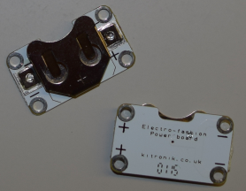

## Introduction

Ces cartes Sushi t'initieront à l'électronique portable. Ce sont des circuits électroniques que tu peux créer à l'aide de pièces spécialement conçues pour créer des vêtements et des accessoires étonnants.

Tu apprendras et réaliseras des circuits électroniques, et tu feras également de la couture.

Tu peux utiliser des appareils électroniques portables pour décorer des vêtements, des sacs, des chapeaux, n'importe quoi - les possibilités sont illimitées !

### Ce que tu feras

Tu vas faire un insigne ou un écusson en feutre qui s'illumine !

Tu verras également comment tu peux concevoir l'insigne afin de pouvoir en joindre un grand nombre pour créer un patchwork éclatant. Cela pourrait être amusant à faire avec d'autres Ninjas !

--- collapse ---
---
title: Ce que tu vas apprendre
---

+ Les bases des composants de circuit et les concepts impliqués dans **positif / +** et **négatif / -**
+ Créer un circuit LED simple
+ Comment fonctionne un commutateur et comment en utiliser un dans un circuit
+ Utiliser de fils conducteurs et de composants (pièces) à coudre pour créer un circuit portable
+ Compétences de base en couture
+ Ajouter plusieurs LED à un circuit
+ Comment créer un circuit portable divisé en composants détachables

--- /collapse ---

--- collapse ---
---
title: Ce dont tu as besoin
---

### Matériel informatique

Les différentes parties d'un circuit électronique sont appelées **composants**. Voici une liste des composants que tu utiliseras :

+ Une pile 

+ Des LED. Ce sont de petites lumières de différentes couleurs, et certaines d'entre elles peuvent même clignoter ou changer de couleur. Tu peux également obtenir des LED cousues spéciales. Pour ce projet, tu peux utiliser n'importe quel type de LED !

+ Un support de pile à coudre. Il s'agit d'un support de pile fixé à une carte spéciale (appelée **carte de circuit imprimé** ou **PCB**) que tu peux coudre sur ton projet.

Remarque : ton support de pile peut être différent de ceux illustrés ci-dessus.

+ Fil conducteur. C'est comme du fil à broder, mais il contient du métal pour que l'électricité puisse y circuler. On dit qu'il **conduit** électricité.

+ Pinces crocodiles (facultatif)

+ Un commutateur (en option). Tu verras qu'il existe de nombreux types de commutateurs.

### Autres éléments

+ Du tissu sur lequel coudre les composants. Cela peut être un vêtement ou un sac ou tout ce que tu aimes. J'utiliserai du feutre artisanal ordinaire.

+ Une aiguille à coudre, p.ex. une aiguille à broder

+ Des ciseaux

+ Ruban adhésif électrique ou de masquage, ou tout autre ruban amovible

+ Une épingle de sécurité ou tout type d'épingle d'insigne

#### Facultatif

+ Fil à broder ordinaire (ou tout autre type de fil)

+ Pinces (de préférence à bec rond)

--- /collapse ---