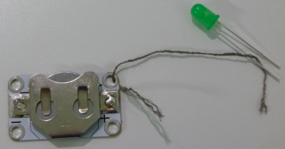

## Créer un circuit

Créons ton premier circuit !

+ Prends une LED ordinaire (une avec deux pattes plutôt qu'une cousable) et connecte-la à une pile en tenant les deux pattes à la pile, une de chaque côté. Note que l'une des pattes de la LED est plus longue que l'autre. La plus longue doit être connecté au côté de la pile marqué d'un signe plus **+**. Regarde ta LED s'allumer !

--- collapse ---
---
title: Ma LED ne s'est pas allumée
---

+ Si cela n'a pas fonctionné, vérifie que les pattes sont dans le bon sens.

--- /collapse ---

+ Une fois que la LED est allumée, essaie de retourner la pile pour que les pattes soient connectés dans le mauvais sens, avec le plus court sur le côté `+` de la pile. Est-ce que çà fonctionne encore ?

--- collapse ---
---
title: Comment ça marche
---

Dans chaque circuit, il y a une borne **positive** ou **+** et **négative** ou **-**.

Pour que l'électricité circule, tu dois faire correspondre le **+** à **+** et le **-** à **-** entre tes composants. C'est pourquoi la LED ne s'allume pas lorsque tu retournes la pile.

--- /collapse ---

--- collapse ---
---
title: Identifier + et - sur différentes LED
---

+ Sur la LED, la patte la plus longue est **+** et la plus courte est **-**. Tu peux également identifier **-** en regardant de près l'ampoule : c'est le côté avec le bord plat.

+ Une LED cousable est construite sur une minuscule **carte de circuit imprimé**, elle a donc des trous au lieu de pattes. Les trous sont marqués du signe **+** et **-**.

--- /collapse ---

+ Sépare la LED et la pile et insère la pile dans un support de pile, avec le **+** vers le haut (le support aura une marque pour montrer également son côté **+**).

+ Procure-toi deux morceaux de fil conducteur et fais équipe avec le Ninja à côté de toi, afin que vous puissiez vous entraider à maintenir les choses en place.

+ Place une extrémité du premier fil dans le trou **+** du support de pile, en t'assurant qu'il touche le métal, et maintiens l'autre extrémité sur les **pattes positives** de la LED. Tu peux utiliser du ruban adhésif si tu en as besoin, même si cela effilochera beaucoup le fil. Si tu as des pinces crocodiles, tu peux les utiliser à la place du fil.

+ Maintenant, prends le deuxième fil. Place une extrémité par l'intermédiaire du trou du support de pile **-**, et maintiens l'autre extrémité à la patte **négative** de la LED.

+ Assure-toi que les deux fils ne se touchent ou ne se croisent à aucun moment. S'ils le font, cela provoquera un **court-circuit** dans ton circuit et cela ne fonctionnera pas correctement.

--- collapse ---
---
title: Qu'est-ce qu'un court-circuit ?
---

+ Lorsque tu as un **court-circuit**, l'électricité passe un chemin plus court dans le circuit, sautant certains composants, et c'est pourquoi il cesse de fonctionner.

--- /collapse ---

Tu as maintenant un circuit et tu es prêt à faire un insigne lumineux !
