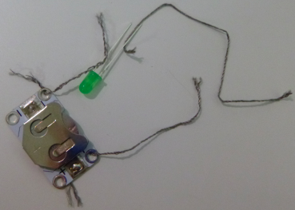

## Ajouter un commutateur

Et si tu souhaites désactiver ton circuit ? Pour faire cela, tu as besoin d'une coupure quelque part dans le circuit pour empêcher l'électricité de circuler. Un **commutateur** est un composant qui te permet d'éteindre et de rallumer facilement un circuit. Il existe de nombreux types de commutateurs : boutons, curseurs, même magnétiques ou inclinables. Certains supports de pile ont même un commutateur intégré.

+ Sur ton circuit, détache le fil du trou **+** du support de pile. Prends un nouveau morceau de fil et place une extrémité de la nouvelle pièce dans le trou **+** où se trouvait l'autre fil. Tu devras peut-être faire équipe avec une troisième personne ici, pour avoir quelques mains supplémentaires ! Sinon, tu peux toujours utiliser du ruban adhésif ou utiliser des pinces crocodiles au lieu du fil.

+ Si tu as un commutateur prêt à l'emploi, maintiens l'autre extrémité du nouveau fil à une extrémité de celui-ci. Ensuite, prends le fil que tu as retiré du support de pile (il doit toujours être attaché à la LED) et maintiens-le à l'autre extrémité du commutateur. Tu peux maintenant utiliser le commutateur pour éteindre et allumer la LED !

--- collapse ---
---
title: Dans quel sens le commutateur doit-il aller ?
---

+ Note qu'il n'y a pas de côté positif ou négatif sur un commutateur. Cela signifie que le sens du commutateur n'a pas d'importance.

--- /collapse ---

+ Si tu n'as pas de commutateur, tu peux en créer un très facilement. Prends les deux extrémités de fil libres de ton circuit et maintiens-les ensemble pour que ta LED s'allume. Lorsque tu les sépares, elle s'éteint à nouveau. Tu viens de créer un commutateur simple !

  

--- collapse ---
---
title: Comment ça marche ?
---

Comme tu l'as vu, l'électricité circule tout autour du circuit pour que la LED s'allume. Pour que l'électricité circule, il doit y avoir une connexion entre chaque composant du circuit.

Lorsque tu sépares les deux fils, tu as interrompu la connexion entre eux, de sorte que l'électricité ne peut plus circuler.

Lorsque tu fais toucher les fils, ils sont connectés et l'électricité peut circuler à nouveau.

J'ai mis du ruban adhésif près de l'extrémité de chaque fil afin que tu puisses voir plus facilement où se trouve la coupure dans le circuit. Ce sera le commutateur. Le voici en action :

Dans un commutateur prêt à l'emploi, la partie où la connexion est interrompue et reconnectée est généralement cachée à l'intérieur afin que tu ne puisses pas la voir. Tu sais maintenant ce qui se passe réellement lorsque tu actives ou désactives quelque chose !

--- /collapse ---

Différents types de commutateurs fonctionnent en coupant le circuit de différentes manières. Tu peux utiliser un commutateur dans tes projets d'objets portatifs pour te donner le contrôle du moment où le circuit est activé ou désactivé.
