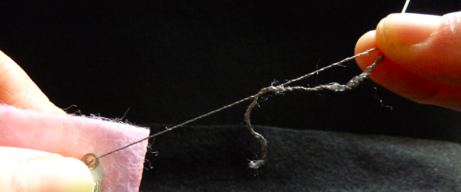

## Coudre des composants

+ Découpe un morceau de feutre à la taille que tu souhaites pour ton insigne. Décide où tu vas placer la LED et marque l'endroit sur le feutre. Décide maintenant où placer ton support de pile. Ça pourrait être sur le dos ! Marque l'endroit pour l'un des trous positifs et l'un des trous négatifs avec un **+** et **-**.

+ Si tu utilises une LED ordinaire, tu devras plier les broches en boucles. Les pinces peuvent être utiles ici. Si tu as une LED à coudre, ignore cette étape !

 

+ Enfile ton aiguille ! Prends un morceau de fil conducteur d'environ 30 cm de long et tire une extrémité de celui-ci à travers le trou de l'aiguille (appelé **œil**). Cela peut être assez délicat. Si le fil est effiloché à l'extrémité, coupe les morceaux effilochés avec des ciseaux.

+ Une fois l'aiguille enfilée, le fil pendra en deux morceaux. Tire sur l'un d'eux pour qu'il soit un peu plus long que l'autre et fais un nœud au bout du long morceau.

Prêt à commencer à coudre ?

+ Place ta LED sur le feutre à l'endroit que tu as marqué. D'une main, tiens le feutre et la LED. De l'autre main, place la pointe de l'aiguille **derrière** le feutre et pousse-la à travers de sorte qu'elle sorte par le trou **-** de la LED.

+ Tire l'aiguille et enfile complètement à l'avant. Essaie de tenir l'aiguille par l'œil et de pincer fermement le fil pour l'empêcher de tomber de l'aiguille pendant que tu tires (si elle tombe, c'est bon, tu peux l'enfiler à nouveau). Tu veux continuer à tirer jusqu'à ce que seul le nœud reste à l'arrière.

+ Maintenant, placer la pointe de l'aiguille **à côté** du trou **-** de la LED (celui qu'il vient à travers), mais **pas à l' intérieur de** celui-ci. Comme ça :

+ Pousse l'aiguille à travers le feutre pour qu'elle sorte par l'arrière. Saisis l'aiguille derrière le feutre et tire-la complètement, comme tu l'as fait à l'avant. Tu viens de coudre ton premier point ! Ça devrait ressembler a quelque chose comme çà :

+ Répète les deux dernières étapes trois fois de plus. Assure-toi de serrer le fil à chaque fois. Cela créera un bon lien et maintiendra la LED solidement fixée au feutre.

+ Tu viens d'apprendre à attacher des composants portables. Tu y es presque !

--- collapse ---
---
title: Conseils pour la couture
---

+ C'est en forgeant qu'on devient forgeron ! Si tu n'as jamais cousu auparavant, cela peut être délicat au début. Ne t’inquiète pas, tu comprendras.

+ Cette vidéo peut être utile si tu es novice en couture : [dojo.soy/wear-stitches](http://dojo.soy/wear-stitches){:target="_blank"}

--- /collapse ---
