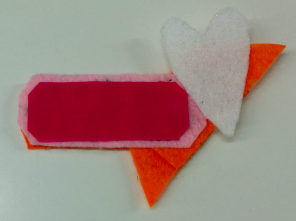

## Compléter ton circuit portable

À présent, tu as une aiguille et du fil qui sortent du feutre où la LED a été fixée. Imagine une ligne entre cet endroit et l'endroit que tu as marqué pour le trou **-** du support de la pile. Si cela aide, tu peux tracer la ligne sur le feutre. Tu coudras un **point coulé** le long de cette ligne pour relier la LED au support de pile.

+ Place la pointe de l'aiguille sur la ligne, à environ 1 cm de l'endroit où le fil sort du feutre, et pousse-la à travers. Tire l'aiguille et enfile complètement comme avant. Ensuite, répète ceci de l'autre côté du feutre. Continue à le faire dans les étapes de 1 cm de large jusqu'à l'endroit que tu as marqué pour le trou **-** du support de la pile.

+ Ensuite, mets ton support de pile en place sur le feutre. Alors, comme tu l'as fait pour la LED, attache le support de pile en cousant trois points à travers le trou **-**. N'oublie pas de t'assurer qu'ils sont bien fixés et serrés !

+ Pour finir, couds trois petits points juste à côté de l'endroit où tu as fixé le support de pile, tous au même endroit. Cela sécurisera l'extrémité du fil et empêchera ton travail de s’effilocher.

+ Coupe le fil de sorte que seul un tout petit morceau dépasse du feutre.

--- collapse ---
---
title: Regarde une vidéo de la dernière partie
---

Voici une vidéo te montrant comment terminer cette partie de la couture : [dojo.soy/wear-finishing](http://dojo.soy/wear-finishing){:target="_blank"}

--- /collapse ---

 

Tu as maintenant la moitié de ton circuit cousu.

+ Pour terminer le circuit, tu dois connecter le trou **+** sur la LED avec le trou **+** sur le support de pile. Fais ceci de la même manière que tu viens de connecter les **négatifs**. Je n'inclus pas de commutateur dans ce circuit, mais tu pourrais si te le souhaite, en utilisant un troisième morceau de fil comme avant.

  **Important !** Assure-toi que le chemin pour ton fil **+** **ne croise pas / ne touche pas** le fil **-** ou tout autre bord du support de pile. N'oublie pas que cela provoquerait un **court-circuit** (une mauvaise chose) !

+ Insère une pile dans le support de pile et regarde ta LED s'allumer !

### Créer l'insigne

+ Il est temps de faire preuve de créativité ! Décore ton insigne comme tu le souhaites avec du feutre ou du fil de couleur différente, ou tout autre matériau dont tu disposes. Couvrir la LED avec du feutre lui donnera une lueur plus douce.

+ Si tu attaches une épingle à ton insigne, il est judicieux de la placer sur un morceau de feutre séparé que tu attaches au dos de ton insigne. Cela garantit que la broche ne touche aucune partie de ton circuit - puisque la broche est en métal, cela provoquerait un court-circuit. Utilise du fil ordinaire pour la couture supplémentaire, ou de la colle ou du ruban adhésif à la place.

Félicitations ! Ton insigne est terminé et tu as cousu un circuit portable complet. Les prochaines cartes Sushi te montrent comment ajouter plus de LED, et elles sont facultatives.
