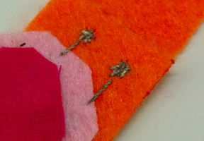
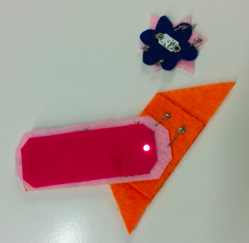

## Créer des pièces détachables

Tu peux également prolonger ton circuit d'insignes afin que des morceaux de feutre séparés avec leurs propres LED (du même type) puissent s'y joindre pour les faire s'allumer !

Tu auras d'abord besoin d'un autre insigne. Celui-ci n'aura pas sa propre pile. Mais sans pile, où iront les fils ?

+ Lorsque tu couds ta LED sur ce nouvel insigne, fais les points coulés jusqu'au bord du feutre, ou près du bord. N'oublie pas de garder les fils **positifs** et **négatifs** séparés l'un de l'autre !

+ Ensuite, couds plusieurs points de taille moyenne les uns à côté des autres ou en s'entrecroisant les uns sur les autres. Tu veux le faire ressembler à une « boulette » de fil conducteur sur le feutre.

+ Termine la couture normalement en faisant trois petits points en un seul endroit avant de couper le fil court.

+ Une fois que tu as une boulette pour le **négatif** et une boulette pour le **positif** côté, le nouvel insigne est prêt. Si tu le souhaites, tu peux répéter ces étapes afin d'étendre le circuit à une autre paire de boulettes sur le bord opposé du nouvel insigne, comme ceci :

+ Il ne te reste plus qu'à prolonger le circuit sur l'insigne principal (celui avec la pile). N'oublie pas de retirer d'abord la pile du support.

+ Décide où tu veux que les insignes se rejoignent. Tu couds des points à partir de la LED de l'insigne principal jusqu'à ce point, alors assure-toi de pouvoir tracer une ligne du **+** à la boulette **positive** et de la boulette **-** à la boulette **négative** sans que les lignes ne se croisent.

+ Marque deux points sur l'insigne principal où les boulettes **positives** et **négatives** le touchent. Tu vas coudre des boulettes correspondantes ici pour qu'elles se connectent. Tu peux mettre le nouvel insigne de côté pour la partie suivante.

+ En prenant un nouveau fil et l'insigne principal, couds un tas de points à l'endroit que tu as marqué pour la boulette **négative**. Ensuite, couds un point coulé jusqu'à la LED sur cet insigne et attache-le au trou **-**. Répète ce processus pour créer une boulette **positive** qui est connectée au trou **+** de la même LED. Lorsque tu as terminé, cela devrait ressembler à ceci :

Tes insignes sont prêts à être réunis !

+ Remets la pile dans son support. Place le nouvel insigne sur l'insigne principal afin que les boulettes se touchent. N'oublie pas de faire correspondre **+** à **+** et **-** à **-**. Tu devrais voir le nouvel insigne s'allumer soudainement !

 

--- challenge ---

## Défi : Créer un commutateur doux

+ Tu peux utiliser cette technique pour faire un simple commutateur doux sur ton projet. Par exemple, place une boulette **positive** à chaque extrémité d'un bracelet, afin que les deux entrent en contact lorsque tu la fermes.

--- /challenge ---

***
Ce projet a été traduit par des bénévoles:

Jonathan Vannieuwkerke

Michel Arnols

Grâce aux bénévoles, nous pouvons donner aux gens du monde entier la chance d'apprendre dans leur propre langue. Vous pouvez nous aider à atteindre plus de personnes en vous portant volontaire pour la traduction - plus d'informations sur [rpf.io/translate](https://rpf.io/translate).
