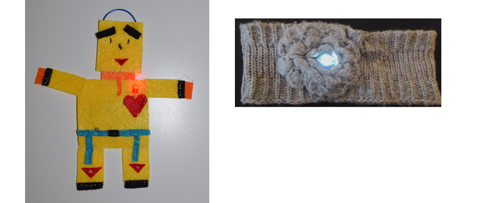

## परिचय

ये सुशी कार्ड आपको पहनने वाले इलेक्ट्रॉनिक्स से परिचित कराएंगे। ये इलेक्ट्रॉनिक सर्किट्स (electronic circuits) हैं जो आप अनोखे दिखने वाले कपड़े और सामान बनाने के लिए विशेष रूप से डिज़ाइन किए गए भागों का उपयोग कर सकते हैं।

आपको इलेक्ट्रॉनिक सर्किट्स के बारे में जानने और बनाने के लिए मिलेगा, और आप कुछ सिलाई भी करेंगे।

आप कपड़े, बैग, टोपी, कुछ भी सजाने के लिए पहनने योग्य इलेक्ट्रॉनिक्स का उपयोग कर सकते हैं - संभावनाएं असीमित हैं!

### What you will make

आप एक महसूस करने वाला पदक या पैच बनाने जा रहे हैं जो जलकर रोशनी करता है!

आप यह भी देखेंगे कि आप पदक को कैसे डिज़ाइन कर सकते हैं ताकि आप उनमें बहुत से एक साथ मिलाकर एक चमकदार पैचवर्क (patchwork) बना सकें। यह अन्य बच्चो के साथ मिलकर करने में काफी मजेदार हो सकता है!

--- collapse ---
---
title: आप क्या सीखेंगे
---

+ सर्किट पुर्ज़े (components) की मूल बातें और **सकारात्मक/+** (positive) और **माइनस/-** (minus) में शामिल अवधारणाएं
+ एक साधारण LED सर्किट बनाना
+ एक स्विच कैसे काम करता है और एक सर्किट में इसका उपयोग कैसे करें
+ पहनने योग्य सर्किट बनाने के लिए प्रवाहकीय धागे और सीवेबल पुर्ज़ों (भागों) का उपयोग करना
+ बुनियादी सिलाई की कला
+ एक सर्किट में कई LEDs जोड़ना
+ एक पहनने योग्य सर्किट कैसे बनाया जाए जो अलग-अलग भागो में भट जाएं

--- /collapse ---

--- collapse ---
---
title: आपको किन चीज़ों की आवश्यकता होगी
---

### हार्डवेयर

इलेक्ट्रॉनिक सर्किट के विभिन्न भागों को **components** (पुर्ज़े) कहा जाता है. यहां उन पुर्ज़ों की सूची दी गई है जिनका आप उपयोग करेंगे:

+ एक बैटरी 

+ LEDs. ये छोटी बत्तियां हैं जो विभिन्न रंगों में आती हैं और उनमें से कुछ चम चमाती है और रंग भी बदलती हैं। आप विशेष सिलने लायक LEDs भी प्राप्त कर सकते हैं। इस प्रोजेक्ट के लिए आप किसी भी प्रकार के LED का उपयोग कर सकते हैं!

+ एक सिलाई किया हुआ बैटरी होल्डर (battery holder) I यह एक बैटरी होल्डर है जो एक विशेष बोर्ड से जुड़ा होता है (जिसे **printed circuit board** या **PCB** कहा जाता है) जिसे आप अपने प्रोजेक्ट पर सिलाई कर सकते हैं।

नोट: आपका बैटरी होल्डर ऊपर दिखाए गए उदहारण से अलग दिख सकता है।

+ प्रवाहकीय (conductive) धागा। यह कढ़ाई के धागे की तरह है, लेकिन इसमें धातु (metal) होती है ताकि इसके माध्यम से बिजली प्रवाहित हो सके। हम कहते हैं कि यह बिजली की **संचालन** (conducts) करता है ।

+ मगरमच्छ क्लिप (वैकल्पिक)

+ एक स्विच (वैकल्पिक)। आप देखेंगे कि विभिन्न प्रकार के स्विच होते हैं।

### अन्य सामान

+ पुर्ज़ों को सिलने के लिए कुछ कपड़े। यह कपड़े का एक टुकड़ा या एक बैग या आप जो भी चाहे हो सकता है। हम यहाँ एक सामान कारीगरी के कागज़ का इस्तेमाल करेंगे I

+ एक सिलाई सुई, जैसे कढ़ाई सुई

+ कैंची

+ टेप-इलेक्ट्रिकल या मास्किंग टेप, या कोई अन्य हटाने योग्य टेप (tape)

+ सेफ्टी पिन या किसी भी तरह का बैज पिन (badge pin)

#### ऐच्छिक (optional)

+ साधारण कढ़ाई धागा (या किसी अन्य प्रकार का धागा)

+ सरौता/चिमटा (कोशिश करें गोल-नाक वाला)

--- /collapse ---