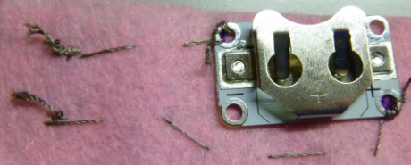

## अपने पहनने योग्य circuit को पूरा करें

अब तक आप सुई और धागा महसूस कर रहे हैं जहां LED संलग्न किया गया है से बाहर आ रहा है। इस स्थान और उस स्थान के बीच की रेखा की कल्पना करें जिसे आपने के लिए चिह्नित किया है ** - ** बैटरी धारक का छेद। यदि यह मदद करता है, तो आप महसूस पर रेखा खींच सकते हैं। आप एक ** सिलाई सिलाई करेंगे ** LED को बैटरी धारक से जोड़ने के लिए इस लाइन के साथ।

+ सुई की नोक को लाइन पर रखें, जहां से धागा महसूस हो रहा है, वहां से लगभग 1 सेंटीमीटर की दूरी पर रखें और इसे धक्का दें। सुई खींचें और पहले की तरह से सभी तरह से थ्रेड करें। फिर महसूस किए जाने के दूसरी तरफ इसे दोहराएं। जब तक आप उस स्थान तक नहीं पहुंचते हैं, जब तक कि आप 1cm विस्तृत चरणों में ऐसा करते रहें ** - ** बैटरी धारक का छेद।

+ इसके बाद, अपने बैटरी धारक को जगह पर रखें। फिर, जैसे आपने LED के लिए किया था, बैटरी धारक को ** - ** के माध्यम से तीन टांके लगाकर संलग्न करें। छेद। यह सुनिश्चित करने के लिए याद रखें कि वे अच्छे और तंग हैं!

+ समाप्त करने के लिए, जहाँ आप बैटरी धारक को संलग्न किया था, ठीक उसी स्थान पर तीन छोटे टाँके सीवे। यह धागे के अंत को सुरक्षित करेगा और आपके काम को अनियंत्रित करने से रोक देगा।

+ धागे को काटें ताकि केवल एक छोटा सा महसूस होने से बाहर लटका रहे।

--- collapse ---
---
title: अंतिम बिट का एक वीडियो देखें
---

यहां एक वीडियो दिखाया गया है कि आप सिलाई के इस भाग को कैसे पूरा कर सकते हैं: [ dojo.soy/wear-finishing ](http://dojo.soy/wear-finishing) {: target= "_ blank"}

--- /collapse ---

 

अब आपके पास अपने circuit का आधा हिस्सा है।

+ Circuit को पूरा करने के लिए, आपको ** + ** कनेक्ट करना होगा** + ** के साथ LED पर छेद बैटरी धारक पर छेद। इसे उसी तरीके से करें जिसमें आपने अभी ** नकारात्मक ** को जोड़ा है। मैं इस circuit में एक स्विच शामिल नहीं कर रहा हूँ, लेकिन यदि आप चाहते हैं, तो पहले की तरह तीसरे धागे का उपयोग कर सकते हैं।

  ** महत्वपूर्ण! ** अपने ** + **के लिए रास्ता सुनिश्चित करें थ्रेड ** क्रॉस / टच नहीं करता है ** ** - ** धागा या बैटरी धारक के किसी भी किनारे कहीं भी। याद रखें, यह एक ** शॉर्ट circuit **का कारण होगा (बुरी बात)!

+ बैटरी धारक में एक बैटरी डालें और अपने LED प्रकाश को देखें!

### बिल्ला बनाना

+ रचनात्मक पाने के लिए समय! अपने बैज को सजाइए, हालाँकि आपको अलग-अलग रंग के कपड़े या धागे या आपके पास मौजूद कोई अन्य सामग्री पसंद है। महसूस के साथ LED को कवर करने से यह एक नरम चमक देगा।

+ यदि आप अपने बैज में एक pin संलग्न कर रहे हैं, तो यह एक अच्छा विचार है कि आप इसे अपने बैज के पीछे संलग्न करें। यह सुनिश्चित करता है कि pin आपके circuit के किसी भी हिस्से को नहीं छूता है - चूंकि pin धातु है, जिससे शॉर्ट circuit होता है। इसके बजाय अतिरिक्त सिलाई, या गोंद या टेप के लिए साधारण धागे का उपयोग करें।

बधाई हो! आपका बैज किया जाता है, और आपने एक पूरा पहनने योग्य circuit सिल दिया है। अगले सुशी कार्ड आपको दिखाते हैं कि अधिक LEDs कैसे जोड़ें, और वे वैकल्पिक हैं।
