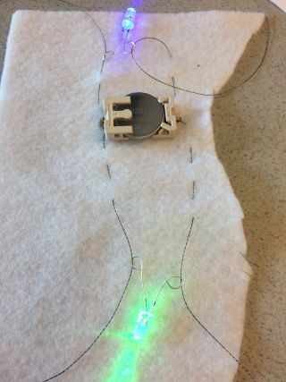

## और LEDs जोड़ें

आपके सर्किट में अधिक LEDs जोड़ना आसान है, और आपको किसी अतिरिक्त बैटरी की आवश्यकता नहीं है!

**ध्यान दें**: आपके सर्किट में LEDs एक ही प्रकार के होना चाहिए या तो सभी सिलने लायक या सभी जो सिलने लायक नहीं होते। यह सिलने लायक LEDs के साथ सबसे अच्छा काम करेगा क्योंकि आप इनमें से कई को एक ही बैटरी से बिना बिजली कम किए जोड़ सकते हैं।

+ बैटरी होल्डर से बैटरी को अभी के लिए निकाल दें। सर्किट पर काम करते समय, यह सुनिश्चित करना हमेशा महत्वपूर्ण होता है कि **live** (चालु) न हो, और ये हम या तो इसे बंद करके या बैटरी निकालकर करते हैं!

+ तय करें कि आपके पदक (बैज) पर आप अपना अगला LED कहां लगाना चाहते हैं, और उस जगह को चिह्नित करें।

आप **समानांतर** (parallel) में LEDs कनेक्ट करेंगे । इसे करने के दो तरीके हैं।

### विधि 1

एक विकल्प LED को सीधे बैटरी से जोड़ना है, पहले LED की तरह। बैटरी होल्डर पर एक से अधिक बार बैटरी होल्डर पर एक ही छेद का उपयोग करना ठीक है - केवल सीमा यह है कि आप कितने धागे आप अटा सकते हैं! चित्र में उदाहरण सर्किट को किसी भी चीज़ पर सीवन नहीं किया गया है, इसलिए आप थ्रेड्स को स्पष्ट रूप से देख सकते हैं:

### विधि 2

एक अन्य विकल्पयह है कि नई LED को बैटरी के बजाय पहले से ही आपके सर्किट में संलग्न करना है। आप **+** को **+** से मेल करें और **-** को **-** से जैसा कि यदि आप इसे एक बैटरी से रहे हो I नीचे दिए गए उदाहरण में, दोनों LEDs के लिए दो धागे के लंबे टुकड़ों का उपयोग किया जाता है। आप प्रत्येक LED के लिए धागे के अलग-अलग टुकड़ों का भी उपयोग कर सकते हैं।

--- collapse ---
---
title: मुझे कौन सी विधि चुननी चाहिए?
---

यह तय करना कि LED को बैटरी होल्डर से जोड़ना है या अन्य LED पर निर्भर करता है कि आप नई LED कहां लगाना चाहते हैं!

+ आमतौर पर आप उस पुर्ज़े (component) को चुनेंगे जो उस जगह के करीब है जिसे आपने अपनी दूसरी LED के लिए चुना है।

+ आपको यह भी सुनिश्चित करने की आवश्यकता है कि सभी अलग-अलग धागे अलग-अलग रखे गए हैं और एक दुसरे को छू नहीं रहे हैं, इसलिए यह देखना एक अच्छा विचार है कि विधि और LED का जगह चुनते वक़्त आपके पुर्ज़ो का **+** और **-** कहां है I

--- /collapse ---

+ LED को जगह में पकड़े, एक सुई और प्रवाहकीय धागे (conductive thread) का एक नया टुकड़ा का उपयोग करें और LED का **-** छेद सुरक्षित करें जैसा कि आपने पहले वाले कि सलाई में की थी I

+ अगला चरण रनिंग स्टिच (running stitch) है। यदि आप LED को दूसरी LED से जोड़ रहे हैं, तो इस बार टाँके एक लाइन में LED के **-** छेद जाएंगे, बैटरी होल्डर के बजाय। एक बार जब आप सही छेद पर पहुँच जाते हैं, तो इसमें तीन टाँके बनाएं, और तीन छोटे टाँके खत्म करने के लिए, ठीक वैसे ही जैसे आपने पहले किया था।

+ अब नई LED का **+** छेद कनेक्ट करें उसी विधि का उपयोग करके।

इस तस्वीर में, दूसरी LED सीधे बैटरी से जुड़ी है:

अगली तस्वीर में, एक दूसरी LED को पहले LED से जोड़ा गया है, जो बदले में बैटरी से जुड़ा है (बैटरी कपड़े के पीछे है):

