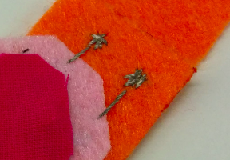
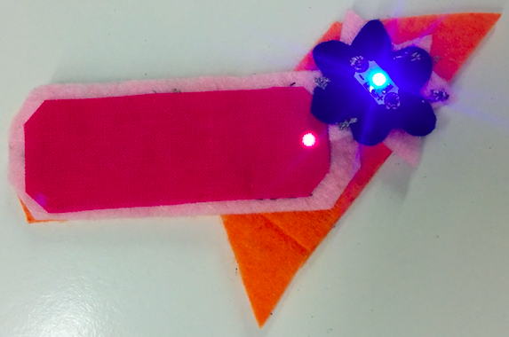

## अलग किए जाने योग्य भाग बनाएं

आप अपने पदक (बैज) सर्किट का विस्तार भी कर सकते हैं ताकि उनके स्वयं के LEDs(एक ही प्रकार के) के साथ महसूस किए गए अलग-अलग टुकड़ों को इसमें शामिल किया जा सके ताकि उन्हें जलाया जा सके!

पहले आपको दूसरे पदक (बैज) की आवश्यकता होगी। इसकी अपनी बैटरी नहीं होगी। लेकिन बैटरी के बिना, धागे कहां जाएंगे?

+ जब आप इस नए बैज पर अपने LED को सिलेंगे, तो रनिंग स्टिच (running stitch) को करियेगा उस महसूस करने वाले जगह के किनारे तक, या किनारे के पास तक याद रखना ** सकारात्मक ** और ** नकारात्मक ** एक दूसरे से अलग धागे!

+ फिर एक-दूसरे के बगल में कई मध्यम-आकार के टाँके सीना या एक-दूसरे के ऊपर क्रॉस करना। आपको ऐसा दिखाना है की प्रवाहकीय धागा (conductive thread) एक 'बूँद' जैसा दिखे उस जगह पर I

+ धागा छोटा काटने से पहले एक स्थान पर तीन छोटे टांके लगाकर सिलाई को सामान्य रूप से समाप्त करें।

+ एक बार जब आपके पास **नकारात्मक** का एक बूँद है और **सकारात्मक** तरफ का भी एक बूँद है, तब नया पदक या बैज (badge) तैयार है! यदि आप चाहते हैं, तो आप इन चरणों को दोहरा सकते हैं, ताकि आप नए पदक के विपरीत छोर पर एक और जोड़ी के लिए सर्किट का विस्तार करें:

+ अब आपको बस मुख्य बैज (बैटरी के साथ वाला) पर सर्किट का विस्तार करने की आवश्यकता है। पहले होल्डर से बैटरी को को हटाना याद रखना।

+ तय करें कि आप पदक/बैज कहाँ से मिलाना चाहते हैं। आप इस बिंदु तक मुख्य बैज पर LED से टांके सिलाई करेंगे, इसलिए सुनिश्चित करें कि आप रेखा का पता लगा सकते हैं जो कि **+** से **सकारात्मक** बूँद और **-** से **नकारात्मक** रेखाओं के बिना एक दुसरे को छुए।

+ मुख्य बैज पर दो स्थानों को चिह्नित करें जहां **सकारात्मक** और **नकारात्मक** छाले इसे छूते हैं। आप उन्हें कनेक्ट करने के लिए यहाँ मिलान बूँदें (matching blobs) सिलाई करने जा रहे हैं। आप नए बैज को अगले चरण के लिए एक तरफ रख सकते हैं।

+ नया धागा और मुख्य बैज लेते हुए, एक गुच्छा उस स्थान पर टाँके जिसे आपने **नकारात्मक** बूँद (blob) के लिए चिह्नित किया है। फिर एक रनिंग स्टिच (running stitch) सीले जो कि पदक के LED तक जाये और इसे सुरक्षित करने के लिए **-** छेद से निकालिये I इस प्रक्रिया को दोहराइये ताकि आप एक **सकारात्मक** बूँद (blob) बना पाएं जो उसी LED के **+** छेद से जुड़ा है I जब आप पूरा करलें, यह कुछ इस तरह दिखना चाहिए:

आपके पदक/बैज (badges) एक साथ जुड़ने के लिए तैयार हैं!

+ बैटरी को उसके होल्डर में वापस डालें। नए बैज को मुख्य बैज पर रखें ताकि बूंदे (blobs) एक दूसरे को स्पर्श करें। याद रखें **+** से **+** और **-** को **-** जोड़ें। आपको नए पदक/बैज (badge) को अचानक से जलते हुए दिखना चाहिए!

 

--- challenge ---

## चुनौती: एक सॉफ्ट स्विच बनाएं

+ आप इस तकनीक का उपयोग अपने प्रोजेक्ट पर एक सरल सॉफ्ट स्विच बनाने के लिए कर सकते हैं। उदाहरण के लिए, एक **सकारात्मक**बूँद (blob) एक कंगन के प्रत्येक छोर पर डालें, ताकि जब आप इसे बंद करें तो दोनों संपर्क में आएं ।

--- /challenge ---
