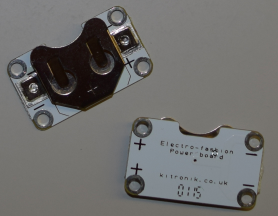

## Introduction

These Sushi Cards will introduce you to wearable electronics. These are electronic circuits you can make using especially designed parts to create amazing-looking clothes and accessories.

You will get to learn about and make electronic circuits, and you'll also do some sewing.

You can use wearable electronics to decorate clothes, bags, hats, anything — the possibilities are unlimited!

### What you will make

You are going to make a felt badge or patch that lights up!

You will also see how you can design the badge so that you can join lots of them together to make a glowing patchwork. This might be fun to do together with other Ninjas!

--- collapse ---
---
title: What you will learn
---

+ The basics of circuit components and the concepts involved in **positive/+** and **minus/-**
+ Making a simple LED circuit
+ How a switch works and how to use one in a circuit
+ Using conductive thread and sewable components (parts) to make a wearable circuit
+ Basic sewing skills
+ Adding multiple LEDs to a circuit
+ How to make a wearable circuit that’s split into detachable components

--- /collapse ---

--- collapse ---
---
title: What you need
---

### Hardware

The different parts of an electronic circuit are called **components**. Here is a list of the components you'll be using:

+ A battery 

+ LEDs. These are small lights that come in different colours, and some of them can even flash or change colour. You can also get special sewable LEDs. For this project, you can use any kind of LED!

+ A sewable battery holder. This is a battery holder that's attached to a special board (called a **printed circuit board** or **PCB**) that you can sew onto your project.

Note: Your battery holder might look different from the ones shown above.

+ Conductive thread. This is like embroidery thread, but it contains metal so that electricity can flow through it. We say that it **conducts** electricity.

+ Crocodile clips (optional)

+ A switch (optional). You will see there are lots of different kinds of switches.

### Other items

+ Some fabric to sew the components onto. This could be a piece of clothing or a bag or anything you like. I will use regular craft felt.

+ A sewing needle, e.g. embroidery needle

+ Scissors

+ Tape-electrical or masking tape, or any other removable tape

+ A safety pin or any kind of badge pin

#### Optional

+ Regular embroidery thread (or any other kind of thread)

+ Pliers (preferably round-nosed)

--- /collapse ---