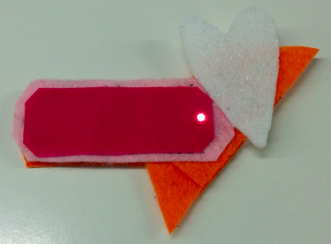

## ಪರಿಚಯ

ಈ ಸುಶಿ ಕಾರ್ಡ್‌ಗಳು ಧರಿಸಬಹುದಾದ ಎಲೆಕ್ಟ್ರಾನಿಕ್ಸ್ ಅನ್ನು ನಿಮಗೆ ಪರಿಚಯಿಸುತ್ತದೆ. ಇವು ಆಶ್ಚರ್ಯಕರವಾಗಿ ಕಾಣುವ ಬಟ್ಟೆ ಮತ್ತು ಪರಿಕರಗಳನ್ನು ರಚಿಸಲು ನೀವು ವಿಶೇಷವಾಗಿ ವಿನ್ಯಾಸಗೊಳಿಸಿದ ಭಾಗಗಳನ್ನು ಬಳಸಿ ಮಾಡಬಹುದಾದ ಎಲೆಕ್ಟ್ರಾನಿಕ್ ಸರ್ಕ್ಯೂಟ್‌ಗಳು.

ನೀವು ಎಲೆಕ್ಟ್ರಾನಿಕ್ ಸರ್ಕ್ಯೂಟ್‌ಗಳ ಬಗ್ಗೆ ತಿಳಿದುಕೊಳ್ಳುವಿರಿ ಮತ್ತು ಕೆಲವು ಹೊಲಿಗೆಗಳನ್ನು ಸಹ ಹಾಕುತ್ತೀರಿ.

ಬಟ್ಟೆ, ಚೀಲಗಳು, ಟೋಪಿಗಳು, ಯಾವುದನ್ನಾದರೂ ಅಲಂಕರಿಸಲು ನೀವು ಧರಿಸಬಹುದಾದ ಎಲೆಕ್ಟ್ರಾನಿಕ್ಸ್ ಅನ್ನು ಬಳಸಬಹುದು - ಸಾಧ್ಯತೆಗಳು ಅಪರಿಮಿತವಾಗಿವೆ!

### ನೀವು ಏನನ್ನು ಮಾಡುತ್ತೀರಿ

ನೀವು ದೀಪಗಳನ್ನು ಬೆಳಗಿಸುವ ಫೆಲ್ಟ್ ಬ್ಯಾಡ್ಜ್ ಅಥವಾ ಪ್ಯಾಚ್ ಮಾಡಲು ಹೊರಟಿದ್ದೀರಿ!

ನೀವು ಬ್ಯಾಡ್ಜ್ ಅನ್ನು ಹೇಗೆ ವಿನ್ಯಾಸಗೊಳಿಸಬಹುದು ಎಂಬುದನ್ನು ಸಹ ನೋಡುತ್ತೀರಿ, ಇದರಿಂದ ನೀವು ಹೊಳೆಯುವ ಪ್ಯಾಚ್‌ವರ್ಕ್ ಮಾಡಲು ಅವುಗಳಲ್ಲಿ ಸಾಕಷ್ಟು ಸೇರಿಕೊಳ್ಳಬಹುದು. ಇತರ ನಿಂಜಾಗಳ \(Ninja\) ಜೊತೆ ಸೇರಿ ಖುಷಿಯಾಗಿರಬಹುದು!

--- collapse ---
---
title: ನೀವು ಏನನ್ನು ಕಲಿಯುವಿರಿ?
---

+ ಸರ್ಕ್ಯೂಟ್ ಘಟಕಗಳ ಮೂಲಗಳು ಮತ್ತು **ಪಾಸಿಟಿವ್/+** ಮತ್ತು **ಮೈನಸ್/-** ನಲ್ಲಿ ಒಳಗೊಂಡಿರುವ ಪರಿಕಲ್ಪನೆಗಳು
+ ಸರಳ ಎಲ್ಇಡಿ ಸರ್ಕ್ಯೂಟ್ ಮಾಡುವುದು
+ ಸ್ವಿಚ್ ಹೇಗೆ ಕಾರ್ಯನಿರ್ವಹಿಸುತ್ತದೆ ಮತ್ತು ಸರ್ಕ್ಯೂಟ್‌ನಲ್ಲಿ ಸ್ವಿಚ್ಚನ್ನು ಹೇಗೆ ಬಳಸುವುದು
+ ಧರಿಸಬಹುದಾದ ಸರ್ಕ್ಯೂಟ್ ಮಾಡಲು ವಾಹಕ ದಾರ ಮತ್ತು ಹೊಲಿಯ ಬಹುದಾದ ಘಟಕಗಳನ್ನು (ಭಾಗಗಳು) ಬಳಸುವುದು
+ ಮೂಲ ಹೊಲಿಗೆ ಕೌಶಲ್ಯಗಳು
+ ಸರ್ಕ್ಯೂಟ್‌ಗೆ ಅನೇಕ ಎಲ್ಇಡಿಗಳನ್ನು ಸೇರಿಸಲಾಗುತ್ತಿದೆ
+ ಬೇರ್ಪಡಿಸಬಹುದಾದ ಘಟಕಗಳಾಗಿ ವಿಭಜಿಸಲಾದ ಧರಿಸಬಹುದಾದ ಸರ್ಕ್ಯೂಟ್ ಅನ್ನು ಹೇಗೆ ಮಾಡುವುದು

--- /collapse ---

--- collapse ---
---
title: ನಿಮಗೆ ಬೇಕಾದುದು
---

### ಯಂತ್ರಾಂಶ (hardware)

ಎಲೆಕ್ಟ್ರಾನಿಕ್ ಸರ್ಕ್ಯೂಟ್ನ ವಿಭಿನ್ನ ಭಾಗಗಳನ್ನು **components** (ಘಟಕಗಳು) ಎಂದು ಕರೆಯಲಾಗುತ್ತದೆ. ನೀವು ಬಳಸುವ ಘಟಕಗಳ ಪಟ್ಟಿ ಇಲ್ಲಿದೆ:

+ ಬ್ಯಾಟರಿ 

+ ಎಲ್ಇಡಿಗಳು. ಇವುಗಳು ವಿಭಿನ್ನ ಬಣ್ಣಗಳಲ್ಲಿ ಬರುವ ಸಣ್ಣ ದೀಪಗಳು, ಮತ್ತು ಅವುಗಳಲ್ಲಿ ಕೆಲವು ಮಿಂಚಬಹುದು ಅಥವಾ ಬಣ್ಣವನ್ನು ಬದಲಾಯಿಸಬಹುದು. ನೀವು ವಿಶೇಷ ಹೊಲಿಗೆ ಎಲ್ಇಡಿಗಳನ್ನು ಸಹ ಪಡೆಯಬಹುದು. ಈ ಪ್ರಾಜೆಕ್ಟ್ ಗೆ, ನೀವು ಯಾವುದೇ ರೀತಿಯ ಎಲ್ಇಡಿ ಬಳಸಬಹುದು!

+ ಹೊಲಿಯಬಹುದಾದ ಬ್ಯಾಟರಿ ಸಾಧನ. ಇದು ಬ್ಯಾಟರಿ ಸಾಧನ, ಇದನ್ನು ವಿಶೇಷ ಬೋರ್ಡ್‌ಗೆ ಜೋಡಿಸಲಾಗಿದೆ (ಇದನ್ನು **ಪ್ರಿಂಟೆಡ್ ಸರ್ಕ್ಯೂಟ್ ಬೋರ್ಡ್** ಅಥವಾ **PCB** ಎಂದು ಕರೆಯಲಾಗುತ್ತದೆ) ಇದನ್ನು ನಿಮ್ಮ ಪ್ರಾಜೆಕ್ಟ್‌ನಲ್ಲಿ ಹೊಲಿಯಬಹುದು.

ಗಮನಿಸಿ: ನಿಮ್ಮ ಬ್ಯಾಟರಿ ಸಾಧನ, ಮೇಲೆ ತೋರಿಸಿರುವವುಗಳಿಗಿಂತ ಭಿನ್ನವಾಗಿ ಕಾಣಿಸಬಹುದು.

+ ವಾಹಕ ದಾರ. ಇದು ಕಸೂತಿ ದಾರದಂತಿದೆ, ಆದರೆ ಅದರಲ್ಲಿ ಲೋಹ ಇದ್ದು, ಇದರ ಮೂಲಕ ವಿದ್ಯುತ್ ಹರಿಯುತ್ತದೆ. ಅದು ವಿದ್ಯುತ್ **ಹರಿಯಗೊಡುತ್ತದೆ** ಎಂದು ನಾವು ಹೇಳುತ್ತೇವೆ.

+ ಮೊಸಳೆ ತುಣುಕುಗಳು - Crocodile clips (ನಿರ್ಬಂಧವಲ್ಲ)

+ ಒಂದು ಸ್ವಿಚ್ (ನಿರ್ಬಂಧವಲ್ಲ). ವಿವಿಧ ರೀತಿಯ ಸ್ವಿಚ್‌ಗಳಿವೆ ಎಂದು ನೀವು ನೋಡುತ್ತೀರಿ.

### ಇತರ ವಸ್ತುಗಳು

+ ಘಟಕಗಳನ್ನು ಹೊಲಿಯಲು ಕೆಲವು ಬಟ್ಟೆಗಳು. ಇದು ಬಟ್ಟೆಯ ತುಂಡು ಅಥವಾ ಚೀಲ ಅಥವಾ ನೀವು ಇಷ್ಟಪಡುವ ಯಾವುದಾದರೂ ಆಗಿರಬಹುದು. ನಾನು ಸಾಮಾನ್ಯ ಕ್ರಾಫ್ಟ್ ಬಳಸುತ್ತೇನೆ.

+ ಹೊಲಿಗೆ ಸೂಜಿ, ಉದಾ. ಕಸೂತಿ ಸೂಜಿ

+ ಕತ್ತರಿಗಳು

+ ಟೇಪ್-ವಿದ್ಯುತ್ ಅಥವಾ ಮಾಸ್ಕಿಂಗ್ ಟೇಪ್, ಅಥವಾ ತೆಗೆಯಬಹುದಾದ ಯಾವುದೇ ಟೇಪ್

+ ಸುರಕ್ಷತಾ ಪಿನ್ ಅಥವಾ ಯಾವುದೇ ರೀತಿಯ ಬ್ಯಾಡ್ಜ್ ಪಿನ್

#### ಐಚ್ಛಿಕ

+ ಸಾಮಾನ್ಯ ಕಸೂತಿ ದಾರ (ಅಥವಾ ಯಾವುದೇ ರೀತಿಯ ದಾರ)

+ ಇಕ್ಕಳ (ಮೇಲಾಗಿ ದುಂಡನೆ ಅಂಚಿನ)

--- /collapse ---