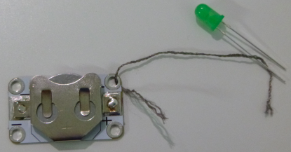

## ಸರ್ಕ್ಯೂಟ್ ರಚಿಸಿ

ನಿಮ್ಮ ಮೊದಲ ಸರ್ಕ್ಯೂಟ್ ಅನ್ನು ರಚಿಸೋಣ!

+ ಸಾಮಾನ್ಯವಾದ ಎಲ್ಇಡಿ ತೆಗೆದುಕೊಳ್ಳಿ (ಹೊಲಿಗೆ ಹಾಕುವಂಥಹುದರ ಬದಲು ಎರಡು ಕಾಲುಗಳನ್ನು ಹೊಂದಿರುವ) ಮತ್ತು ಎರಡೂ ಕಾಲುಗಳನ್ನು ಬ್ಯಾಟರಿಗೆ ಹಿಡಿದಿಟ್ಟುಕೊಳ್ಳುವ ಮೂಲಕ ಎರಡೂ ಬದಿಯಲ್ಲಿ ಅದನ್ನು ಬ್ಯಾಟರಿಗೆ ಸಂಪರ್ಕಪಡಿಸಿ. ಎಲ್ಇಡಿಯ ಕಾಲುಗಳಲ್ಲಿ ಒಂದು ಇತರ ಕಾಲುಗಳಿಗಿಂತ ಉದ್ದವಾಗಿದೆ ಎಂಬುದನ್ನು ಗಮನಿಸಿ. ಪ್ಲಸ್ ಚಿಹ್ನೆ ** +** ನೊಂದಿಗೆ ಗುರುತಿಸಲಾದ ಬ್ಯಾಟರಿಯ ಬದಿಗೆ ಉದ್ದವಾದದನ್ನು ಸಂಪರ್ಕಿಸಬೇಕು. ನಿಮ್ಮ ಎಲ್ಇಡಿ ಬೆಳಕನ್ನು ವೀಕ್ಷಿಸಿ!

--- collapse ---
---
title: ನನ್ನ ಎಲ್ಇಡಿ ಬೆಳಗಲಿಲ್ಲ
---

+ ಅದು ಕೆಲಸ ಮಾಡದಿದ್ದರೆ, ಕಾಲುಗಳು ಸರಿಯಾದ ಮಾರ್ಗವಿದಿಯ ಎಂದು ಪರಿಶೀಲಿಸಿ.

--- /collapse ---

+ ಒಮ್ಮೆ ನೀವು ಎಲ್ಇಡಿ ಬೆಳಕನ್ನು ಹೊಂದಿದ ನಂತರ, ಬ್ಯಾಟರಿಯನ್ನು ಫ್ಲಿಪ್ ಮಾಡಲು ಪ್ರಯತ್ನಿಸಿ ಇದರಿಂದ ಕಾಲುಗಳು ತಪ್ಪಾದ ರೀತಿಯಲ್ಲಿ ಸಂಪರ್ಕಗೊಳ್ಳುತ್ತವೆ, ` + ` ನ ಬ್ಯಾಟರಿಯ ಬದಿಯಲ್ಲಿ ಚಿಕ್ಕ ಕಾಲು ಸೇರಿಕೊಳ್ಳುವುದು. ಇದು ಇನ್ನೂ ಕಾರ್ಯನಿರ್ವಹಿಸುತ್ತದೆಯೇ?

--- collapse ---
---
title: ಇದು ಹೇಗೆ ಕೆಲಸ ಮಾಡುತ್ತದೆ
---

ಪ್ರತಿ ಸರ್ಕ್ಯೂಟ್‌ನಲ್ಲಿ, ** ಪಾಸಿಟಿವ್ ** ಅಥವಾ ** + ** ಮತ್ತು ** ನೆಗೆಟಿವ್** ಅಥವಾ ** - ** ನಿರ್ದೇಶನಗಳಿರುತ್ತವೆ.

ವಿದ್ಯುತ್ ಹರಿಯಲು, ನೀವು ** +** ಅನ್ನು ** + ** ಗೆ ಮತ್ತು ** - ** ಅನ್ನು ** - ** ಗೆ ಘಟಕಗಳ ನಡುವೆ ಹೊಂದಿಸಬೇಕಾಗಿದೆ. ಇದರಿಂದಾಗಿಯೇ ನೀವು ಬ್ಯಾಟರಿಯನ್ನು ಫ್ಲಿಪ್ ಮಾಡಿದಾಗ ಎಲ್ಇಡಿ ಬೆಳಗುವುದಿಲ್ಲ.

--- /collapse ---

--- collapse ---
---
title: ವಿಭಿನ್ನ ಎಲ್ಇಡಿಗಳಲ್ಲಿ + ಮತ್ತು - ಗುರುತಿಸುವುದು
---

+ ಎಲ್ಇಡಿಯಲ್ಲಿ, ಉದ್ದವಾದ ಕಾಲು ** +** ಮತ್ತು ಚಿಕ್ಕ ಪಿನ್ ** - ** ಆಗಿದೆ. ಬಲ್ಬ್ ಅನ್ನು ಹತ್ತಿರದಿಂದ ನೋಡುವ ಮೂಲಕ ನೀವು ** - ** ಅನ್ನು ಸಹ ಗುರುತಿಸಬಹುದು: ಇದು ಚಪ್ಪಟೆ ಅಂಚಿನ ಬದಿಯಾಗಿದೆ.

+ ಹೊಲಿಯಬಹುದಾದ ಎಲ್ಇಡಿಯನ್ನು ಸಣ್ಣ ** ಮುದ್ರಿತ ಸರ್ಕ್ಯೂಟ್ ಬೋರ್ಡ್‌ ** ನಲ್ಲಿ ಸೇರಿಸಲಾಗಿದ್ದು, ಆದ್ದರಿಂದ ಇದು ಕಾಲುಗಳ ಬದಲಿಗೆ ರಂಧ್ರಗಳನ್ನು ಹೊಂದಿರುತ್ತದೆ. ರಂಧ್ರಗಳನ್ನು ** +** ಮತ್ತು ** - ** ಚಿಹ್ನೆಗಳು ಎಂದು ಗುರುತಿಸಲಾಗಿದೆ.

--- /collapse ---

+ ಎಲ್ಇಡಿ ಮತ್ತು ಬ್ಯಾಟರಿಯನ್ನು ಬೇರ್ಪಡಿಸಿ, ಮತ್ತು ಬ್ಯಾಟರಿಯನ್ನು ಬ್ಯಾಟರಿ ಸಾಧನದಲ್ಲಿ ** + ** ಮೇಲ್ಮುಖವಾಗಿ ಸೇರಿಸಿ( ಸಾಧನ ತನ್ನ ** +** ಅನ್ನು ತೋರಿಸುವ ಗುರುತು ಬದಿಯಲ್ಲಿ ಇರುತ್ತದೆ).

+ ವಾಹಕ ದಾರದ ಎರಡು ತುಣುಕುಗಳನ್ನು ಪಡೆಯಿರಿ, ಮತ್ತು ನಿಮ್ಮ ಪಕ್ಕದಲ್ಲಿರುವ ನಿಂಜಾ ಜೊತೆ ಸೇರಿಸಿಕೊಳ್ಳಿ, ಇದರಿಂದ ನೀವು ಪರಸ್ಪರ ವಸ್ತುಗಳನ್ನು ಹಿಡಿದಿಡಲು ಸಹಾಯವಾಗಬಹುದು.

+ ಮೊದಲ ದಾರದ ಒಂದು ತುದಿಯನ್ನು ಬ್ಯಾಟರಿ ಹೊಂದಿರುವವರ ** + ** ರಂಧ್ರದ ಮೂಲಕ ಇರಿಸಿ, ಅದು ಲೋಹವನ್ನು ಮುಟ್ಟುತ್ತದೆ ಎಂದು ಖಚಿತಪಡಿಸಿಕೊಳ್ಳಿ ಮತ್ತು ಇನ್ನೊಂದು ತುದಿಯನ್ನು ಎಲ್ಇಡಿ ಯ ** ಪಾಸಿಟಿವ್** ಕಾಲಿಗೆ ಹಿಡಿದುಕೊಳ್ಳಿ. ನಿಮಗೆ ಅಗತ್ಯವಿದ್ದರೆ ನೀವು ಟೇಪ್ ಅನ್ನು ಬಳಸಬಹುದು, ಆದರೂ ಇದು ದಾರವನ್ನು ಬಹಳಷ್ಟು ಹುರಿದುಂಬಿಸುತ್ತದೆ. ನೀವು ಮೊಸಳೆ ಕ್ಲಿಪ್ ಗಳನ್ನು ಹೊಂದಿದ್ದರೆ, ದಾರದ ಬದಲಿಗೆ ಇವುಗಳನ್ನು ಬಳಸಬಹುದು.

+ ಈಗ ಎರಡನೇ ದಾರವನ್ನು ತೆಗೆದುಕೊಳ್ಳಿ. ಮೊದಲ ದಾರದ ಒಂದು ತುದಿಯನ್ನು ಬ್ಯಾಟರಿ ಹೊಂದಿರುವವರ ** -** ರಂಧ್ರದ ಮೂಲಕ ಇರಿಸಿ, ಅದು ಲೋಹವನ್ನು ಮುಟ್ಟುತ್ತದೆ ಎಂದು ಖಚಿತಪಡಿಸಿಕೊಳ್ಳಿ ಮತ್ತು ಇನ್ನೊಂದು ತುದಿಯನ್ನು ** ನೆಗೆಟಿವ್** ಕಾಲಿಗೆ ಹಿಡಿದುಕೊಳ್ಳಿ.

+ ಎರಡು ದಾರಗಳು ಯಾವುದೇ ಹಂತದಲ್ಲಿ ಮುಟ್ಟುತ್ತಿಲ್ಲ ಅಥವಾ ದಾಟುತ್ತಿಲ್ಲ ಎಂದು ಖಚಿತಪಡಿಸಿಕೊಳ್ಳಿ. ಅವು ಹಾಗೆ ಆದರೆ ಇದು ನಿಮ್ಮ ಸರ್ಕ್ಯೂಟ್‌ನಲ್ಲಿ ** ಶಾರ್ಟ್ ** ಗೆ ಕಾರಣವಾಗುತ್ತದೆ ಮತ್ತು ಅದು ಸರಿಯಾಗಿ ಕಾರ್ಯನಿರ್ವಹಿಸುವುದಿಲ್ಲ.

--- collapse ---
---
title: ಶಾರ್ಟ್ ಎಂದರೇನು?
---

+ ನೀವು ** ಶಾರ್ಟ್ ಸರ್ಕ್ಯೂಟ್ ** ಅನ್ನು ಹೊಂದಿರುವಾಗ, ವಿದ್ಯುತ್ ಸರ್ಕ್ಯೂಟ್ ಮೂಲಕ ಕಡಿಮೆ ದಾರಿಯಲ್ಲಿ ಹೋಗುತ್ತದೆ, ಕೆಲವು ಘಟಕಗಳನ್ನು ಬಿಟ್ಟುಬಿಡುತ್ತದೆ ಮತ್ತು ಅದಕ್ಕಾಗಿಯೇ ಅದು ಕಾರ್ಯನಿರ್ವಹಿಸುವುದನ್ನು ನಿಲ್ಲಿಸುತ್ತದೆ.

--- /collapse ---

ಈಗ ನೀವು ಸರ್ಕ್ಯೂಟ್ ಹೊಂದಿದ್ದೀರಿ ಮತ್ತು ಹೊಳೆಯುವ ಪದಕ(Badge) ಮಾಡಲು ಸಿದ್ಧರಿದ್ದೀರಿ!
