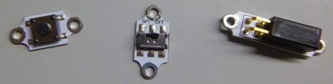

## ಸ್ವಿಚ್ ಸೇರಿಸಿ

ನಿಮ್ಮ ಸರ್ಕ್ಯೂಟ್ ಆಫ್ ಮಾಡಲು ಬಯಸುವಿರೇ? ಇದನ್ನು ಮಾಡಲು, ವಿದ್ಯುತ್ ಹರಿಯದಂತೆ ತಡೆಯಲು ನಿಮಗೆ ಸರ್ಕ್ಯೂಟ್‌ನಲ್ಲಿ ಎಲ್ಲೋ ಬಿರುಕು ಬೇಕು. ** ಸ್ವಿಚ್ ** ಎಂಬುದು ಸರ್ಕ್ಯೂಟ್ ಆಫ್ ಮಾಡಲು ಮತ್ತು ಸುಲಭವಾಗಿ ಆನ್ ಮಾಡಲು ನಿಮಗೆ ಅನುಮತಿಸುವ ಒಂದು ಘಟಕವಾಗಿದೆ. ವಿವಿಧ ರೀತಿಯ ಸ್ವಿಚ್‌ಗಳಿವೆ: ಬಟನ್ ಗಳು, ಸ್ಲೈಡರ್‌ಗಳು, ಮ್ಯಾಗ್ನೆಟಿಕ್ ಅಥವಾ ಟಿಲ್ಟಿಂಗ್. ಕೆಲವು ಬ್ಯಾಟರಿ ಸಾಧನಗಳು ಅಂತರ್ನಿರ್ಮಿತ ಸ್ವಿಚ್ ಅನ್ನು ಸಹ ಹೊಂದಿರುತ್ತವೆ.

+ ನಿಮ್ಮ ಸರ್ಕ್ಯೂಟ್‌ನಲ್ಲಿ, ದಾರವನ್ನು ಬ್ಯಾಟರಿಯ ** + ** ರಂಧ್ರದಿಂದ ಬೇರ್ಪಡಿಸಿ. ಹೊಸ ದಾರದ ತುಂಡನ್ನು ತೆಗೆದುಕೊಂಡು ಹೊಸ ತುಂಡಿನ ಒಂದು ತುದಿಯನ್ನು ** +** ಮೂಲಕ ಇತರ ದಾರದ ಇದ್ದ ರಂಧ್ರದಲಿ ಹಾಕಿ. ಕೆಲವು ಹೆಚ್ಚುವರಿ ಕೈಗಳಿಗಾಗಿ ನೀವು ಇಲ್ಲಿ ಮೂರನೇ ವ್ಯಕ್ತಿಯೊಂದಿಗೆ ಸೇರಿಕೊಳ್ಳಬೇಕಾಗಬಹುದು! ಇಲ್ಲದಿದ್ದರೆ ನೀವು ಯಾವಾಗಲೂ ಟೇಪ್ ಬಳಸಬಹುದು, ಅಥವಾ ದಾರದಬದಲಿಗೆ ಮೊಸಳೆ ಕ್ಲಿಪ್ ಗಳನ್ನು ಬಳಸಬಹುದು.

+ ನೀವು ಸಿದ್ದವಾದ ಸ್ವಿಚ್ ಹೊಂದಿದ್ದರೆ, ಹೊಸ ಥ್ರೆಡ್‌ನ ಇನ್ನೊಂದು ತುದಿಯನ್ನು ಅದರ ಒಂದು ತುದಿಗೆ ಹಿಡಿದುಕೊಳ್ಳಿ. ನಂತರ ಬ್ಯಾಟರಿ ಸಾಧನದಿಂದ ನೀವು ತೆಗೆದುಹಾಕಿದ ದಾರವನ್ನು ತೆಗೆದುಕೊಳ್ಳಿ (ಅದನ್ನು ಇನ್ನೂ ಎಲ್ಇಡಿಗೆ ಲಗತ್ತಿಸಬೇಕು) ಮತ್ತು ಅದನ್ನು ಸ್ವಿಚ್‌ನ ಇನ್ನೊಂದು ತುದಿಗೆ ಹಿಡಿದುಕೊಳ್ಳಿ. ಈಗ ನೀವು ಎಲ್ಇಡಿ ಆಫ್ ಮತ್ತು ಆನ್ ಮಾಡಲು ಸ್ವಿಚ್ ಬಳಸಬಹುದು!

--- collapse ---
---
title: ಸ್ವಿಚ್ ಯಾವ ಮಾರ್ಗದಲ್ಲಿ ಹೋಗಬೇಕು?
---

+ ಗಮನಿಸಿ: ಸ್ವಿಚ್ನಲ್ಲಿ ಯಾವುದೇ ಪಾಸಿಟಿವ್ ಅಥವಾ ನೆಗೆಟಿವ್ ಭಾಗ ವಿರುವುದಿಲ್ಲ. ಇದರರ್ಥ ಸ್ವಿಚ್ ಸುತ್ತಲೂ ಯಾವ ಮಾರ್ಗದಲ್ಲಿದೆ ಎಂಬುದು ಮುಖ್ಯವಲ್ಲ.

--- /collapse ---

+ ನೀವು ಸ್ವಿಚ್ ಹೊಂದಿಲ್ಲದಿದ್ದರೆ, ನೀವು ಅದನ್ನು ಸುಲಭವಾಗಿ ಮಾಡಬಹುದು. ನಿಮ್ಮ ಸರ್ಕ್ಯೂಟ್‌ನಲ್ಲಿ ದಾರದ ಎರಡು ಸಡಿಲವಾದ ತುದಿಗಳನ್ನು ತೆಗೆದುಕೊಂಡು ಎಲ್ಇಡಿ ಬೆಳಕು ಬರಲು ಅವುಗಳನ್ನುಒಟ್ಟಿಗೆ ಹಿಡಿದುಕೊಳ್ಳಿ. ನೀವು ಅವುಗಳನ್ನು ಬೇರ್ಪಡಿಸಿದಾಗ, ಅದು ಮತ್ತೆ ಆಫ್ ಆಗುತ್ತದೆ. ನೀವು ಇದೀಗ ಸರಳ ಸ್ವಿಚ್ ರಚಿಸಿದ್ದೀರಿ!

  

--- collapse ---
---
title: ಇದು ಹೇಗೆ ಕೆಲಸ ಮಾಡುತ್ತದೆ?
---

ನೀವು ನೋಡಿದಂತೆ, ಎಲ್ಇಡಿ ಬೆಳಕು ಬರಲು ವಿದ್ಯುತ್ ಸರ್ಕ್ಯೂಟ್ ಸುತ್ತಲೂ ಹರಿಯುತ್ತದೆ. ವಿದ್ಯುತ್ ಹರಿಯಲು, ಸರ್ಕ್ಯೂಟ್‌ನಲ್ಲಿನ ಪ್ರತಿಯೊಂದು ಘಟಕಗಳ ನಡುವೆ ಸಂಪರ್ಕವಿರಬೇಕು.

ನೀವು ಎರಡು ದಾರಗಳನ್ನು ಬೇರ್ಪಡಿಸಿದಾಗ, ಅವುಗಳ ನಡುವಿನ ಸಂಪರ್ಕವನ್ನು ಮುರಿದುಬಿಟ್ಟಿದ್ದೀರಿ, ಆದ್ದರಿಂದ ವಿದ್ಯುತ್ ಇನ್ನು ಮುಂದೆ ಹರಿಯುವುದಿಲ್ಲ.

ನೀವು ದಾರಗಳನ್ನು ಸ್ಪರ್ಶಿಸಿದಾಗ, ಅವು ಸಂಪರ್ಕಗೊಂಡಿವೆ ಮತ್ತು ವಿದ್ಯುತ್ ಮತ್ತೊಮ್ಮೆ ಹರಿಯಲು ಸಾಧ್ಯವಾಗುತ್ತದೆ.

ನಾನು ಪ್ರತಿ ದಾರದ ಕೊನೆಯಲ್ಲಿ ಟೇಪ್ ಅನ್ನು ಇರಿಸಿದ್ದೇನೆ ಆದ್ದರಿಂದ ಸರ್ಕ್ಯೂಟ್ನಲ್ಲಿ ವಿರಾಮ ಎಲ್ಲಿದೆ ಎಂದು ನೀವು ಸುಲಭವಾಗಿ ನೋಡಬಹುದು. ಇದು ಸ್ವಿಚ್ ಆಗಿರುತ್ತದೆ. ಇಲ್ಲಿ ಅದು ಕಾರ್ಯದಲ್ಲಿದೆ:

ರೆಡಿಮೇಡ್ ಸ್ವಿಚ್‌ನಲ್ಲಿ, ಸಂಪರ್ಕವು ಮುರಿದು ಮರುಸಂಪರ್ಕಗೊಳ್ಳುವ ಭಾಗವನ್ನು ಸಾಮಾನ್ಯವಾಗಿ ಒಳಗೆ ಮರೆಮಾಡಲಾಗುತ್ತದೆ ಆದ್ದರಿಂದ ನೀವು ಅದನ್ನು ನೋಡಲಾಗುವುದಿಲ್ಲ. ನೀವು ಸ್ವಿಚ್ಚನ್ನು ಏನನ್ನಾದರೂ ಆನ್ ಅಥವಾ ಆಫ್ ಮಾಡಿದಾಗ ನಿಜವಾಗಿಯೂ ಏನಾಗುತ್ತಿದೆ ಎಂದು ಈಗ ನಿಮಗೆ ತಿಳಿದಿದೆ!

--- /collapse ---

ಸರ್ಕ್ಯೂಟ್ ಅನ್ನು ವಿಭಿನ್ನ ರೀತಿಯಲ್ಲಿ ಮುರಿಯುವ ಮೂಲಕ ವಿವಿಧ ರೀತಿಯ ಸ್ವಿಚ್‌ಗಳು ಕಾರ್ಯನಿರ್ವಹಿಸುತ್ತವೆ. ಸರ್ಕ್ಯೂಟ್ ಆನ್ ಅಥವಾ ಆಫ್ ಆಗಿರುವಾಗ ನಿಮಗೆ ನಿಯಂತ್ರಣವನ್ನು ನೀಡಲು ನಿಮ್ಮ ಧರಿಸಬಹುದಾದ ಪ್ರಾಜೆಕ್ಟ್ ಗಳಲ್ಲಿ ನೀವು ಸ್ವಿಚ್ ಬಳಸಬಹುದು.
