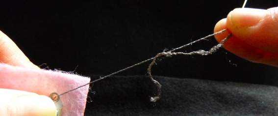

## ಘಟಕಗಳನ್ನು ಹೊಲಿಯಿರಿ

+ ನಿಮ್ಮ ಬ್ಯಾಡ್ಜ್ಗಾಗಿ ನೀವು ಬಯಸುವ ಗಾತ್ರಕ್ಕೆ ಫೆಲ್ಟ್ ತುಂಡನ್ನು ಕತ್ತರಿಸಿ. ನೀವು ಎಲ್ಇಡಿ ಎಲ್ಲಿ ಹಾಕಲಿದ್ದೀರಿ ಎಂದು ನಿರ್ಧರಿಸಿ ಮತ್ತು ಫೆಲ್ಟ್ ಸ್ಥಳವನ್ನು ಗುರುತಿಸಿ. ನಿಮ್ಮ ಬ್ಯಾಟರಿ ಸಾಧನವನ್ನು ಎಲ್ಲಿ ಇರಿಸಬೇಕೆಂದು ಈಗ ನಿರ್ಧರಿಸಿ. ಅದು ಹಿಂಭಾಗದಲ್ಲಿರಬಹುದು! ಪಾಸಿಟಿವ್ ರಂಧ್ರಗಳಲ್ಲಿ ಒಂದನ್ನು **+** ನೊಂದಿಗೆ ಮತ್ತು ನೆಗೆಟಿವ್ ರಂಧ್ರಗಳಲ್ಲಿ ಒಂದನ್ನು **-** ಎಂದು ಗುರುತಿಸಿ.

+ ನೀವು ಸಾಮಾನ್ಯ ಎಲ್ಇಡಿ ಬಳಸುತ್ತಿದ್ದರೆ, ಪಿನ್ಗಳನ್ನು ಲೂಪ್ಗಳಾಗಿ ಬಗ್ಗಿಸಬೇಕಾಗುತ್ತದೆ. ತಂತಿಗಳನ್ನು ಬಗ್ಗಿಸುವ ಅಥವಾ ಕತ್ತರಿಸುವ ಇಕ್ಕಳ ಇಲ್ಲಿ ಸಹಾಯ ಮಾಡುತ್ತದೆ. ನೀವು ಹೊಲಿಯುವ ಎಲ್ಇಡಿ ಹೊಂದಿದ್ದರೆ, ಈ ಹಂತವನ್ನು ಬಿಟ್ಟುಬಿಡಿ!

 

+ ನಿಮ್ಮ ಸೂಜಿಯನ್ನು ಎಳೆಯಿರಿ! ಸುಮಾರು 30 ಸೆಂ. ಮೀ ಉದ್ದದ ವಾಹಕ ದಾರದ ತುಂಡನ್ನು ತೆಗೆದುಕೊಂಡು, ಅದರ ಒಂದು ತುದಿಯನ್ನು ಸೂಜಿಯ ರಂಧ್ರದ ಮೂಲಕ ಎಳೆಯಿರಿ (ಇದನ್ನು **ಕಣ್ಣು** (eye) ಎಂದು ಕರೆಯಲಾಗುತ್ತದೆ). ಇದು ಬಹಳ ಚಡಪಡಿಸಬಹುದು. ದಾರವನ್ನು ಕೊನೆಯಲ್ಲಿ ಹುರಿಯಲಾಗಿದ್ದರೆ, ಕತ್ತರಿಸಿದ ಬಿಟ್‌ಗಳನ್ನು ಕತ್ತರಿಗಳಿಂದ ಕತ್ತರಿಸಿ.

+ ಸೂಜಿಯಲ್ಲಿ ದಾರವನ್ನು ಹಾಕಿದ ನಂತರ, ದಾರ ಎರಡು ತುಂಡುಗಳಾಗಿ ಸ್ಥಗಿತಗೊಳ್ಳುತ್ತದೆ. ಅವುಗಳಲ್ಲಿ ಒಂದನ್ನು ಎಳೆಯಿರಿ ಇದರಿಂದ ಅದು ಇನ್ನೊಂದಕ್ಕಿಂತ ಸ್ವಲ್ಪ ಉದ್ದವಾಗಿರುತ್ತದೆ ಮತ್ತು ಉದ್ದನೆಯ ತುಂಡಿನ ತುದಿಯಲ್ಲಿ ಗಂಟು ಕಟ್ಟಿಕೊಳ್ಳಿ.

ಹೊಲಿಗೆ ಪ್ರಾರಂಭಿಸಲು ಸಿದ್ಧರಿದ್ದೀರಾ?

+ ನಿಮ್ಮ ಎಲ್‌ಇಡಿಯನ್ನು ನೀವು ಗುರುತಿಸಿರುವ ಫೆಲ್ಟಿನ ಸ್ಥಳದಲ್ಲಿಯೇ ಇರಿಸಿ. ಒಂದು ಕೈಯಿಂದ, ಫೆಲ್ಟ್ ಮತ್ತು ಎಲ್ಇಡಿ ಅನ್ನು ಹಿಡಿದುಕೊಳ್ಳಿ. ಮತ್ತೊಂದೆಡೆ, ಸೂಜಿಯ ತುದಿಯನ್ನು **ಹಿಂದೆ** ಇರಿಸಿ ಫೆಲ್ಟ್ ಮತ್ತು ಅದನ್ನು ತಳ್ಳುವ ಮೂಲಕ ಅದು ಎಲ್ಇಡಿಯ **-** ರಂಧ್ರದಿಂದ ಹೊರಬರುತ್ತದೆ.

+ ಸೂಜಿ ಮತ್ತು ದಾರವನ್ನು ಮುಂಭಾಗದಲ್ಲಿ ಎಳೆಯಿರಿ. ನೀವು ಎಳೆಯುವಾಗ ಸೂಜಿಯಿಂದ ಹೊರಗೆ ಬೀಳದಂತೆ ನೋಡಿಕೊಳ್ಳಲು ಸೂಜಿಯನ್ನು ಹಿಡಿದುಕೊಳ್ಳಿ ಮತ್ತು ಅಲ್ಲಿ ಎಳೆಯನ್ನು ಬಿಗಿಯಾಗಿ ಹಿಡಿಯಲು ಪ್ರಯತ್ನಿಸಿ (ಅದು ಬಿದ್ದರೆ, ನೀವು ಅದನ್ನು ಮತ್ತೆ ಸೂಜಿಯೊಳಗೆ ಸೇರಿಸಬಹುದು). ಗಂಟು ಮಾತ್ರ ಹಿಂಭಾಗದಲ್ಲಿ ಉಳಿಯುವವರೆಗೆ ನೀವು ಎಳೆಯಲು ಬಯಸುತ್ತೀರಿ.

+ ಈಗ, ಸೂಜಿಯ ತುದಿಯನ್ನು ಎಲ್ಇಡಿಯ **ಬಲ ಪಕ್ಕದ** **-** ರಂಧ್ರದಲ್ಲಿ ಇರಿಸಿ (ಅದು ಈಗ ಬಂದದ್ದು), ಆದರೆ **ಒಳಗೆ** ಅಲ್ಲ. ಹೀಗೆ:

+ ಫೆಲ್ಟ್ ಮೂಲಕ ಸೂಜಿಯನ್ನು ತಳ್ಳಿರಿ ಆದ್ದರಿಂದ ಅದು ಹಿಂಭಾಗದಿಂದ ಹೊರಬರುತ್ತದೆ. ಫೆಲ್ಟ್ ಹಿಂದೆ ಸೂಜಿಯನ್ನು ಹಿಡಿದು ನೀವು ಮುಂಭಾಗದಲ್ಲಿ ಮಾಡಿದಂತೆಯೇ ಅದನ್ನು ಎಳೆಯಿರಿ. ನಿಮ್ಮ ಮೊದಲ ಹೊಲಿಗೆಯನ್ನು ನೀವು ಹೊಲಿದಿದ್ದೀರಿ! ಇದು ಬಹುಶಹ ಈ ರೀತಿ ಕಾಣಬೇಕು:

+ ಕೊನೆಯ ಎರಡು ಹಂತಗಳನ್ನು ಇನ್ನೂ ಮೂರು ಬಾರಿ ಪುನರಾವರ್ತಿಸಿ. ಪ್ರತಿ ಬಾರಿಯೂ ದಾರವನ್ನು ಬಿಗಿಯಾಗಿ ಎಳೆಯಲು ಮರೆಯದಿರಿ. ಇದು ಉತ್ತಮ ಸಂಪರ್ಕವನ್ನು ಸೃಷ್ಟಿಸುತ್ತದೆ ಮತ್ತು ಎಲ್ಇಡಿ ಫೆಲ್ಟ್ಗಳನ್ನುಬಿಗಿಯಾಗಿ ಸುರಕ್ಷಿತವಾಗಿರಿಸುತ್ತದೆ.

+ ಧರಿಸಬಹುದಾದ ಘಟಕಗಳನ್ನು ಹೇಗೆ ಲಗತ್ತಿಸುವುದು ಎಂಬುದನ್ನು ನೀವು ಇದೀಗ ಕಲಿತಿದ್ದೀರಿ. ಬಹುತೇಕ ಅಲ್ಲಿದೆ!

--- collapse ---
---
title: ಹೊಲಿಗೆ ಸಲಹೆಗಳು
---

+ ಪ್ರಯತ್ನದಿಂದ ಪರಿಪೂರ್ಣತೆ ಸಿದ್ಧಿಸುತ್ತದೆ! ನೀವು ಹಿಂದೆಂದೂ ಹೊಲಿಯದಿದ್ದರೆ, ಅದು ಆರಂಭದಲ್ಲಿ ಟ್ರಿಕಿ ಆಗಿರಬಹುದು. ಚಿಂತಿಸಬೇಡಿ, ನೀವು ಅದನ್ನು ಕಲಿಯುತ್ತೀರಿ.

+ ನೀವು ಹೊಲಿಗೆಗೆ ಹೊಸಬರಾಗಿದ್ದರೆ ಈ ವೀಡಿಯೊ ಸಹಾಯಕವಾಗಬಹುದು: [dojo.soy/wear-stitches](http://dojo.soy/wear-stitches){:target="_blank"}

--- /collapse ---
