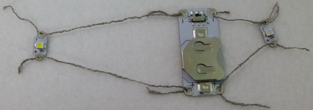
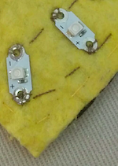

## ಹೆಚ್ಚಿನ ಎಲ್ಇಡಿ ಗಳನ್ನು ಸೇರಿಸಿ

ನಿಮ್ಮ ಸರ್ಕ್ಯೂಟ್ ಗೆ ಹೆಚ್ಚಿನ LEDಗಳನ್ನು ಸೇರಿಸುವುದು ಸುಲಭ, ಮತ್ತು ನಿಮಗೆ ಯಾವುದೇ ಹೆಚ್ಚುವರಿ ಬ್ಯಾಟರಿಗಳ ಅಗತ್ಯವಿಲ್ಲ!

** ಗಮನಿಸಿ **: ನಿಮ್ಮ ಸರ್ಕ್ಯೂಟ್‌ನಲ್ಲಿನ LEDಗಳು ಒಂದೇ ರೀತಿಯದ್ದಾಗಿರಬೇಕು, ಎಲ್ಲಾ ಹೊಲಿಯಬಹುದಾದ ಅಥವಾ ಹೊಲಿಯಲಾಗದ LEDಗಳು. ಇದು ಹೊಲಿಯ ಬಹುದಾದ LEDಗಳೊಂದಿಗೆ ಉತ್ತಮವಾಗಿ ಕಾರ್ಯನಿರ್ವಹಿಸುತ್ತದೆ, ಏಕೆಂದರೆ ಅವುಗಳಲ್ಲಿ ಹೆಚ್ಚಿನದನ್ನು ನೀವು ವಿದ್ಯುತ್ ಕಡಿಮೆ ಮಾಡದೆಯೇ ಒಂದೇ ಬ್ಯಾಟರಿಗೆ ಸಂಪರ್ಕಿಸಬಹುದು.

+ ಇದೀಗ ಬ್ಯಾಟರಿ ಸಾಧನದಿಂದ ಬ್ಯಾಟರಿಯನ್ನು ತೆಗೆದುಹಾಕಿ. ಸರ್ಕ್ಯೂಟ್‌ನಲ್ಲಿ ಕೆಲಸ ಮಾಡುವಾಗ, ಅದನ್ನು ಸ್ವಿಚ್ ಆಫ್ ಮಾಡುವ ಮೂಲಕ ಅಥವಾ ಬ್ಯಾಟರಿಯನ್ನು ಹೊರತೆಗೆಯುವ ಮೂಲಕ ** ಲೈವ್ ** ಅಲ್ಲ ಎಂದು ಯಾವಾಗಲೂ ಖಚಿತಪಡಿಸಿಕೊಳ್ಳುವುದು ಬಹಳ ಮುಖ್ಯ!

+ ನಿಮ್ಮ ಮುಂದಿನ LEDಯನ್ನು ಎಲ್ಲಿ ಹಾಕಬೇಕೆಂದು ನಿಮ್ಮ ಬ್ಯಾಡ್ಜ್ನಲ್ಲಿ ನಿರ್ಧರಿಸಿ ಮತ್ತು ಆ ಸ್ಥಳವನ್ನು ಗುರುತಿಸಿ.

ನೀವು LEDಗಳನ್ನು ** ಸಮಾನಾಂತರವಾಗಿ ** ಸಂಪರ್ಕಿಸುತ್ತೀರಿ. ಇದನ್ನು ಮಾಡಲು ಎರಡು ಮಾರ್ಗಗಳಿವೆ.

### ವಿಧಾನ 1

ಮೊದಲ ಎಲ್ಇಡಿಯಂತೆಯೇ ಎಲ್ಇಡಿಯನ್ನು ನೇರವಾಗಿ ಬ್ಯಾಟರಿಗೆ ಸಂಪರ್ಕಿಸುವುದು ಒಂದನೇ ಆಯ್ಕೆಯಾಗಿದೆ. ಬ್ಯಾಟರಿ ಸಾಧನದ ಮೇಲೆ ಒಂದೇ ರಂಧ್ರಗಳನ್ನು ಬ್ಯಾಟರಿ ಸಾಧನದಲ್ಲಿ ಒಂದಕ್ಕಿಂತ ಹೆಚ್ಚು ಬಾರಿ ಬಳಸುವುದು ಸರಿಯಾಗಿದೆ - ನೀವು ಎಷ್ಟು ದಾರದ ಮೂಲಕ ಹೊಂದಿಕೊಳ್ಳಬಹುದು ಎಂಬುದು ಒಂದೇ ಮಿತಿ! ಚಿತ್ರದಲ್ಲಿನ ಮಾದರಿ ಸರ್ಕ್ಯೂಟ್ ಅನ್ನು ಯಾವುದಕ್ಕೂ ಹೊಲಿಯಲಾಗಿಲ್ಲ, ಆದ್ದರಿಂದ ನೀವು ಎಳೆಗಳನ್ನು ಸ್ಪಷ್ಟವಾಗಿ ನೋಡಬಹುದು:

### ವಿಧಾನ 2

ಬ್ಯಾಟರಿಗೆ ಬದಲಾಗಿ ನಿಮ್ಮ circuit‌ನಲ್ಲಿರುವ LEDಗೆ ಹೊಸ LED ಲಗತ್ತಿಸುವುದು ಇನ್ನೊಂದು ಆಯ್ಕೆಯಾಗಿದೆ. ನೀವು ಅದನ್ನು ಬ್ಯಾಟರಿಗೆ ಸಂಪರ್ಕಿಸುತ್ತಿದ್ದರೆ ** + ** ಅನ್ನು ** + ** ಗೆ ಮತ್ತು ** - ** ಅನ್ನು ** - ** ಗೆ ಹೊಂದಿಸುತ್ತೀರಿ. ಕೆಳಗಿನ ಉದಾಹರಣೆಯಲ್ಲಿ, ಎರಡೂ LEDsಗಳಿಗೆ ಒಂದೇ ಎರಡು ಉದ್ದದ ದಾರವನ್ನು ಬಳಸಲಾಗುತ್ತದೆ. ಪ್ರತಿ LEDಗೆ ನೀವು ಪ್ರತ್ಯೇಕ ದಾರದ ತುಣುಕುಗಳನ್ನು ಸಹ ಬಳಸಬಹುದು.

--- collapse ---
---
title: ನಾನು ಯಾವ ವಿಧಾನವನ್ನು ಆರಿಸಬೇಕು?
---

LEDಯನ್ನು ಬ್ಯಾಟರಿ ಸಾಧನಕ್ಕೆ ಅಥವಾ ಇತರ LEDಗೆ ಸಂಪರ್ಕಿಸಬೇಕೆ ಎಂದು ನಿರ್ಧರಿಸುವುದು ನೀವು ಹೊಸ LEDಯನ್ನು ಎಲ್ಲಿ ಹಾಕಬೇಕೆಂಬುದನ್ನು ಅವಲಂಬಿಸಿರುತ್ತದೆ!

+ ಸಾಮಾನ್ಯವಾಗಿ, ನಿಮ್ಮ ಎರಡನೇ ಎಲ್ಇಡಿಗಾಗಿ ಆಯ್ಕೆ ಮಾಡಿದ ಸ್ಥಳಕ್ಕೆ ಹತ್ತಿರವಿರುವ ಘಟಕವನ್ನು ಆರಿಸುತ್ತೀರಿ.

+ ಎಲ್ಲಾ ವಿಭಿನ್ನ ಎಳೆಗಳನ್ನು ಪ್ರತ್ಯೇಕವಾಗಿ ಇರಿಸಲಾಗಿದೆಯೆ ಎಂದು ನೀವು ಖಚಿತಪಡಿಸಿಕೊಳ್ಳಬೇಕು ಮತ್ತು ದಾಟಬೇಡಿ ಅಥವಾ ಸ್ಪರ್ಶಿಸಬೇಡಿ, ಆದ್ದರಿಂದ ನೀವು LEDಗಾಗಿ ಒಂದು ವಿಧಾನ ಮತ್ತು ಸ್ಥಳವನ್ನು ಆರಿಸಿದಾಗ ನಿಮ್ಮ ಘಟಕದ ** + ** ಮತ್ತು ** - ** ಎಲ್ಲಿದೆ ಎಂದು ನೋಡುವುದು ಒಳ್ಳೆಯದು.

--- /collapse ---

+ LEDಯನ್ನು ಸ್ಥಳದಲ್ಲಿ ಹಿಡಿದಿಟ್ಟುಕೊಳ್ಳಿ, ನೀವು ಈ ಮೊದಲು ಹೊಲಿದಂತೆ LEDಯ ** - ** ರಂಧ್ರವನ್ನು ಸುರಕ್ಷಿತವಾಗಿರಿಸಲು ಸೂಜಿ ಮತ್ತು ಹೊಸ ವಾಹಕ ದಾರವನ್ನು ಬಳಸಿ.

+ ಮುಂದಿನ ಹಂತವು ಚಾಲನೆಯಲ್ಲಿರುವ ಹೊಲಿಗೆ. ನೀವು ಎಲ್ಇಡಿಯನ್ನು ಇತರ ಎಲ್ಇಡಿಗೆ ಸಂಪರ್ಕಿಸುತ್ತಿದ್ದರೆ, ಈ ಬಾರಿ ಹೊಲಿಗೆಗಳು ಬ್ಯಾಟರಿ ಸಾಧನೆಗೆ ಬದಲಾಗಿ ಇತರ ಎಲ್ಇಡಿಯ ** - ** ರಂಧ್ರದ ಕಡೆಗೆ ಹೋಗುತ್ತವೆ. ನೀವು ಸರಿಯಾದ ರಂಧ್ರವನ್ನು ತಲುಪಿದ ನಂತರ, ಅದರ ಮೂಲಕ ಮೂರು ಹೊಲಿಗೆಗಳನ್ನು ಮಾಡಿ ಮತ್ತು ಮುಗಿಸಲು ಮೂರು ಸಣ್ಣ ಹೊಲಿಗೆಗಳನ್ನು ಮೊದಲು ಮಾಡಿದಂತೆ ಮಾಡಿ.

+ ಈಗ ಅದೇ ವಿಧಾನವನ್ನು ಬಳಸಿಕೊಂಡು ಹೊಸ ಎಲ್ಇಡಿಯ ** + ** ರಂಧ್ರವನ್ನು ಸಂಪರ್ಕಿಸಿ.

ಈ ಫೋಟೋದಲ್ಲಿ, ಎರಡನೇ LED ನೇರವಾಗಿ ಬ್ಯಾಟರಿಗೆ ಸಂಪರ್ಕ ಹೊಂದಿದೆ:

ಮುಂದಿನ ಫೋಟೋದಲ್ಲಿ, ಎರಡನೇ ಎಲ್ಇಡಿಯನ್ನು ಮೊದಲ ಎಲ್ಇಡಿಗೆ ಸಂಪರ್ಕಿಸಲಾಗಿದೆ, ಅದು ಬ್ಯಾಟರಿಗೆ ಸಂಪರ್ಕ ಹೊಂದಿದೆ (ಬ್ಯಾಟರಿ ಬಟ್ಟೆಯ ಹಿಂಭಾಗದಲ್ಲಿದೆ):

