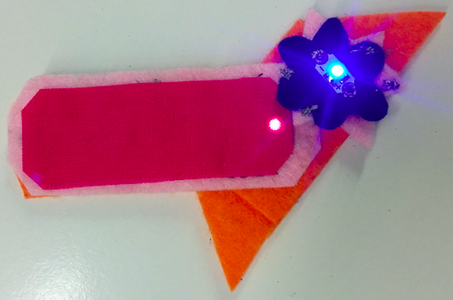

## ಬೇರ್ಪಡಿಸಬಹುದಾದ ಭಾಗಗಳನ್ನು ತಯಾರಿಸಿ

ನಿಮ್ಮ ಬ್ಯಾಡ್ಜ್ circuit ಅನ್ನು ಸಹ ನೀವು ವಿಸ್ತರಿಸಬಹುದು, ಇದರಿಂದಾಗಿ ತಮ್ಮದೇ ಆದ ಎಲ್ಇಡಿಗಳೊಂದಿಗೆ (ಒಂದೇ ರೀತಿಯ) ಪ್ರತ್ಯೇಕವಾದ ತುಣುಕುಗಳನ್ನು ಸೇರಿಸಿಕೊಳ್ಳಬಹುದು ಮತ್ತು ಅವುಗಳನ್ನು ಬೆಳಗಿಸಲು ಸಾಧ್ಯವಾಗುತ್ತದೆ!

ಮೊದಲು ನಿಮಗೆ ಮತ್ತೊಂದು ಬ್ಯಾಡ್ಜ್ ಅಗತ್ಯವಿದೆ. ಇದು ತನ್ನದೇ ಆದ ಬ್ಯಾಟರಿಯನ್ನು ಹೊಂದಿರುವುದಿಲ್ಲ. ಆದರೆ ಬ್ಯಾಟರಿ ಇಲ್ಲದೆ, ಎಳೆಗಳು ಎಲ್ಲಿಗೆ ಹೋಗುತ್ತವೆ?

+ ಈ ಹೊಸ ಬ್ಯಾಡ್ಜ್‌ನಲ್ಲಿ ನಿಮ್ಮ LEDಯನ್ನು ನೀವು ಹೊಲಿಯುವಾಗ, running ಹೊಲಿಗೆಗಳನ್ನು ಫೆಲ್ಟಿನ ಅಂಚಿಗೆ ಅಥವಾ ಅಂಚಿನ ಬಳಿ ಮಾಡಿ. **ಪಾಸಿಟಿವ್** ಮತ್ತು **ನೆಗೆಟಿವ್** ಎಳೆಗಳನ್ನು ಪರಸ್ಪರ ಪ್ರತ್ಯೇಕವಾಗಿಡಲು ಮರೆಯದಿರಿ!

+ ನಂತರ ಹಲವಾರು ಮಧ್ಯಮ ಗಾತ್ರದ ಹೊಲಿಗೆಗಳನ್ನು ಒಂದರ ಪಕ್ಕದಲ್ಲಿ ಹೊಲಿಯಿರಿ ಅಥವಾ ಒಂದರ ಮೇಲೊಂದು ಕ್ರೈಸ್-ಕ್ರಾಸಿಂಗ್ ಮಾಡಿ. ಫೆಲ್ಟಿನ ಮೇಲೆ ವಾಹಕ ದಾರದ "ಆಕೃತಿಯಿಂದ"(ಬ್ಲಾಬ್) ಕಾಣುವಂತೆ ನೀವು ಬಯಸುತ್ತೀರಿ.

+ ದಾರವನ್ನು ಚಿಕ್ಕದಾಗಿ ಕತ್ತರಿಸುವ ಮೊದಲು ಒಂದೇ ಸ್ಥಳದಲ್ಲಿ ಮೂರು ಸಣ್ಣ ಹೊಲಿಗೆಗಳನ್ನು ಮಾಡುವ ಮೂಲಕ ಹೊಲಿಗೆಯನ್ನು ಸಾಮಾನ್ಯ ರೀತಿಯಲ್ಲಿ ಮುಗಿಸಿ.

+ ಒಮ್ಮೆ ನೀವು **ನೆಗೆಟಿವ್** ಗೆ ಒಂದು ಆಕೃತಿಯನ್ನು ಹೊಂದಿದ್ದರೆ, ಮತ್ತು **ಪಾಸಿಟಿವ್** ಬದಿಗೆ ಒಂದು ಆಕೃತಿಯನ್ನು ಹೊಂದಿದ್ದರೆ, ಹೊಸ ಬ್ಯಾಡ್ಜ್ ಸಿದ್ಧವಾಗಿದೆ. ನೀವು ಬಯಸಿದರೆ, ನೀವು ಈ ಹಂತಗಳನ್ನು ಪುನರಾವರ್ತಿಸಬಹುದು ಇದರಿಂದ ನೀವು ಹೊಸ ಬ್ಯಾಡ್ಜ್‌ನ ಎದುರು ತುದಿಯಲ್ಲಿರುವ circuit ಅನ್ನು ಮತ್ತೊಂದು ಜೋಡಿ ಬ್ಲೋಬ್‌ಗಳಿಗೆ ವಿಸ್ತರಿಸಬಹುದು, ಈ ರೀತಿಯಾಗಿ:

+ ಈಗ ನೀವು ಮುಖ್ಯ ಬ್ಯಾಡ್ಜ್‌ನಲ್ಲಿ (ಬ್ಯಾಟರಿಯೊಂದಿಗೆ) circuit ಅನ್ನು ವಿಸ್ತರಿಸಬೇಕಾಗಿದೆ. ಮೊದಲು ಹೋಲ್ಡರ್ನಿಂದ ಬ್ಯಾಟರಿ ತೆಗೆದುಹಾಕಲು ಮರೆಯದಿರಿ.

+ ಬ್ಯಾಡ್ಜ್‌ಗಳು ಎಲ್ಲಿ ಒಟ್ಟಿಗೆ ಸೇರಲು ನೀವು ಬಯಸುತ್ತೀರಿ ಎಂಬುದನ್ನು ನಿರ್ಧರಿಸಿ. ಈ ಹಂತದವರೆಗೆ ನೀವು ಮುಖ್ಯ ಬ್ಯಾಡ್ಜ್‌ನಲ್ಲಿರುವ LEDಯಿಂದ ಹೊಲಿಗೆಗಳನ್ನು ಹೊಲಿಯುತ್ತೀರಿ, ಆದ್ದರಿಂದ ನೀವು **+** ರಿಂದ **ಪಾಸಿಟಿವ್** ಆಕೃತಿಗೆ ಮತ್ತು **-** ರಿಂದ **ನೆಗೆಟಿವ್** ಆಕೃತಿಗೆ ಗೆರೆಗಳನ್ನು ದಾಟುವುದಿಲ್ಲ ಎಂಬುದನ್ನು ಖಚಿತಪಡಿಸಿಕೊಳ್ಳಿ.

+ **ಪಾಸಿಟಿವ್** ಮತ್ತು **ನೆಗೆಟಿವ್** ಬ್ಲೋಬ್‌ಗಳು ಅದನ್ನು ಸ್ಪರ್ಶಿಸುವ ಮುಖ್ಯ ಬ್ಯಾಡ್ಜ್‌ನಲ್ಲಿ ಎರಡು ತಾಣಗಳನ್ನು ಗುರುತಿಸಿ. ಸಂಪರ್ಕಿಸಲು ನೀವು ಹೊಂದಾಣಿಕೆಯ ಬ್ಲೋಬ್‌ಗಳನ್ನು ಇಲ್ಲಿ ಹೊಲಿಯಲು ಹೊರಟಿದ್ದೀರಿ. ಮುಂದಿನ ತುಣುಕಿಗಾಗಿ(Bit) ನೀವು ಹೊಸ ಬ್ಯಾಡ್ಜ್ ಅನ್ನು ಒಂದು ಬದಿಗೆ ಹಾಕಬಹುದು.

+ ಹೊಸ ದಾರ ಮತ್ತು ಮುಖ್ಯ ಬ್ಯಾಡ್ಜ್ ತೆಗೆದುಕೊಂಡು, **ನೆಗೆಟಿವ್** ಆಕೃತಿಯಿಂದ ನೀವು ಗುರುತಿಸಿದ ಸ್ಥಳದಲ್ಲಿ ಒಂದು ಗುಂಪಿನ ಹೊಲಿಗೆಗಳನ್ನು ಹೊಲಿಯಿರಿ. ನಂತರ ಈ ಬ್ಯಾಡ್ಜ್‌ನಲ್ಲಿರುವ ಎಲ್‌ಇಡಿಗೆ ಎಲ್ಲಾ ರೀತಿಯಲ್ಲಿ ಚಾಲನೆಯಲ್ಲಿರುವ ಹೊಲಿಗೆ ಹೊಲಿಯಿರಿ ಮತ್ತು ಅದನ್ನು **-** ರಂಧ್ರಕ್ಕೆ ಸುರಕ್ಷಿತಗೊಳಿಸಿ. ಅದೇ ಎಲ್ಇಡಿಯ **+** ರಂಧ್ರಕ್ಕೆ ಸಂಪರ್ಕಗೊಂಡಿರುವ **ಪಾಸಿಟಿವ್** ಆಕೃತಿಯನ್ನು ಮಾಡಲು ಈ ಪ್ರಕ್ರಿಯೆಯನ್ನು ಪುನರಾವರ್ತಿಸಿ. ನೀವು ಪೂರ್ಣಗೊಳಿಸಿದಾಗ ಅದು ಈ ರೀತಿ ಕಾಣಬೇಕು:

ನಿಮ್ಮ ಬ್ಯಾಡ್ಜ್‌ಗಳು ಒಟ್ಟಿಗೆ ಸೇರಲು ಸಿದ್ಧವಾಗಿವೆ!

+ ಬ್ಯಾಟರಿಯನ್ನು ಮತ್ತೆ ಅದರ ಹೋಲ್ಡರ್‌ಗೆ ತೆಗೆದುಹಾಕಿ. ಹೊಸ ಬ್ಯಾಡ್ಜ್ ಅನ್ನು ಮುಖ್ಯ ಬ್ಯಾಡ್ಜ್‌ನಲ್ಲಿ ಇರಿಸಿ ಇದರಿಂದ ಬ್ಲೋಬ್‌ಗಳು ಪರಸ್ಪರ ಸ್ಪರ್ಶಿಸುತ್ತವೆ. **+** ರಿಂದ **+** ಮತ್ತು **-** ಗೆ **-** ಗೆ ಹೊಂದಿಸಲು ಮರೆಯದಿರಿ. ಹೊಸ ಬ್ಯಾಡ್ಜ್ ಇದ್ದಕ್ಕಿದ್ದಂತೆ ಬೆಳಗುವುದನ್ನು ನೀವು ನೋಡಬೇಕು!

 

--- challenge ---

## ಸವಾಲು: ಮೃದುವಾದ ಸ್ವಿಚ್ ಮಾಡಿ

+ ನಿಮ್ಮ ಯೋಜನೆಯಲ್ಲಿ ಸರಳವಾದ ಮೃದು ಸ್ವಿಚ್ ಮಾಡಲು ನೀವು ಈ ತಂತ್ರವನ್ನು ಬಳಸಬಹುದು. ಉದಾಹರಣೆಗೆ, ಒಂದು ಕಂಕಣದ ಎರಡೂ ತುದಿಯಲ್ಲಿ **ಪಾಸಿಟಿವ್** ಆಕೃತಿಯನ್ನು ಹಾಕಿ, ಆದ್ದರಿಂದ ನೀವು ಅದನ್ನು ಮುಚ್ಚಿದಾಗ ಎರಡೂ ಸಂಪರ್ಕಕ್ಕೆ ಬರುತ್ತವೆ.

--- /challenge ---
