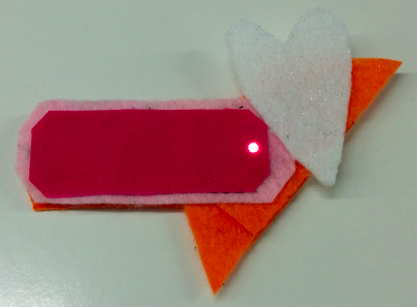
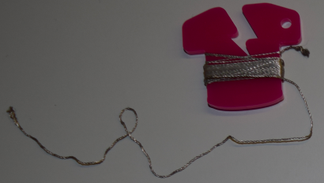
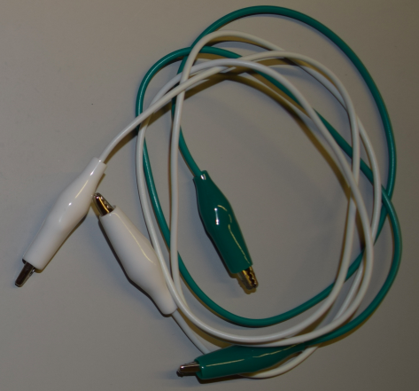

## परिचय

ह्या सूशी (Sushi) कार्ड्स आपल्याला घालण्यायोग्य इलेक्ट्रॉनिक्सची ओळख करुन देतील. खास रचलेले भाग वापरून बनवलेले ह्या इलेक्ट्रॉनिक सर्किट्सचे वापर करून आपण आश्चर्यकारक दिसणारे कपडे आणि उपकरणे (एक्सेसरीस) तयार करू शकता.

आपल्याला इलेक्ट्रॉनिक सर्किट्स विषयी शिकता येईल आणि आपण काही शिवणकाम देखील कराल.

आपण कपडे, पिशव्या, टोपी, काहीही सजवण्यासाठी घालण्यायोग्य (वेअरेबल) इलेक्ट्रॉनिक्सचा वापरू शकता - शक्यता अमर्यादित आहेत!

### आपण काय बनवाल

आपण दिवा लागणारा एक बिल्ला (बॅज) किंवा ठिगळा (पॅच) बनवणार आहोत!

आपण बॅज कसे डिझाइन करू शकता हे देखील आपण पाहू शकाल जेणेकरून चमकणारे पॅचवर्क करण्यासाठी आपण त्यापैकी पुष्कळजण सामील होऊ शकता. इतर मित्रांबरोबर हे बनवायला किती मज्जा येईल!

--- collapse ---
---
title: आपण काय शिकणार आहोत
---

+ सर्किट घटकांची मूलभूत माहिती आणि सर्किट मध्ये ** पॉझिटिव्ह / + ** तसेच ** निगेटिव्ह / - ** चे संकल्पना
+ एक साधी एल.ई.डी सर्किट रचणे
+ स्विच कसे कार्य करते आणि सर्किटमध्ये स्विच कसे वापरावे
+ घालण्यायोग्य सर्किट बनविण्यासाठी प्रवाहकीय धागा आणि शिवणेयोग्य घटक (भाग) चे वापर
+ शिवणकाम प्राथमिक कुशलता
+ सर्किटमध्ये अनेक एल.ई.डी दिवे जोडणे
+ घालण्यायोग्य सर्किट कसे तयार करावे जे वेगवेगळ्या घटकांमध्ये विभागणी करता येईल

--- /collapse ---

--- collapse ---
---
title: आपल्याला काय लागेल
---

### हार्डवेअर

इलेक्ट्रॉनिक सर्किटच्या वेगवेगळ्या भागांना **घटक** (components) म्हणतात. आपण वापरत असलेल्या घटकांची सूची येथे आहे:

+ एक बॅटरी 

+ एलईडी. हे छोटे दिवे आहेत जे वेगवेगळ्या रंगात मिळतात आणि त्यातील काही चमकतात किंवा रंग बदलतात. आपण विशेष सीवेबल एलईडी देखील मिळवू शकता. या प्रकल्पासाठी, आपण कोणत्याही प्रकारचे एलईडी वापरू शकता!

+ शिवता येणारा बॅटरी धारक किंवा खिशा. हा बॅटरी धारक एका विशेष बाेर्डावर (**प्रिंटेड सर्किट बोर्ड** किंवा **PCB** म्हणतात) लावला जाताे जे आपल्या सर्किटसह शिवू शकता.

टीपः आपला बॅटरी धारक कदाचित वर दर्शविलेल्यापेक्षा वेगळा दिसेल.

+ प्रवाहकीय धागा. हे भरतकामात वापरण्यात येणार्या धाग्यासारखे आहे, परंतु त्यात धातु आहे जेणेकरून त्यातून वीज वाहू शकेल. आम्ही म्हणतो की हे ** चालविते ** वीज.

+ मगरमच्छ क्लिप्स (पर्यायी)

+ एक स्विच (पर्यायी / ऐच्छिक) -  आपल्याला लक्ष्यात आलं असेल की बरेच प्रकारचे स्विचेस आहेत.

### इतर वस्तू

+ घटकांना शिवण्यासाठी कापडाचा तुकडा. हा कापडाचा तुकडा किंवा आपल्या आवडीचे पिशवी असू शकतो. मी हस्तकला कापड वापरेन.

+ शिवणकाम सुई, उदा. भरतकाम सुई

+ कात्री

+ टेप - इलेक्ट्रिकल किंवा मास्किंग टेप किंवा इतर कोणतीही सहज काढता येण्यासारखा टेप

+ सेफ्टी पिन किंवा कोणत्याही प्रकारचे बिल्ला (बॅज) पिन

#### पर्यायी / ऐच्छिक

+ नियमित भरतकामाचा धागा (किंवा इतर कोणत्याही प्रकारचा धागा)

+ चिमटा (शक्यतो गोल-नाक असलेला)

--- /collapse ---