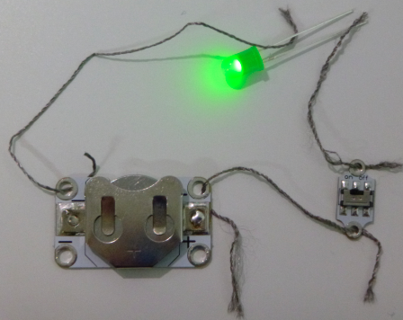
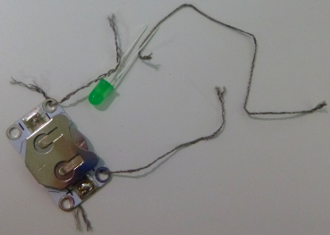

## एक स्विच जोडा

आपण आपले सर्किट बंद करू इच्छित असल्यास काय करावे? हे करण्यासाठी, वीज वाहणे थांबविण्यासाठी आपल्याला सर्किटमध्ये कुठेतरी खंड करणे आवश्यक आहे. **स्विच** असा एक घटक आहे जो आपल्याला एक सर्किट बंद आणि सहजपणे चालू करण्यास मदत करते. बरेच प्रकारचे स्विचेस आहेत: बटणे, स्लाइडर, अगदी चुंबकीय किंवा झुकणारे देखील. काही बॅटरी धारकांमध्ये अंगभूत स्विच देखील असते.

+ आपल्या सर्किटमध्ये बॅटरी धारकाची **+** छिद्रातून धागा बाहेर काढा. नवीन धाग्याचा तुकडा घ्या आणि त्याचे एक टोक **+** छिद्रातून काढा जिथे दुसरा धागा नुकताच होता. आपल्याला कदाचित अतिरिक्त हातांसाठी तिसर्‍या व्यक्तीसह गट करावे लागेल! अन्यथा आपण टेप वापरू शकता किंवा धाग्याऐवजी मगर (crocodile) क्लिप्स वापरू शकता.

+ आपल्याकडे रेडीमेड स्विच असल्यास, नवीन धाग्याच्या दुसर्‍या टोकास स्विचच्या एका टोकाला धरून ठेवा. नंतर आपण बॅटरी धारकातून काढलेला धागा घ्या (तो अद्याप एल.ई.डी शी संलग्न केलेला असावा) आणि स्विचच्या दुसर्‍या टोकाला धरून ठेवा. आता आपण एल.ई.डी बंद आणि चालू करण्यासाठी स्विच चा वापरू शकता!

--- collapse ---
---
title: स्विच कोणत्या मार्गाने जावे?
---

+ लक्षात घ्या, स्विचवर पाॅझिटिव्ह किंवा निगेटिव्ह बाजू नसते. याचा अर्थ स्विच कोणत्या मार्गाने बसवलेला आहे त्याचा फरक पडत नाही.

--- /collapse ---

+ आपल्याकडे स्विच नसल्यास आपण अगदी सहजपणे एक तयार करू शकता. आपल्या सर्किटमधील धाग्यांचे दोन सैल टोक घ्या आणि आपला एल.ई.डी चालू करण्यासाठी त्यांना एकत्र धरून ठेवा. आपण त्यांना वेगळं करता तेव्हा एल.ई.डी पुन्हा बंद होते. आपण एक साधा स्विच तयार केले आहात!

  

--- collapse ---
---
title: हे कसे कार्य करते
---

आपण पाहिलेत की एल.ई.डी चालू करण्यासाठी सर्किटमधून वीज वाहते. वीज वाहण्यासाठी, सर्किटमधील प्रत्येक घटक जोडून असणे आवश्यक आहे.

जेव्हा आपण दोन धागे वेगळे करतो तेव्हा आपण त्यांच्यामधील कनेक्शन तोडतो, जेणेकरून वीजेचा प्रवाह होऊ शकत नाही.

जेव्हा आपण धाग्यांना स्पर्श करतो तेव्हा ते जोडले जातात आणि वीज वाहण्यास सक्षम होते.

मी प्रत्येक धाग्याच्या शेवटी एक टेप लावले आहे जेणेकरून सर्किटमध्ये खंड कोठे आहे हे आपण सहजपणे पाहू शकता. हे स्विच असेल. ते येथे कार्य करत आहे:

रेडीमेड स्विचमध्ये, कनेक्शन तुटलेला आणि पुन्हा जोडलेला भाग सहसा आत लपविला जातो जेणेकरून आपण ते पाहू शकत नाही. आपण विजेचे उपकरण चालू किंवा बंद करता तेव्हा खरोखर काय होत आहे हे आपल्याला आता माहित आहे!

--- /collapse ---

वेगवेगळ्या प्रकारचे स्विच वेगवेगळ्या प्रकारे सर्किट तोडून कार्य करतात. आपल्या घालण्यायोग्य प्रकल्पांमध्ये सर्किट चालू किंवा बंद करायला स्विच नियंत्रण देते.
