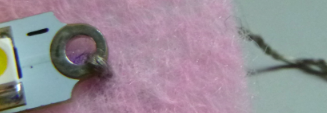

## घटकांवर शिवणे

+ आपल्या चमकणारा बिल्ला (बॅज) साठी इच्छित आकाराचा कापडाचा तुकडा कापून घ्या. आपण कोठे एल.ई.डी ठेवणार आहात ते ठरवा व चिन्हांकित करावे. आता आपला बॅटरी धारक कोठे ठेवायचा हे ठरवा. हे मागे असू शकते! पाॅझिटिव्ह छिद्रांपैकी एक छिद्र व निगेटिव्ह छिद्रांपैकी एक छिद्र **+** आणि ** - ** चिन्हांकित करा.

+ आपण नियमित एल.ई.डी वापरत असल्यास, आपल्याला पिन एक छोट्या वर्तुळ आकारात वाकवा. पक्कड येथे उपयुक्त होऊ शकतो. आपल्याकडे शिवणेयोग्य एल.ई.डी असल्यास, हे चरण वगळा!

 

+ सुई मध्ये धागा घाला! सुमारे 30 सेंटीमीटर लांबीच्या प्रवाहकीय धाग्याचा तुकडा घ्या आणि त्यातील एक टोक सुईच्या छिद्रातून खेचा (ज्याला **डोळा** म्हणतात). हे थोडे कठीण असू शकते. जर धाग्याचे टोक झिजले असेल तर कात्रीने झिजलेला भाग कापून टाका.

+ सुई मध्ये धागा घातल्यावर, धागा दोन तुकड्यांमध्ये टांगला जाईल. त्यापैकी एक खेचा म्हणजे ते दुसर्यापेक्षा लांब असेल, लांब तुकड्याच्या अगदी शेवटी गाठ बांधा.

शिवणकाम सुरू करण्यास तयार आहात?

+ आपण ज्या ठिकाणी कपड्यावर चिन्हांकित केला होता त्या जागेवर आपले एल.ई.डी लावा. एका हाताने कापड आणि एल.ई.डी दाबून ठेवा. दुसर्या हाताने, सुईचे टोक कापड्याचे **मागे** ठेवा आणि त्यास ढकलून एल.ई.डी च्या **-** छिद्रातून काढा.

+ सुई आणि धागा ओढून पुढे आणा. सुई ओढतांना सुईच्या बाहेर धागा पडू नये म्हणून सुईचे छिद्रात धाग्यास पकडण्याचा प्रयत्न करा (धागा बाहेर पडल्यास काळजी नको, आपण पुन्हा धागा सुई मध्ये घालू शकतो).  मागील गाठ फक्त शेवटपर्यंत गाठत नाही तोपर्यंत आपल्याला खेचत रहायचे आहे.

+ आता, सुईचे टोक एल.ई.डी चे **-** छिद्राच्या (ज्याद्वारे नुकताच बाहेर काढला होता), **बाजूला ठेवा** परंतु **आत नाही**. असे:

+ सुईला टोचून कापडाच्या मागच्या बाजूला काढा. आधी केल्या प्रमाणे सुईला कापडातून संपूर्ण खेचा. आपला पहिला टाका शिवून झाला आहे! अभिनंदन! परिणाम यासारखे दिसेल:

+ नुकतेच पूर्ण केलेले दोन चरण आणखी तीन वेळा पुन्हा करा. प्रत्येक वेळी धागा घट्ट खेचून घ्या. असे केल्याने एक चांगले कनेक्शन तयार होईल आणि एल.ई.डी कसून सुरक्षित ठेवेल.

+ घालण्यायोग्य घटक कसे जोडावेत हे आपण नुकतेच शिकलात. आपण जवळजवळ पोहोचलो!

--- collapse ---
---
title: शिवणकामासाठी टिपा
---

+ सरावाने परिपूर्णता येते! आपण यापूर्वी कधीही शिवणकाम केले नसल्यास हे सुरुवातीस अवघड असू शकते. काळजी करू नका, आपल्याला हळूहळू त्याचे ज्ञान मिळेल.

+ आपण शिवणकामासाठी नवीन असल्यास हा व्हिडिओ कदाचित उपयुक्त ठरेलः [dojo.soy/wear-stitches](http://dojo.soy/wear-stitches){:target="_blank"}

--- /collapse ---
