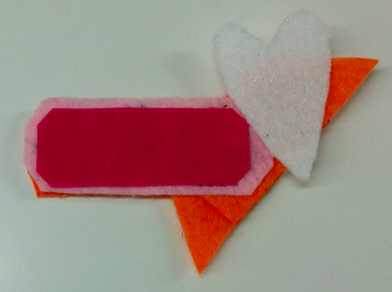

## आपले घालण्यायोग्य सर्किट पूर्ण करा

आता आपल्याकडे सुई व धागा कपड्यातून जेथे एल.ई.डी जोडली गेली आहे तेथे बाहेर आले असेल. **-** चिन्हांकित केलेले बॅटरी धारकाची छिद्र आणि सुई असलेल्या स्थान ह्यांच्या दरम्यान एक ओळ कल्पना करा . मदतीस आपण ही ओळ कपड्यावर काढू शकता. **चालणारी टाके** ह्या ओळीवर बॅटरी धारकाला व एल.ई.डी जोडण्यासाठी शिवा.

+ सुईचे टोक रेषावर ठेवा, धाग्यापासून सुमारे 1 सेमी अंतरावर आणि त्यास कपड्यात टोचा. पुर्वी केल्या प्रमाणे सुई आणि धागा ओढून पुढे आणा. नंतर दुसर्‍या बाजूला हे कार्य पुन्हा करा. आपण **-** चिन्हांकित केलेल्या बॅटरी धारकाचे छिद्रा पर्यंत 1 से.मी रुंदीचे टाके मारत रहा.

+ मग आपल्या बॅटरी धारकाला कपड्यावर ठेवा. मग, आपण एल.ई.डी साठी केले त्याप्रमाणे, **-** छिद्रातून तीन टाके शिवून बॅटरी धारकास जोडा. ते चांगले आणि घट्ट असल्याची खात्री करुन घ्या!

+ समाप्त करण्यासाठी, बॅटरी धारक जेथे जोडले आहे तेथेच तीन लहान टाके शिवून घ्या. अश्याने धाग्याचे टोक सुरक्षित होईल आणि धाग्याला सुटण्यापासून थांबवेल.

+ धागा कापून घ्या जेणेकरून कपड्यातून फक्त एक छोटासा भाग बाहेर दिसेल.

--- collapse ---
---
title: आता संपवलेल्या कामा चे व्हिडिओ पहा
---

शिवणकामाचा हा भाग कसा पूर्ण करायचा हे दर्शविणारा एक व्हिडिओ येथे आहे: [dojo.soy/wear-finishing](http://dojo.soy/wear-finishing){:target="_blank"}

--- /collapse ---

 

आता आपले सर्किट अर्धा शिवुन झालेला आहे.

+ सर्किट पूर्ण करण्यासाठी, आपल्याला एल.ई.डी चे **+** छिद्र बॅटरी धारक चे **+** छिद्रा सह जोडणे आवश्यक आहे. आपण नुकतेच **निगेटिव्ह** छिद्र जोडले होते त्याच प्रकारे हे जोडा. मी या सर्किट मध्ये स्विचचा समावेश करत नाही, परंतु आपल्याला पूर्वीसारखे धाग्याचे तिसरा तुकडा वापरू शकता.

  **महत्वाचे!** हे निश्चित करा की **+** धाग्याचे मार्ग **-**  धाग्याला **ओलांडत किंवा स्पर्श** करत नाही व कोठेही बॅटरी धारकाच्या कड्याला स्पर्श होत नाही.   लक्षात ठेवा, यामुळे **शॉर्ट सर्किट** होईल (वाईट गोष्ट)!

+ बॅटरी धारकामध्ये बॅटरी टाका आणि आपला एल.ई.डी चालू झालेला पहा!

### बिल्ला (बॅज) बनवणे

+ सर्जनशील होण्याची वेळ! आपला बिल्ला (बॅज) वेगवेगळ्या रंगांच्या कपड्यांनी किंवा धाग्यांसह किंवा आपल्याकडे असलेल्या इतर सामग्री वापरून सजवा. एल.ई.डी ला कपड्याने झाकून ठेवल्याने दिव्याचे चमक सौम्य होईल.

+ आपण आपल्या बॅजला पिन जोडत असल्यास, बॅजच्या मागील भागाशी संलग्न असे कपड्याचे वेगळ्या तुकड्यावर ठेवा. हे सुनिश्चित करते की पिन आपल्या सर्किटच्या कोणत्याही भागास स्पर्श करीत नाही - कारण पिन धातूचा आहे, यामुळे शॉर्ट सर्किट होईल. अतिरिक्त शिवणकामासाठी सामान्य धागा किंवा त्याऐवजी गोंद किंवा टेप वापरा.

अभिनंदन! आपला बॅज पूर्ण झाला आहे व आपण घालण्यायोग्य सर्किट शिवले आहात. पुढील सुशी कार्डे आपल्याला आणखी एल.ई.डी कसे जोडायचे हे दर्शवतात, पण ते पर्यायी आहेत.
