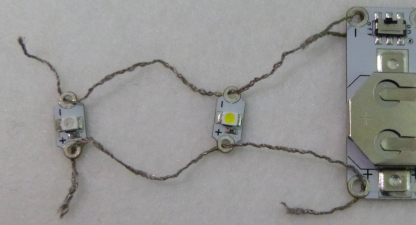

## अजुन एल.ई.डी जोडा

आपल्या सर्किटमध्ये अधिक एल.ई.डी जोडणे सोपे आहे आणि आपल्याला अतिरिक्त बॅटरीची आवश्यकता नाही!

** टीप ** : आपल्या सर्किटमधील एल.ई.डी एकाच प्रकारचे असणे आवश्यक आहे, सर्व शिवणेयोग्य असावे किंवा सर्व शिवणेयोग्य नसावे. हे शिवणेयोग्य एल.ई.डी सह सर्वोत्कृष्ट कार्य करेल, कारण आपण बरेच एल.ई.डी उर्जा कमी न करता एकाच बॅटरीशी जोडणी करू शकता.

+ आत्ता पुरते बॅटरी धारकाच्या बाहेर बॅटरी काढून ठेवा. सर्किटवर काम करताना ते बंद करून किंवा बॅटरी काढून, सर्किट ** लाइव्ह अथवा चालू ** नसल्याचे नेहमी सुनिश्चित करणे आवश्यक आहे!

+ आपल्या बॅजवर आपण आपला पुढील एल.ई.डी कोठे ठेवायचा ते ठरवा आणि त्या जागेवर चिन्हांकित करा.

आपण ** समांतर ** रीतीने एल.ई.डी जोडाल. असे करण्याचे दोन पद्धत आहेत.

### पद्धत 1

पहिला एल.ई.डी प्रमाणेच एल.ई.डी थेट बॅटरीशी जोडणे हा एक पर्याय आहे. बॅटरी धारकावरचे छिद्र एकदा पेक्षा जास्त वापरणे ठीक आहे - आपण किती धागा घालू शकता याची एकमात्र मर्यादा आहे! चित्रातील उदाहरण सर्किट कोणत्याही गोष्टीवर शिवलेले नाही, जेणेकरुन आपण धाग्यांना स्पष्टपणे पाहू शकता:

### पद्धत 2

दुसरा पर्याय म्हणजे बॅटरीऐवजी आपल्या सर्किटमध्ये आधीपासून असलेल्या एल.ई.डीला नवीन एलईडी जोडणे. आपण ** + ** ला ** + ** वर जुळवा आणि ** - ** ला **  - ** जुळवा जसे की आपण त्यास बॅटरीशी जोडत आहात. खाली दिलेल्या उदाहरणात, त्याच दोन लांब धाग्यांचे तुकडे दोन्ही एल.ई.डी साठी वापरले जातात. आपण प्रत्येक एल.ई.डी साठी धाग्याचे वेगवेगळे तुकडे देखील वापरू शकता.

--- collapse ---
---
title: मी कोणती पद्धत निवडावी? title:
---

एल.ई.डी, बॅटरी धारकाशी किंवा इतर एल.ई.डी शी जोडायचे की नाही हे आपण नवीन एल.ई.डी कोठे ठेवायचे यावर अवलंबून आहे!

+ सामान्यत: आपण आपल्या दुसर्या एल.ई.डी साठी निवडलेल्या जागेच्या अगदी जवळचा घटक निवडाल.

+ जेव्हा आपण एखादी पद्धत आणि एल.ई.डी साठी जागा निवडता तेव्हा आपल्याला हे सुनिश्चित करण्याची आवश्यकता आहे की सर्व भिन्न धागे स्वतंत्र ठेवले आहेत आणि त्यास ओलांडत किंवा स्पर्श होत नाही, म्हणून घटकांचे ** + ** आणि ** - ** कोठे आहेत हे पाहणे आवश्यक आहे आपले असतात.

--- /collapse ---

+ एल.ई.डी एका ठिकाणी धरून, सुई आणि प्रवाहकीय धाग्याचा एक नवीन तुकडा वापरा व एल.ई.डी चे ** - ** छिद्राबरोबर शिवा जसे आपण पहिल्या एल.ई.डी शिवलात.

+ पुढील चरण मध्ये टाके घालू. जर आपण एल.ई.डी ला इतर एल.ई.डी ला जोडत असाल तर बॅटरी धारकाऐवजी टाके एका ओळीत इतर एल.ई.डी चे ** - ** छिद्राच्या दिशेने जातील. योग्य छिद्र गाठल्यावर तीन टाके बनवा आणि जसे आपण पूर्वी केले होते तसे तीन लहान टाके तयार करा.

+ आता नवीन एल.ई.डी चे ** + ** छिद्र त्याच पद्धतीने जोडा.

या फोटोमध्ये, दुसरा एल.ई.डी थेट बॅटरीशी कनेक्ट झाला आहे:

पुढच्या फोटोमध्ये, दुसर्‍या एल.ई.डी ला पहिल्या एल.ई.डी शी जोडले गेले आहे, जे बॅटरीशी जोडलेले आहे (बॅटरी कापडाच्या मागील बाजूस आहे):

