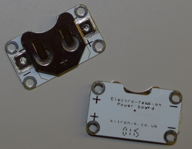

## Wat heb je nodig

### Hardware

De verschillende onderdelen van een elektronisch circuit worden **componenten** genoemd. Hier is een lijst met de onderdelen die je gaat gebruiken:

+ Een batterij 

+ LED's. Dit zijn kleine lampjes die er in verschillende kleuren zijn, en sommigen van hen kunnen zelfs flitsen of van kleur veranderen. Je kunt ook speciale naaibare LED's krijgen. Voor dit project kun je elk type LED gebruiken!

+ Een naaibare batterijhouder. Dit is een batterijhouder die is bevestigd aan een speciale houder (een **printplaat** of **PCB** genoemd) die je op je project kunt naaien.

Opmerking: De batterijhouder kan er anders uitzien dan die hierboven weergegeven.

+ Geleidende draad. Dit is als borduurdraad, maar het bevat metaal zodat er elektriciteit doorheen kan stromen. We zeggen dat het elektriciteit **geleidt**.

+ Krokodillenklemmen (optioneel)

+ Een schakelaar (optioneel). Je zult zien dat er veel verschillende soorten schakelaars zijn.

### Andere items

+ Wat stof om de onderdelen op te naaien. Dit kan een kledingstuk, een tas of iets wat je maar wilt zijn. Ik zal vilt gebruiken.

+ Een naainaald, bijvoorbeeld een borduurnaald

+ Schaar

+ Tape - isolatie- of afplaktape, of een andere verwijderbare tape

+ Een veiligheidsspeld of een andere badge speld

#### Optioneel

+ Normaal borduurdraad (of een ander soort draad)

+ Tang (bij voorkeur rond)
 
