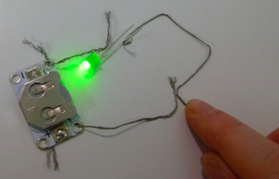

## Voeg een schakelaar toe

Wat als je je circuit wilt uitschakelen? Om dit te doen, heb je ergens in het circuit een onderbreking nodig om de elektriciteit te stoppen. Een **schakelaar** is een onderdeel waarmee je een circuit eenvoudig kunt in- en uitschakelen. Er zijn veel verschillende soorten schakelaars: knoppen, schuifregelaars, zelfs magnetische of kantelbare. Sommige batterijhouders hebben zelfs een ingebouwde schakelaar.

+ Maak op je circuit de draad los van het **+** gat in de batterijhouder. Neem een nieuw stukje draad en steek het ene uiteinde van het nieuwe stuk door het **+** gat waar de andere draad net zat. Misschien moet je hier samenwerken met een derde persoon, voor wat extra handen! Anders kun je altijd tape gebruiken, of krokodillenklemmen gebruiken in plaats van draad.

+ Als je een kant-en-klare schakelaar hebt, houd dan het andere uiteinde van de nieuwe draad aan het ene uiteinde. Neem vervolgens de draad die je hebt verwijderd uit de batterijhouder (deze moet nog steeds aan de LED zijn bevestigd) en houd deze aan het andere uiteinde van de schakelaar. Nu kun je de schakelaar gebruiken om de LED uit en aan te zetten!

--- collapse ---
---
title: Hoe moet de schakelaar aangesloten worden?
---

+ Merk op dat er geen positieve of negatieve kant op een schakelaar is. Dit betekent dat het er niet toe doet in welke richting de schakelaar zit.

--- /collapse ---

+ Als je geen schakelaar hebt, kun je er heel makkelijk een maken. Neem de twee losse uiteinden van de draad in je circuit en houd ze bij elkaar om je LED te laten oplichten. Wanneer je ze scheidt, wordt het weer uitgeschakeld. Je hebt zojuist een eenvoudige schakelaar gemaakt!

  

--- collapse ---
---
title: Hoe werkt het?
---

Zoals je hebt gezien, stroomt elektriciteit helemaal rond het circuit om de LED te laten branden. Om de elektriciteit te laten stromen, moet er een verbinding zijn tussen elke component in het circuit.

Wanneer je de twee draden scheidt, heb je de verbinding verbroken, zodat de elektriciteit niet meer kan stromen.

Wanneer de draden elkaar raken, zijn ze aangesloten en kan de elektriciteit weer stromen.

Ik heb tape aan het einde van elke draad geplaatst, zodat je gemakkelijker kunt zien waar de onderbreking in het circuit is. Dit zal de schakelaar worden. Hier zie je het in actie:

In een kant-en-klare schakelaar is het deel waar de verbinding wordt verbroken en opnieuw wordt verbonden meestal verborgen in de schakelaar, zodat je het niet kunt zien. Nu weet je wat er echt gebeurt als je iets in- of uitschakelt!

--- /collapse ---

Verschillende soorten schakelaars werken door het circuit op verschillende manieren te onderbreken. Je kunt een schakelaar in je wearables-projecten gebruiken om je controle te geven over wanneer het circuit aan of uit is.
