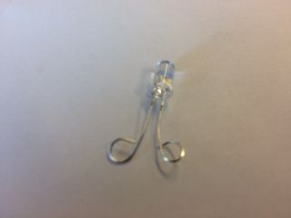

## Naai de onderdelen vast

+ Knip een stuk vilt op de maat die je voor je badge wilt hebben. Bepaal waar je de LED gaat plaatsen en markeer de plek op het vilt. Bepaal nu waar je de batterijhouder wilt plaatsen. Het zou op de achterkant kunnen! Markeer de plek voor een van de positieve gaten en een van de negatieve gaten met een **+** en **-**.

+ Als je een gewone LED gebruikt, moet je de pinnen in lussen buigen. Tangen kunnen hier handig bij zijn. Als je een naaibare LED hebt, sla deze stap dan over!

 

+ Rijg de draad door je naald! Neem een stuk geleidende draad van ongeveer 30 cm lang en trek een uiteinde ervan door het gat in de naald (het **oog** genoemd). Dit kan behoorlijk lastig zijn. Als de draad aan het einde gerafeld is, knip de gerafelde stukjes er dan af met een schaar.

+ Zodra de naald is voorzien van draad, hangt de draad in twee delen naar buiten. Trek er een uit zodat het een beetje langer is dan het andere en bind een knoop aan het einde van het lange stuk.

Klaar om te beginnen met naaien?

+ Plaats je LED op het vilt op de plek waar je het hebt gemarkeerd. Houd met één hand het vilt en de LED vast. Plaats met de andere hand de punt van de naald **achter** het vilt en duw het erdoor zodat het uit het **-** gat van de LED komt.

+ Trek de naald en draad helemaal door het vilt. Probeer de naald bij het oog vast te houden en de draad er stevig in te knijpen om te voorkomen dat deze uit de naald valt terwijl je aan het touw trekt (als deze eruit valt, kun je het er opnieuw doorrijgen). Je wilt blijven trekken totdat alleen de knoop tegen de achterkant komt.

+ Plaats nu de punt van de naald **naast** het **-** gat van de LED (het gat waar het net doorheen kwam), maar **niet erin**. Zoals dit:

+ Duw de naald door het vilt zodat het naar buiten komt. Pak de naald achter het vilt en trek het helemaal door, net zoals je aan de voorkant deed. Je hebt net je eerste steek genaaid! Het zou er ongeveer zo uit moeten zien:

+ Herhaal de laatste twee stappen nog drie keer. Zorg ervoor dat je de draad elke keer strak trekt. Dit zorgt voor een goede verbinding en houdt de LED stevig vast aan het vilt.

+ Je hebt zojuist geleerd hoe je draagbare onderdelen kunt bevestigen. Bijna klaar!

--- collapse ---
---
title: Tips voor naaien
---

+ Oefening baart kunst! Als je nog nooit eerder hebt genaaid, kan het in het begin lastig zijn. Maak je geen zorgen, je zult het onder de knie krijgen.

+ Deze video kan handig zijn als je voor het eerst gaat naaien: [dojo.soy/wear-stitches](http://dojo.soy/wear-stitches){:target="_blank"}

--- /collapse ---
