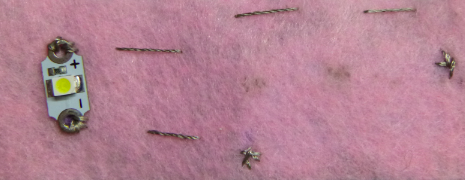

## Maak je draagbare circuit compleet

Nu heb je naald en draad die uit het vilt komen waar de LED is bevestigd. Stel je een lijn voor tussen deze plek en de plek die je hebt gemarkeerd voor het **-** gat in de batterijhouder. Als het helpt, kun je de lijn op het vilt tekenen. Je naait een **rijgsteek** langs deze lijn om de LED op de batterijhouder aan te sluiten.

+ Plaats de punt van de naald op de lijn, ongeveer 1 cm afstand van waar de draad uit het vilt komt, en druk hem er doorheen. Trek de naald en draad er helemaal door zoals voorheen. Herhaal dit dan aan de andere kant van het vilt. Blijf dit doen in stappen van 1 cm breed totdat je de plek bereikt die je hebt gemarkeerd voor het **-** gat in de batterijhouder.

+ Plaats vervolgens de batterijhouder op het vilt. Bevestig vervolgens, net als voor de LED, de batterijhouder door drie steken door het **-** gat te naaien. Vergeet niet om ervoor te zorgen dat ze goed strak zitten!

+ Naai tot slot drie kleine steken naast de plaats waar je de batterijhouder hebt bevestigd, allemaal op dezelfde plaats. Hierdoor wordt het einde van de draad vastgezet en wordt voorkomen dat je werk ontrafelt.

+ Knip de draad zodanig dat er slechts een klein beetje uit het vilt hangt.

--- collapse ---
---
title: Bekijk een video van het laatste stukje
---

Hier is een video die laat zien hoe je dit deel van het naaien afmaakt: [dojo.soy/wear-finishing](http://dojo.soy/wear-finishing){:target="_blank"}

--- /collapse ---

 

Je hebt nu de helft van je circuit genaaid.

+ Om het circuit te voltooien, moet je het **+** gat op de LED verbinden met het **+** gat op de batterijhouder. Doe dit op dezelfde manier waarop je net de **negatieven** hebt verbonden. Ik neem geen schakelaar in dit circuit, maar het kan wel als je dat wilt, met een derde stukje draad als voorheen.

  **Belangrijk!** Zorg ervoor dat het pad voor je **+** draad de **-** draad of andere randen van de batterijhouder **nergens kruist/aanraakt**. Vergeet niet dat dit **kortsluiting** kan veroorzaken (een slechte zaak)!

+ Plaats een batterij in de batterijhouder en kijk hoe de LED gaat branden!

### Het maken van de badge

+ Tijd om creatief te worden! Versier je badge met verschillende kleuren vilt of draad, of andere materialen die je hebt. Als je de LED bedekt met vilt, krijg je een zachtere gloed.

+ Als je een speld aan je badge bevestigt, is het een goed idee om deze op een apart viltje te zetten dat je aan de achterkant van je badge bevestigt. Dit zorgt ervoor dat de speld geen enkel deel van je circuit raakt — omdat de speld van metaal is, zou dit een kortsluiting veroorzaken. Gebruik gewone draad voor het extra naaien, of lijm of tape.

Gefeliciteerd! Je badge is klaar en je hebt een compleet draagbaar circuit genaaid. De volgende Sushi-kaarten laten zien hoe je meer LED's kunt toevoegen, en ze zijn optioneel.
