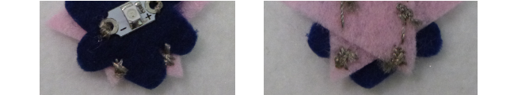

## Maak afneembare onderdelen

Je kunt ook je badge-circuit uitbreiden zodat afzonderlijke stukken vilt met hun eigen LED's (van hetzelfde type) eraan kunnen worden verbonden om ze te laten oplichten!

Eerst heb je nog een badge nodig. Deze heeft geen eigen batterij. Maar zonder een batterij, waar gaan de draden heen?

+ Wanneer je je LED op deze nieuwe badge naait, doe je de rijgsteken helemaal tot aan de rand van het vilt of bij de rand. Vergeet niet om de **positieve** en **negatieve** draden van elkaar gescheiden te houden!

+ Naai vervolgens enkele middelgrote steken naast elkaar of kruislings over elkaar. Je wilt het laten lijken op een "bobbel" van geleidende draad op het vilt.

+ Voltooi de stiksels zoals normaal door drie kleine steken op één plek te maken voordat je de draad kort knipt.

+ Zodra je een bobbel hebt voor de **negatieve**, en een bobbel voor de **positieve** kant, is de nieuwe badge klaar. Als je wilt, kun je deze stappen herhalen zodat je het circuit uitbreidt naar een ander paar bobbels aan de tegenoverliggende rand van de nieuwe badge, zoals dit:

+ Nu hoef je alleen maar het circuit op de hoofdbadge (die met de batterij) uit te breiden. Vergeet niet om de batterij eerst uit de houder te verwijderen.

+ Bepaal waar je de badges wilt laten samenkomen. Je gaat steken naaien van de LED op de hoofdbadge naar dit punt, dus zorg ervoor dat je een lijn kunt volgen van de **+** naar de **positieve** bobbel en van de **-** naar de **negatieve** bobbel zonder ze te laten kruisen.

+ Markeer twee plekken op de hoofdbadge waar de **positieve** en **negatieve** bobbels deze raken. Je gaat hier overeenkomende bobbels naaien zodat ze verbinding kunnen maken. Je kunt de nieuwe badge even aan de kant leggen voor het volgende stukje.

+ Naai een stel steken op de plek waar je de **negatieve** bobbel hebt gemarkeerd. Naai vervolgens een lopende steek helemaal aan de LED op deze badge en zet deze vast in het **-** gat. Herhaal dit proces om een **positieve** bobbel te maken die is aangesloten op het **+** gat van dezelfde LED. Wanneer je klaar bent zou het er ongeveer zo uit moeten zien:

Je badges zijn klaar om samen te worden samengevoegd!

+ Plaats de batterij terug in de houder. Plaats de nieuwe badge op de hoofdbadge zodat de bobbels elkaar raken. Vergeet niet om **+** te laten aansluiten op **+** en **-** op **-**. Je zou moeten zien dat de nieuwe badge plotseling oplicht!

 

--- challenge ---

## Uitdaging: Maak een zachte schakelaar

+ Je zou deze techniek kunnen gebruiken om een eenvoudige zachte schakelaar op je project te maken. Zet bijvoorbeeld een **positieve** bobbel aan beide uiteinden van een armband, zodat de twee in contact komen wanneer je deze sluit.

--- /challenge ---
